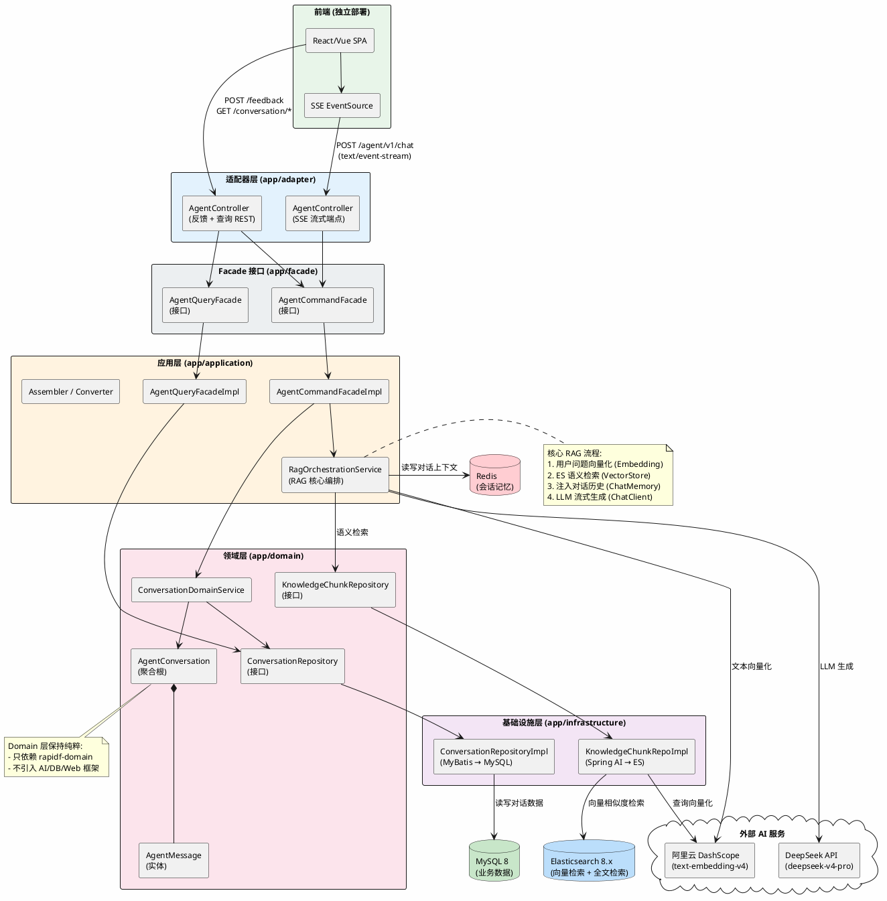
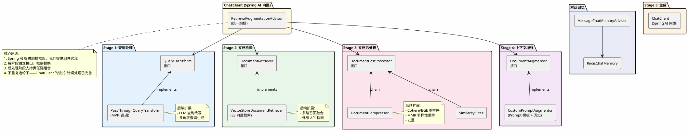
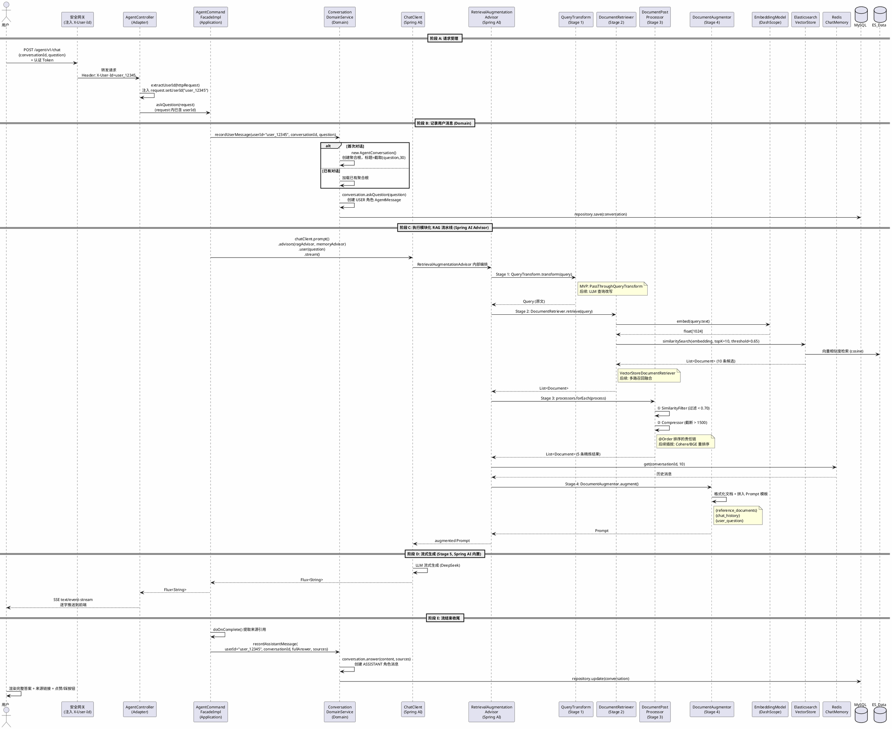
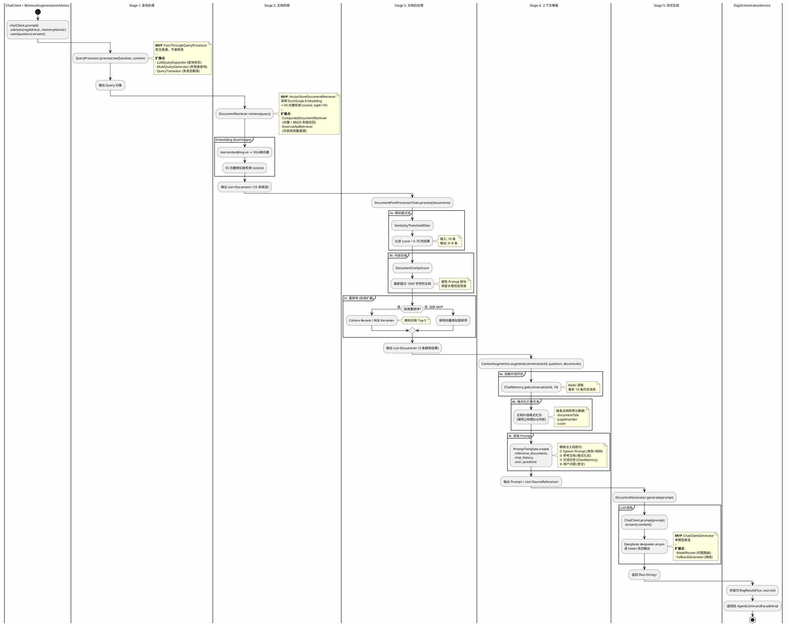
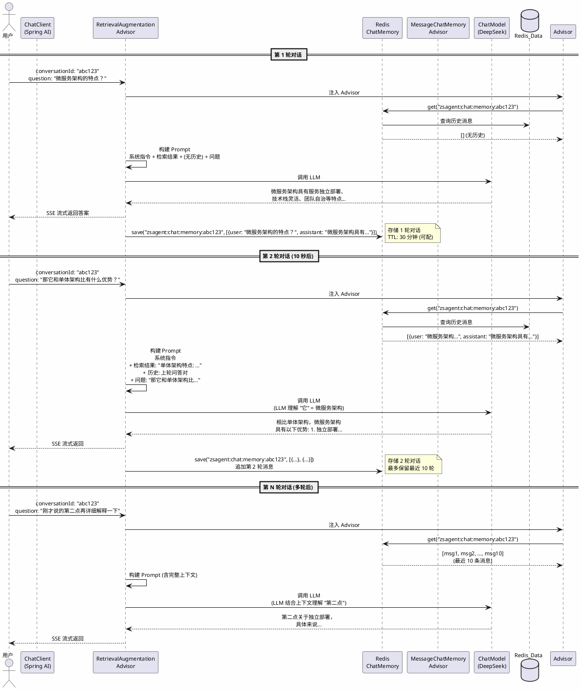
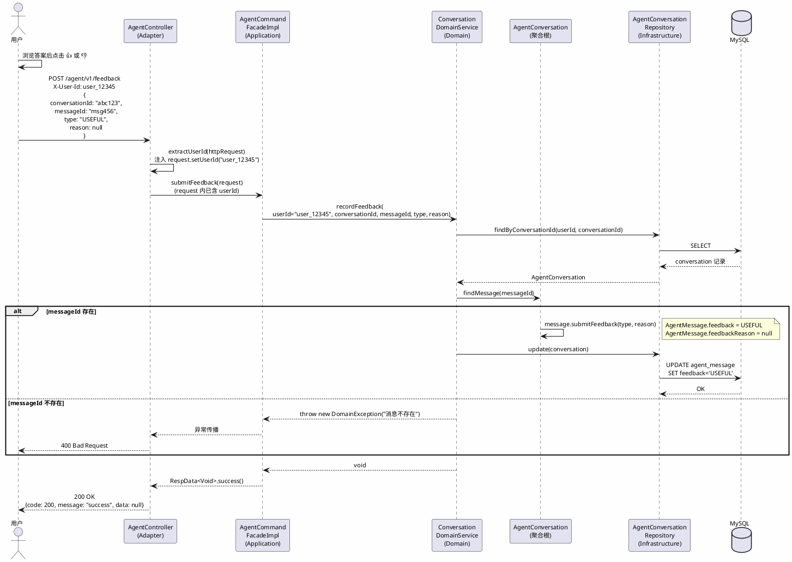

# 智能问答模块 — 详细设计

| 文档版本 | 修改日期 | 说明 |
|---------|---------|------|
| V1.0 | 2026-07-25 | 初稿，MVP 智能问答模块详细设计 |

---
<!-- TOC -->
* [智能问答模块 — 详细设计](#智能问答模块--详细设计)
  * [1. 设计概述](#1-设计概述)
    * [1.1 模块定位](#11-模块定位)
    * [1.2 技术选型](#12-技术选型)
    * [1.3 设计原则](#13-设计原则)
    * [1.4 模块架构图](#14-模块架构图)
  * [2. 模块划分与包结构](#2-模块划分与包结构)
    * [2.1 新增模块依赖](#21-新增模块依赖)
    * [2.2 各模块新增内容](#22-各模块新增内容)
  * [3. 领域模型设计](#3-领域模型设计)
    * [3.1 AgentConversation（聚合根）](#31-agentconversation聚合根)
      * [3.1.1 字段定义](#311-字段定义)
      * [3.1.2 行为方法](#312-行为方法)
    * [3.2 AgentMessage（实体）](#32-agentmessage实体)
      * [3.2.1 字段定义](#321-字段定义)
      * [3.2.2 为什么 feedback 放在 Message 而非独立实体？](#322-为什么-feedback-放在-message-而非独立实体)
    * [3.3 SourceReference（值对象）](#33-sourcereference值对象)
      * [3.3.1 字段定义](#331-字段定义)
    * [3.4 枚举设计](#34-枚举设计)
    * [3.5 仓储接口](#35-仓储接口)
      * [3.5.1 为什么仓储接口定义在 Domain 层？](#351-为什么仓储接口定义在-domain-层)
      * [3.5.2 AgentConversationRepository 方法设计](#352-agentconversationrepository-方法设计)
      * [3.5.3 KnowledgeChunkRepository 方法设计](#353-knowledgechunkrepository-方法设计)
      * [3.5.4 为什么没有 `delete` 和 `findAll`？](#354-为什么没有-delete-和-findall)
    * [3.6 KnowledgeChunk（领域值对象）](#36-knowledgechunk领域值对象)
    * [3.7 领域服务 — ConversationDomainService](#37-领域服务--conversationdomainservice)
  * [4. Facade 接口设计](#4-facade-接口设计)
    * [4.0 Command / Query 分离的设计原则](#40-command--query-分离的设计原则)
    * [4.1 AgentCommandFacade](#41-agentcommandfacade)
      * [方法设计](#方法设计)
    * [4.2 AgentQueryFacade](#42-agentqueryfacade)
      * [方法设计](#方法设计-1)
    * [4.3 Request 对象设计](#43-request-对象设计)
      * [4.3.1 AskQuestionRequest](#431-askquestionrequest)
      * [4.3.2 FeedbackRequest](#432-feedbackrequest)
      * [4.3.3 ConversationListQueryRequest](#433-conversationlistqueryrequest)
    * [4.4 DTO 对象设计](#44-dto-对象设计)
      * [4.4.1 MessageDTO](#441-messagedto)
      * [4.4.2 ConversationDTO](#442-conversationdto)
      * [4.4.3 SourceReferenceDTO](#443-sourcereferencedto)
    * [4.5 Facade 接口的设计约束](#45-facade-接口的设计约束)
  * [5. 应用层设计](#5-应用层设计)
    * [5.1 模块化 RAG 架构设计](#51-模块化-rag-架构设计)
      * [5.1.0 模块化 RAG 架构总览](#510-模块化-rag-架构总览)
      * [5.1.1 Stage 1 — 查询处理（QueryTransform）](#511-stage-1--查询处理querytransform)
      * [5.1.2 Stage 2 — 文档检索（DocumentRetriever）](#512-stage-2--文档检索documentretriever)
      * [5.1.3 Stage 3 — 文档后处理（DocumentPostProcessor）](#513-stage-3--文档后处理documentpostprocessor)
      * [5.1.4 Stage 4 — 上下文增强（DocumentAugmentor）](#514-stage-4--上下文增强documentaugmentor)
      * [5.1.5 Stage 5 — 生成](#515-stage-5--生成)
      * [5.1.6 完整装配](#516-完整装配)
      * [5.1.7 扩展点总览](#517-扩展点总览)
    * [5.2 AgentCommandFacadeImpl](#52-agentcommandfacadeimpl)
    * [5.3 AgentQueryFacadeImpl](#53-agentqueryfacadeimpl)
    * [5.4 组装器与转换器](#54-组装器与转换器)
  * [6. 适配器层设计](#6-适配器层设计)
    * [6.1 AgentController（SSE 流式端点）](#61-agentcontrollersse-流式端点)
    * [6.2 前端对接方式](#62-前端对接方式)
  * [7. 基础设施层设计](#7-基础设施层设计)
    * [7.0 自动配置 vs 手动配置](#70-自动配置-vs-手动配置)
    * [7.1 唯一需要手动配置的 Bean：ChatMemory](#71-唯一需要手动配置的-beanchatmemory)
      * [7.1.1 ChatClient — 使用 auto-configured Builder](#711-chatclient--使用-auto-configured-builder)
    * [7.2 配置文件（application.yml）](#72-配置文件applicationyml)
    * [7.3 POM 新增依赖](#73-pom-新增依赖)
  * [8. 核心流程设计](#8-核心流程设计)
    * [8.1 问答主流程](#81-问答主流程)
    * [8.2 RAG 模块化流水线](#82-rag-模块化流水线)
    * [8.3 多轮对话流程](#83-多轮对话流程)
    * [8.4 反馈收集流程](#84-反馈收集流程)
  * [9. API 接口规范](#9-api-接口规范)
    * [9.1 流式问答](#91-流式问答)
    * [9.2 答案反馈](#92-答案反馈)
    * [9.3 查询对话](#93-查询对话)
    * [9.4 对话列表](#94-对话列表)
  * [10. 数据库设计](#10-数据库设计)
    * [10.1 agent_conversation 表（MySQL）](#101-agent_conversation-表mysql)
    * [10.2 agent_message 表（MySQL）](#102-agent_message-表mysql)
    * [10.3 ES 索引映射（知识块）](#103-es-索引映射知识块)
      * [逐字段说明](#逐字段说明)
      * [分词器选型：为什么选 ik_max_word 而非其他](#分词器选型为什么选-ik_max_word-而非其他)
      * [索引与检索策略](#索引与检索策略)
  * [11. 实现计划](#11-实现计划)
    * [11.1 开发顺序](#111-开发顺序)
    * [11.2 关键里程碑](#112-关键里程碑)
  * [12. 异常处理](#12-异常处理)
  * [附录 A. Spring AI 核心组件映射](#附录-a-spring-ai-核心组件映射)
  * [附录 B. RAG 模块化设计 vs 传统 Advisor 模式对比](#附录-b-rag-模块化设计-vs-传统-advisor-模式对比)
<!-- TOC -->

---

## 1. 设计概述

### 1.1 模块定位

智能问答模块是 MVP 的核心功能，实现用户以自然语言提问，系统从知识库中检索相关内容，由 LLM 生成带来源引用的答案，并通过 SSE 流式返回。

### 1.2 技术选型

| 组件 | 选型 |
|------|------|
| AI 框架 | Spring AI 2.0.0 |
| LLM | DeepSeek (deepseek-v4-pro)，通过 OpenAI 兼容协议接入 |
| Embedding | 阿里云 text-embedding-v4，通过 DashScope API |
| 向量存储 | Elasticsearch 8.x |
| 会话记忆 | Redis |

### 1.3 设计原则

- 遵循项目现有 DDD/CQRS 架构，保持 facade → application → domain ← infrastructure 依赖方向
- domain 层保持框架无关，只依赖 rapidf-domain
- AI 相关编排逻辑放在 application 层，不侵入 domain
- 流式响应使用 SSE，端到端 `Flux<String>` 传递

### 1.4 模块架构图



---

## 2. 模块划分与包结构

### 2.1 新增模块依赖

```
facade (接口 + DTO)
  ↑
adapter (SSE Controller)
  ↑
application (RAG 编排、Facade 实现)
  ↑           ↑
domain     infrastructure/acl
(领域模型)  (ES VectorStore、Redis ChatMemory)
```

### 2.2 各模块新增内容

```
app/facade/src/main/java/.../facade/agent/
├── api/
│   ├── AgentCommandFacade.java          ← askQuestion, submitFeedback
│   └── AgentQueryFacade.java            ← getConversation, listConversations
├── dto/
│   ├── ConversationDTO.java
│   ├── MessageDTO.java
│   └── SourceReferenceDTO.java
├── request/
│   ├── AskQuestionRequest.java
│   └── FeedbackRequest.java
└── result/
    └── AskQuestionResult.java

app/domain/src/main/java/.../domain/agent/
├── model/
│   ├── AgentConversation.java           ← @DomainAggregate
│   ├── AgentMessage.java                ← @DomainEntity
│   ├── SourceReference.java             ← @ValueObject
│   ├── ConversationStatus.java          ← BaseEnum
│   ├── MessageRole.java                 ← BaseEnum
│   └── FeedbackType.java                ← BaseEnum
├── repository/
│   ├── AgentConversationRepository.java
│   └── KnowledgeChunkRepository.java    ← 知识块检索接口
└── service/
    ├── ConversationDomainService.java
    └── impl/ConversationDomainServiceImpl.java

app/application/src/main/java/.../application/agent/
├── AgentCommandFacadeImpl.java
├── AgentQueryFacadeImpl.java
├── assembler/AgentAssembler.java
├── converter/AgentConverter.java
├── validator/AskQuestionRequestValidator.java
├── handler/
│   ├── AskQuestionCommandHandler.java
│   └── SubmitFeedbackCommandHandler.java
└── rag/
    └── RagAdvisorConfig.java       ← RetrievalAugmentationAdvisor 装配配置

app/adapter/src/main/java/.../adapter/web/agent/
└── AgentController.java                 ← SSE 流式端点

app/infrastructure/acl/src/main/java/.../infra/acl/repository/
├── AgentConversationRepositoryImpl.java ← MyBatis 实现
└── KnowledgeChunkRepositoryImpl.java    ← ES VectorStore 实现
```

---

## 3. 领域模型设计

领域层是整个智能问答模块的核心，需要准确表达业务概念和规则。以下逐一说明每个模型的设计理由。

---

### 3.1 AgentConversation（聚合根）

**为什么是聚合根？** 一个"对话"是用户与 Agent 交互的完整会话边界。对话内的所有消息必须通过对话来访问和修改——删除对话时消息也应级联删除；向对话追加消息时需要保证消息的顺序和完整性。因此 `AgentConversation` 作为聚合根管理 `AgentMessage` 的生命周期。

#### 3.1.1 字段定义

```java
@DomainAggregate
public class AgentConversation extends Aggregate<String> {

    private String conversationId;          // ①
    private String userId;                  // ②
    private String title;                   // ③
    private ConversationStatus status;      // ④
    private List<AgentMessage> messages;    // ⑤
    private LocalDateTime createTime;        // ⑥
    private LocalDateTime updatedAt;        // ⑦
}
```

| 字段 | 类型 | 定义原因 |
|------|------|---------|
| ① `conversationId` | String (UUID) | **聚合根标识。** 由前端在新建对话时生成 UUID 传入，而非后端自增生成。原因：前端需要在用户点击"新对话"后立即展示空对话界面，后续第一条提问时需要携带该 ID；如果后端生成，前端需要等一次网络往返才能获得 ID，增���了首问延迟和交互复杂度 |
| ② `userId` | String | **数据隔离与安全。** BRD NFR-05 要求"用户只能访问其权限范围内的知识"。每条对话归属一个用户，后续所有查询必须以 userId 为前置过滤条件，防止横向越权访问他人对话 |
| ③ `title` | String | **用户体验标识。** BRD 中对话列表需要展示，取首条问题的前 30 字自动生成。不需要用户手动输入标题——降低交互成本，符合 NFR-03"新用户 3 次交互内完成有效问答"的要求 |
| ④ `status` | ConversationStatus | **生命周期管理。** 当前 MVP 仅需 ACTIVE/ARCHIVED 两种状态。后续 V2 可扩展为"已删除(回收站)"、"已导出"等状态。用枚举而非布尔值，为状态机演进留空间 |
| ⑤ `messages` | List\<AgentMessage\> | **聚合内实体集合。** 消息生命周期绑定于对话。加载对话时一次性加载所有消息，避免 N+1 查询。MVP 阶段单次对话消息量少（< 100 条），内存加载不会成为瓶颈 |
| ⑥ `createTime` | LocalDateTime | **审计与排序。** 对话列表按创建时间倒序排列 |
| ⑦ `updatedAt` | LocalDateTime | **排序与活跃度。** 最后一条消息的时间戳，用于对话列表的"最近活跃"排序 |

#### 3.1.2 行为方法

```java
// 发起提问 — 创建一条 USER 角色的消息追加到 messages 列表
public AgentMessage askQuestion(String content)

// 记录回答 — 创建一条 ASSISTANT 角色的消息（含来源引用）追加到 messages 列表
public AgentMessage answer(String content, List<SourceReference> sources)

// 提交反馈 — 在 messages 中找到指定消息，设置反馈类型和原因
public void submitFeedback(String messageId, FeedbackType type, String reason)

// 归档对话
public void archive()
```

| 方法 | 设计理由 |
|------|---------|
| `askQuestion(content)` | **封装消息创建逻辑，保证不变性。** 不直接暴露 `messages.add()`，而是通过聚合根方法创建并返回 `AgentMessage`——聚合根在此方法内同时更新 `updatedAt`、若为首条消息则自动设 `title`，这些内部规则对外部调用者透明 |
| `answer(content, sources)` | **职责内聚。** 创建 ASSISTANT 消息必须携带来源引用，这���业务规则（BRD: "答案必须附至少一个来源引用"）。通过方法签名强制调用者传入 sources，编译期保障不被遗漏 |
| `submitFeedback(messageId, type, reason)` | **状态修改的入口。** 反馈只能修改自己对话内的消息，跨对话修改在聚合根层面就不通。`reason` 仅在 type=NOT_USEFUL 时必填，validation 放在此方法内 |
| `archive()` | **显式状态转换。** 不直接 setStatus()，而是提供具名方法表达业务意图，后续若归档需要伴随操作（如发送通知、写操作日志），在此方法内追加即可 |

---

### 3.2 AgentMessage（实体）

**为什么是实体而非值对象？** 一条消息有独立的唯一标识（messageId），在其生命周期内 content 可能被更新（如编辑），反馈状态会发生变化。实体有自己的标识和可变状态，符合 Entity 的定义。

#### 3.2.1 字段定义

```java
@DomainEntity
public class AgentMessage extends Entity<String> {

    private String messageId;           // ①
    private String conversationId;      // ②
    private MessageRole role;           // ③
    private String content;             // ④
    private List<SourceReference> sources;  // ⑤
    private FeedbackType feedback;      // ⑥
    private String feedbackReason;      // ⑦
    private LocalDateTime createTime;    // ⑧
}
```

| 字段 | 类型 | 定义原因 |
|------|------|---------|
| ① `messageId` | String (UUID) | **实体唯一标识。** 前端反馈时需要指定 messageId（"对哪条消息点赞"），因此需要在创建时即生成并返回给前端，不能依赖数据库自增 ID。UUID 保证分布式环境下的全局唯一性 |
| ② `conversationId` | String | **反向引用。** 消息需要知道自己属于哪个对话，虽然通过聚合根导航可访问，但数据库层面 conversation_id 是查询索引的必要字段——查询某个对话的所有消息时以此为条件 |
| ③ `role` | MessageRole | **区分消息来源。** 标记 USER/ASSISTANT/SYSTEM。前端渲染时需要根据 role 显示不同的气泡样式（靠左/靠右、头像、颜色）。SYSTEM 角色用于系统级提示（如"对话已超时，请刷新"），虽然 MVP 使用频率低，但预留避免后续改表 |
| ④ `content` | String | **消息正文。** 存储完整 Markdown 文本。不使用 Blob/分表——MVP 阶段单条消息 < 10KB，varchar 足够。若后续支持富文本/附件，再扩展为 JSON 结构 |
| ⑤ `sources` | List\<SourceReference\> | **来源引用，仅 ASSISTANT 角色有值。** 作为 JSON 数组存储到 MySQL JSON 列。不拆分为独立表——来源引用不需要独立查询（查询场景始终是"查某条消息的引用"），JSON 列避免了 JOIN 开销和额外的表维护。V2 若需要"按被引用文档聚合统计"，届时再扩展为独立表 |
| ⑥ `feedback` | FeedbackType | **反馈状态，可空。** 消息创建时无反馈（null），用户操作后设为 USEFUL/NOT_USEFUL。使用可空类型区分"未评价"与"已评价"两种状态，比增加一个 `isFeedback` 布尔值更语义清晰 |
| ⑦ `feedbackReason` | String | **无用反馈的原因，可空。** 仅当 feedback=NOT_USEFUL 时可能填写。长度限制 500 字符，与 BRD 中"无用时可填写原因"对应。不拆表——一条反馈一个原因，1:1 关系 |
| ⑧ `createTime` | LocalDateTime | **消息时间线。** 对话中消息按时间顺序排列（时序），按时间戳精确排序，而不依赖自增 ID 的顺序 |

#### 3.2.2 为什么 feedback 放在 Message 而非独立实体？

```
方案 A（采用）:  AgentMessage 内含 feedback 字段
方案 B（不采用）: AgentFeedback 独立实体，message.feedbackId 关联

选择理由:
1. 1:1 关系 — 一条消息最多一条反馈，独立实体过度设计
2. 查询模式 — 查消息时总是顺便看反馈状态（渲染点赞/踩按钮），
   如果拆表则每次查消息都要 JOIN，增加不必要的查询复杂度
3. 一致性 — 反馈与消息同生命周期，消息删则反馈也删，内嵌天然一致
```

---

### 3.3 SourceReference（值对象）

**为什么是值对象？** 来源引用没有独立标识，它的身份由属性组合（documentId + chunkId）决定。两个引用如果 documentId 相同、chunkId 相同、contentSnippet 相同，就是同一个引用——不需要 unique ID 来区分。

#### 3.3.1 字段定义

```java
@ValueObject
public class SourceReference {
    private String documentId;        // ①
    private String documentTitle;     // ②
    private String chunkId;           // ③
    private String contentSnippet;    // ④
    private Float score;              // ⑤
}
```

| 字段 | 定义原因 |
|------|---------|
| ① `documentId` | **溯源主键。** BRD 要求"点击可跳转到对应文档位置"。前端根据 documentId 拼接文档链接，用户点击后跳转到原文页面。不存完整 URL——文件存储路径可能变更（如 MinIO 迁移），存 ID 由前端/API 动态解析更稳定 |
| ② `documentTitle` | **用户可读的引用标识。** 在答案中展示 `①[产品手册 V2.3]` 格式的引用标签。直接存在引用中而非通过 documentId 二次查询——减少 API 调用次数，且文档标题变更时历史引用的标题不应跟随变化（快照语义） |
| ③ `chunkId` | **精确定位。** 跳转到文档内具体段落，而不仅是文档页。为后续"高亮原文片段"功能预留 |
| ④ `contentSnippet` | **引用预览。** 截取前 200 字符展示在答案下方"查看原文"按钮的 tooltip 中，用户无需跳转即可快速判断引用相关性 |
| ⑤ `score` | **相似度得分，调试与排序。** 存储在消息中用于：(a) 运营分析——哪些文档的被引用得分偏低，可能需要更新；(b) 回答质量排障——若答案质量差，可回溯是否因为检索得分偏低导致的召回不足 |

---

### 3.4 枚举设计

```java
// 对话状态
public enum ConversationStatus implements BaseEnum<String> {
    ACTIVE("active", "活跃"),
    ARCHIVED("archived", "已归档");
}

// 消息角色
public enum MessageRole implements BaseEnum<String> {
    USER("user", "用户"),
    ASSISTANT("assistant", "助手"),
    SYSTEM("system", "系统");
}

// 反馈类型
public enum FeedbackType implements BaseEnum<String> {
    USEFUL("useful", "有用"),
    NOT_USEFUL("not_useful", "无用");
}
```

| 设计决策 | 理由 |
|---------|------|
| **实现 `BaseEnum<String>`** | 项目统一使用 rapidf 的 `BaseEnum` 体系，序列化时存 code（如 "active"），反序列化时通过 code 查找枚举，避免 ordinal 漂移问题 |
| **code 使用字符串而非数字** | MySQL 存字符串可读性好，直接 `SELECT * WHERE status = 'active'` 无需查表映射，线上排错时 DBA 也能直接看懂 |
| **保留 desc 中文描述** | 用于日志输出和管理后台展示，降低理解成本 |
| **不使用 `@Enumerated(EnumType.STRING)`** | rapidf 框架有自定义的枚举序列化机制，不走 JPA 那套 |

---

### 3.5 仓储接口

#### 3.5.1 为什么仓储接口定义在 Domain 层？

DDD 的核心原则：**domain 层定义"我需要什么"，infrastructure 层实现"怎么做"**。Domain 只知道"我需要存取 AgentConversation"，不知道底层是 MySQL 还是 MongoDB。这种依赖倒置让 domain 层零基础设施依赖，可以纯粹用单元测试验证业务逻辑（不需要启动数据库）。

#### 3.5.2 AgentConversationRepository 方法设计

```java
public interface AgentConversationRepository {

    String save(AgentConversation conversation);                                   // ①
    AgentConversation findByConversationId(String userId, String conversationId);  // ②
    List<AgentConversation> findByUserId(String userId, Pagination pagination);    // ③
    void update(AgentConversation conversation);                                   // ④
}
```

| 方法 | 定义原因 |
|------|---------|
| ① `save(conversation)` | **新建对话。** 返回 conversationId 而非 void——虽然当前 MVP 前端已带 UUID，但返回 ID 可校验幂等性、便于日志追踪。方法签名接受整个聚合根而非散列字段，保证聚合完整性（新建时必须传入完整的一级属性） |
| ② `findByConversationId(userId, conversationId)` | **查询单个对话详情。** 第一个参数强制传 userId——这是安全约束下沉到接口层的表现。**为什么不是 `findByConversationId(conversationId)` 然后在应用层校验 userId？** 因为接口定义即契约，强制带 userId 可以防止开发者在应用层漏写鉴权，编译期即约束。此外 MySQL 索引也是 `(user_id, conversation_id)` 联合索引，方法签名与索引对齐 |
| ③ `findByUserId(userId, pagination)` | **分页查询对话列表。** 仅返回摘要信息（title、updatedAt），不加载 messages 列表——列表页只需要摘要，加载全部消息是性能浪费。具体实现通过 MyBatis 的 `resultMap` 控制 SELECT 字段 |
| ④ `update(conversation)` | **更新已有对话。** 与 save 区分——save 用于新建（INSERT），update 用于修改（UPDATE）。虽然可以用 upsert，但分离方法让实现层可以选择更合适的 SQL 策略，同时方法名表达不同的业务意图 |

#### 3.5.3 KnowledgeChunkRepository 方法设计

```java
public interface KnowledgeChunkRepository {
    List<KnowledgeChunk> search(String query, int topK);   // ①
    void index(List<KnowledgeChunk> chunks);                // ②
}
```

| 方法 | 定义原因 |
|------|---------|
| ① `search(query, topK)` | **语义检索。** 接受原始文本而非向量——domain 层不应知道 Embedding 的存在（那是 infrastructure 的实现细节）。实现层负责调用 Embedding 服务向量化后再查 ES。`topK` 由调用方（RagOrchestrationService Stage 2）根据后处理需要动态指定；MVP 阶段传入 10（留 5 条给后处理过滤），后续精排场景可能传入 20 |
| ② `index(chunks)` | **批量索引。** 接受列表而非单个——文档 ETL 每次产生数十个 chunk，批量索引比逐条调用高效一个数量级。**为什么 domain 对象里有 embedding 字段？** 因为 embedding 虽然是实现细节，但作为向量检索的输入是必需的。domain 层持有 embedding 字段定义但不参与向量计算——这类似于 domain 定义了"订单金额"但不管"金额怎么算的" |

#### 3.5.4 为什么没有 `delete` 和 `findAll`？

| 缺失的方法 | 原因 |
|-----------|------|
| `delete(conversationId)` | BRD 知识管理要求"回收站 30 天可恢复"，但**对话模块不属于知识管理**。MVP 对话数据不提供物理删除——用户只能 archive。后续如果需要删除功能，在 application 层做软删除（status=DELETED），domain 仓储接口不需要改动 |
| `findAll()` | 企业应用中查询全部数据不合理——对话始终由 userId 限定边界，不存在管理员看全量对话的场景 |
| `searchByKeyword(keyword)` | 对话全文检索不在 MVP 范围内。后续 V2 若需要"搜索历史对话"，在 application 层直接走 ES 索引，不需要通过 domain repository |

---

### 3.6 KnowledgeChunk（领域值对象）

```java
@ValueObject
public class KnowledgeChunk {
    private String chunkId;                   // ①
    private String documentId;                // ②
    private String documentTitle;             // ③
    private String content;                   // ④
    private float[] embedding;                // ⑤
    private Map<String, Object> metadata;     // ⑥
}
```

| 字段 | 定义原因 |
|------|---------|
| ① `chunkId` | **ES 文档 ID。** 用于精确更新/删除某个 chunk（文档重新解析后替换旧 chunk），以及溯源时跳转 |
| ② `documentId` | **文档归属。** 查询时可按文档过滤（"只检索某篇文档"），删除文档时可批量删除该文档的所有 chunk |
| ③ `documentTitle` | **检索结果的用户可读标签。** 存在 chunk 中而非关联查询——检索返回 chunk 时直接携带文档标题显示在引用处，减少二次查询 |
| ④ `content` | **chunk 文本内容。** 这是 RAG 检索的召回单位，也是注入 LLM Prompt 的最小单元 |
| ⑤ `embedding` | **向量表示。** 只在写入索引时使用（传给 ES dense_vector），检索时由 ES 内部匹配。domain 对象持有但不计算——计算逻辑属于 infrastructure 层 |
| ⑥ `metadata` | **扩展字段。** 用 Map 而非强类型——不同文档类型（PDF/Word/Markdown）的元数据不同（页码、章节、行号、表格标题等），Map 在不牺牲扩展性的前提下保持领域对象的稳定 |

---

### 3.7 领域服务 — ConversationDomainService

```java
public interface ConversationDomainService {
    void recordUserMessage(String userId, String conversationId, String content);
    void recordAssistantMessage(String userId, String conversationId, String content, List<SourceReference> sources);
    void recordFeedback(String userId, String conversationId, String messageId, FeedbackType type, String reason);
}
```

**为什么需要独立的 DomainService 而不是把逻辑放在 FacadeImpl？**

| 考量 | 说明 |
|------|------|
| **跨聚合操作** | 记录消息时需要先查询聚合是否存在（不存在则新建），再操作聚合，最后持久化。这三个步骤是一个原子业务操作，应该封装在 domain 层 |
| **Facade 职责单一** | FacadeImpl 负责编排（调用 domain 服务 + 调用 RAG 服务 + 组装返回值），不应该包含领域业务规则（如"当对话不存在时自动创建，标题取首条问题前 30 字"） |
| **可测试性** | DomainService 只依赖 Repository 接口，单元测试时 mock 接口即可验证业务规则，不依赖 Spring 容器启动。FacadeImpl 依赖 RAG、Controller 等，属于集成测试范畴 |
| **复用** | 如果后续有消息通知、WebSocket 推送等场景需要"记录系统消息"，可以直接扩展 `recordSystemMessage()` 方法，所有调用方共享同一业务规则 |

---

## 4. Facade 接口设计

Facade 层在 DDD 架构中充当 **API 契约**——它定义了对外暴露的方法签名和数据结构，与实现（application 层）解耦。调用方（adapter 层）只依赖接口，不感知底层实现。

这一设计有两个核心目的：(1) `app/facade` 可独立打包发布为 JAR，供其他服务消费；(2) 接口与实现分离后，可以针对同一套 Facade 提供不同实现（如 Mock 实现、A/B 测试实现）。

---

### 4.0 Command / Query 分离的设计原则

```
AgentCommandFacade     → 写操作，产生副作用（创建对话、修改状态）
AgentQueryFacade       → 读操作，无副作用（查询对话）
```

| 考量 | 说明 |
|------|------|
| **CQRS 对齐** | 项目已有架构约定：Controller 以 Command/Query 命名。`OrderCommandFacade`、`OrderQueryFacade` 已有先例，新增的 Agent Facade 遵循同一套约定，降低认知负担 |
| **职责单一** | Command 和 Query 对基础设施的要求不同——Command 需要事务（MySQL 写），Query 可以走只读副本或缓存；分开后可以独立优化 |
| **独立发布** | Facade 接口打包为独立 JAR 后，如果未来有内部管理后台需要复用查询接口，只需依赖 `AgentQueryFacade` jar，不会引入 Command 相关的写操作依赖 |
| **userId 显式传递** | userId 不依赖 Session/ThreadLocal 隐式获取，而是作为 Request 对象的必填字段显式传入。Controller 从 HTTP Header 中提取后注入 Request 对象，后续层级直接从 Request 中读取。Facade 不关心 userId 来源，只要有值即可 |

---

### 4.1 AgentCommandFacade

```java
public interface AgentCommandFacade {

    /**
     * 发起提问，返回流式答案。
     */
    Flux<String> askQuestion(AskQuestionRequest request);         // ①

    /**
     * 提交答案反馈
     */
    RespData<Void> submitFeedback(FeedbackRequest request);       // ②
}
```

#### 方法设计

| 方法 | 设计理由 |
|------|---------|
| ① `askQuestion` | **为什么返回 `Flux<String>` 而非 `RespData<Flux<String>>`？** SSE 流是持续的数据传输，包装在 `RespData` 中会破坏 SSE 协议纯粹性。直接用 `Flux<String>`，由 Adapter 层包装为具体协议格式 |
| ② `submitFeedback` | **为什么返回 `RespData<Void>`？** 反馈只有成功/失败两种结果，保持项目统一响应格式。**为什么作为 Command？** 反馈改变消息状态，属于写操作 |

---

### 4.2 AgentQueryFacade

```java
public interface AgentQueryFacade {

    /**
     * 查询单个对话详情（含所有消息）。
     * userId 独立作为参数——此接口没有对应的 Request 对象（GET 请求的 path variable 只有 conversationId）。
     */
    RespData<ConversationDTO> getConversation(String userId, String conversationId);                    // ①

    /**
     * 分页查询用户的对话列表。
     * userId 封装在 Request 对象中，与分页参数一同传递。
     */
    RespData<PageData<ConversationDTO>> listConversations(ConversationListQueryRequest request);        // ②
}
```

#### 方法设计

| 方法 | 设计理由 |
|------|---------|
| ① `getConversation` | **userId 作为独立参数：** 此接口只有 conversationId 一个 path variable，没有 Request body。如果强制包装一个 Request 对象只为传 userId，需要把简单 GET 改为 POST——不必要。保持 GET 语义更 RESTful。**为什么叫 `getConversation`？** 项目约定 QueryFacade 的方法以 `get`（单条）或 `list`（多条）开头 |
| ② `listConversations` | **userId 放在 Request 对象中。** 列表查询天然有多个参数（分页 + 筛选），Request 对象是合理的参数容器。userId 与业务参数同放在 Request 中，Controller 注入一次，后续链路直接读取 |


---

### 4.3 Request 对象设计

#### 4.3.1 AskQuestionRequest

```java
public class AskQuestionRequest implements Serializable {
    @NotBlank
    private String userId;                // ①
    @NotBlank
    private String conversationId;        // ②
    @NotBlank @Size(max = 2000)
    private String question;              // ③
}
```

| 字段 | 类型 + 约束 | 定义原因 |
|------|-----------|---------|
| ① `userId` | `@NotBlank` String | **操作主体标识。** Controller 从 HTTP Header（安全网关注入）提取后填入此字段，后续 Application/Domain 层直接从 Request 对象中读取。**不在 Facade 方法签名单独列出**——Request 对象内聚了本次操作所需的所有信息，Facade 面向 Request 编程而非散列参数 |
| ② `conversationId` | `@NotBlank` String | **对话归属标识。** 前端必须传——新对话由前端生成 UUID 带入，旧对话由前端从 URL/State 中获取。`@NotBlank` 而非 `@NotNull`——不接受空字符串。**为什么不在服务端生成 conversationId？** 前端生成消除了"点击新对话 → 等待返回 ID → 发起首问"的额外往返，用户感知零延迟 |
| ③ `question` | `@NotBlank @Size(max=2000)` String | **2000 字符上限的定值依据。** (a) LLM 输入 token 总量限制——DeepSeek 上下文 128K，但 Prompt 中检索结果+历史+系统指令已占大部分；(b) 中文 2000 字符 ≈ 500~600 tokens，加上检索结果和历史，总 Prompt 控制在 ~5000 tokens 以内 |

#### 4.3.2 FeedbackRequest

```java
public class FeedbackRequest implements Serializable {
    @NotBlank
    private String userId;                // ①
    @NotBlank
    private String conversationId;        // ②
    @NotBlank
    private String messageId;             // ③
    @NotNull
    private FeedbackType type;            // ④
    private String reason;                // ⑤
}
```

| 字段 | 约束 | 定义原因 |
|------|------|---------|
| ① `userId` | `@NotBlank` | **操作主体。** Controller 从 Header 提取后注入，与 conversationId + messageId 形成双重校验——仅凭 messageId 定位不足以防止横向越权 |
| ② `conversationId` | `@NotBlank` | **定位对话。** 与 messageId 联合精确定位被评价的消息 |
| ③ `messageId` | `@NotBlank` | **精确指定被评价的消息。** 一次对话中有多条 ASSISTANT 消息 |
| ④ `type` | `@NotNull` | **枚举校验。** `@NotNull` 而非 `@NotBlank`——枚举类型不会有空字符串。非法值在 JSON 反序列化阶段直接抛 400 |
| ⑤ `reason` | 无约束，可空 | **仅 NOT_USEFUL 时可能填写。** 不做硬约束——强制填写增加操作成本，优先通过前端交互优化改善收集率 |

#### 4.3.3 ConversationListQueryRequest

```java
public class ConversationListQueryRequest implements Serializable {
    @NotBlank
    private String userId;              // ①
    private Integer pageNum = 1;        // ②
    private Integer pageSize = 20;      // ③
}
```

| 字段 | 默认值/约束 | 定义原因 |
|------|----------|---------|
| ① `userId` | `@NotBlank` | **操作主体。** Controller 从 Header 提取后注入。GET 请求中作为 query param 传递（`?userId=xxx&pageNum=1&pageSize=20`），与 POST 请求体不同但语义一致 |
| ② `pageNum` | 默认 1 | **默认第一页。** 避免前端不传时代码报错 |
| ③ `pageSize` | 默认 20 | **20 条的定值依据。** 移动端/H5 一屏约 4~5 个对话卡片，20 条 = 4~5 屏。少于 10 条分页太频繁，多于 50 条渲染负担高 |


### 4.4 DTO 对象设计

DTO（Data Transfer Object）设计遵循一个核心原则：**DTO 是给前端的视图，不是数据库表的镜像。** 领域对象（domain model）负责表达业务规则，DTO 负责表达展示需求，两者可以不同。

#### 4.4.1 MessageDTO

```java
public class MessageDTO implements Serializable {
    private String messageId;                 // ①
    private MessageRole role;                 // ②
    private String content;                   // ③
    private List<SourceReferenceDTO> sources; // ④
    private FeedbackType feedback;            // ⑤
    private LocalDateTime createTime;          // ⑥
}
```

| 字段 | 与领域对象的差异 | 定义原因 |
|------|----------------|---------|
| ① `messageId` | 相同 | 前端需要 messageId 来调用 feedback 接口。**必须返回给前端** |
| ② `role` | 相同 | 前端根据 role 渲染不同的气泡样式（USER 靠右蓝色，ASSISTANT 靠左灰色），**如果不返回 role 前端无法正确渲染** |
| ③ `content` | 相同 | 消息正文。**注意：包含 Markdown 格式**，前端需要配合 Markdown 渲染组件（如 react-markdown）展示 |
| ④ `sources` | ✅ 用 `SourceReferenceDTO` 替代领域 `SourceReference` | **领域对象不应该暴露给前端。** SourceReference 中有 `float[] embedding`（1024 维向量），传输给前端既是带宽浪费也是安全隐患（逆向工程）。DTO 中只保留前端需要的字段（docId、title、snippet、score） |
| ⑤ `feedback` | 相同 | 前端需要展示当前消息的反馈状态（已点赞高亮、已点踩高亮、未评价灰显）。**为什么 feedback 在每一条消息的 DTO 里而非单独查询？** 对话详情接口返回的消息列表中，前端一次性渲染所有消息的反馈按钮，放在 MessageDTO 中避免了前端额外的批量查询 |
| ⑥ `createTime` | 相同 | 前端展示消息时间戳，用于对话内的时间线显示 |

**MessageDTO 刻意不暴露的字段：**

| 字段 (领域有, DTO 无) | 不暴露的原因 |
|----------------------|-------------|
| `conversationId` | 前端已经知道当前 conversationId（从 URL/State 中获取），不需要每条消息重复携带 |
| `feedbackReason` | 隐私数据——用户点踩的原因可能包含敏感内容（如对公司政策的吐槽），不应该在对话详情中暴露给任何人查看。仅在管理后台/运营分析场景提供 |

#### 4.4.2 ConversationDTO

```java
public class ConversationDTO implements Serializable {
    private String conversationId;            // ①
    private String title;                     // ②
    private List<MessageDTO> messages;        // ③
    private LocalDateTime createTime;          // ④
    private LocalDateTime updatedAt;          // ⑤
}
```

| 字段 | 定义原因 |
|------|---------|
| ① `conversationId` | 前端需要 conversationId 来拼接后续请求（继续提问、反馈、分享）。**如果列表接口不返回 conversationId，前端无法发起任何后续操作** |
| ② `title` | 对话列表展示用。由系统自动生成（首条问题截取前 30 字），不是用户手动输入的。**为什么列表接口也返回 title？** 列表页每个对话卡片需要展示标题，否则用户看到的是一排"未命名对话" |
| ③ `messages` | **详情接口（`getConversation`）返回，列表接口（`listConversations`）不返回**。列表接口只返回 conversation 元数据（id、title、updatedAt），messages 仅在点进具体对话时加载。如果在列表中返回全部消息，20 个对话 × 平均 10 条消息 = 200 条消息的 JSON，接口体积和解析耗时都不划算 |
| ④ `createTime` | 展示对话创建时间 |
| ⑤ `updatedAt` | **对话列表按此字段倒序排列**。列表页的排序依据，代表对话最后活跃时间 |

#### 4.4.3 SourceReferenceDTO

```java
public class SourceReferenceDTO implements Serializable {
    private String documentId;          // ①
    private String documentTitle;       // ②
    private String contentSnippet;      // ③
    private Float score;                // ④
}
```

| 字段 | 与领域值对象 `SourceReference` 的差异 | 定义原因 |
|------|-----------------------------------|---------|
| ① `documentId` | 保留 | 前端拼接文档链接：`/docs/{documentId}?chunk={chunkId}` |
| ② `documentTitle` | 保留 | 前端展示来源标签：`①[产品手册 V2.3]` |
| ③ `contentSnippet` | 保留，但截取长度从领域 200 调整为 120 字 | **DTO 截取更短**——前端 tooltip/卡片空间有限，120 字足够判断相关性，过多文字反而溢出 UI |
| ④ `score` | 保留，但**仅调试模式返回** | `score` 字段在 DTO 中标记为 `@JsonInclude(NON_NULL)`，正常返回时为 null 不序列化。调试模式下传入 `?debug=true` 时返回，方便开发排查检索质量 |
| ~~`chunkId`~~ | ✅ 不暴露 | 前端不需要 chunkId——拼接跳转链接时由后端生成完整 URL 放在 DTO 中，前端只负责 `window.open(url)`。如果后续需要前端自定义跳转行为，再扩展 `url` 字段而非暴露内部 chunkId |


### 4.5 Facade 接口的设计约束

| 约束 | 原因 |
|------|------|
| **userId 作为 Request 对象的必填字段** | Controller 从 HTTP Header 提取后注入 Request 对象，后续层级直接从 Request 读取。不依赖 Session/ThreadLocal——非 HTTP 环境（MQ、定时任务）可直接构造 Request 对象传入。单元测试构造 Request 即可，无需 mock 上下文 |
| **所有 Request/DTO 实现 `Serializable`** | 项目统一规范（CLAUDE.md: "所有 request/result DTO 实现 Serializable"）。同时为后续分布式部署时 Redis 缓存做准备 |
| **使用 `javax.validation` 注解而非自定义校验器** | 项目已引入 `rapidf-validation`，与 `@Valid` 配合在 Controller 层自动校验，减少手写 if-throw 代码 |
| **Facade 不依赖 Spring 注解** | Facade 是纯 Java 接口，不标注 `@Service` 等 Spring 注解。原因是：(1) 调用方可能是不使用 Spring 的系统；(2) 接口干净使得 Mock 测试更简单 |
| **DTO 中的 `LocalDateTime` 使用 ISO-8601 字符串序列化** | 通过 Jackson 默认配置处理，前端统一 `new Date(isoString)` 解析。不自定义日期格式——ISO-8601 是跨语言标准 |
| **返回类型统一使用 `RespData<T>` 包装** | 项目统一响应格式 `{"code":200, "message":"success", "data":{...}}`，前端拦截器可以统一处理 401/500 等非 200 场景 |

---

## 5. 应用层设计

### 5.1 模块化 RAG 架构设计

Spring AI 提供了 `RetrievalAugmentationAdvisor` 作为模块化 RAG 的统一编排器，内部组装了检索、后处理、增强、生成四个可替换阶段。我们**不需要自己写 `RagOrchestrationService`**，而是通过装配自定义组件来实现各阶段的扩展。

```java
// Spring AI 的 RetrievalAugmentationAdvisor 装配方式
RetrievalAugmentationAdvisor advisor = RetrievalAugmentationAdvisor.builder()
    .queryTransform(customQueryTransform)              // Stage 1: 查询处理
    .documentRetriever(customRetriever)                // Stage 2: 文档检索
    .documentPostProcessors(List.of(filter, compressor)) // Stage 3: 后处理责任链
    .documentAugmentor(customAugmentor)                // Stage 4: 上下文增强
    .build();

// 使用时注入 ChatClient
chatClient.prompt()
    .advisors(advisor, new MessageChatMemoryAdvisor(chatMemory))
    .user(question)
    .stream()
    .content();
```

本项目需要自定义的部分（MVP）：

| 组件 | Spring AI 接口 | 本项目策略 |
|------|---------------|-----------|
| 查询处理 | `QueryTransform` | MVP 直通，后续可替换为 LLM 查询改写 |
| 文档检索 | `DocumentRetriever` | 用 auto-config 注入的 `VectorStore` 构建 `VectorStoreDocumentRetriever` |
| 文档后处理 | `DocumentPostProcessor` | 自定义责任链：相似度过滤 → 内容压缩 |
| 上下文增强 | `DocumentAugmentor` | 自定义实现，拼入 Prompt 模板 + 对话历史 |
| 对话记忆 | `ChatMemory` | 注入 `RedisChatMemory`，通过 `MessageChatMemoryAdvisor` 集成 |
| 流式生成 | `ChatClient` | Spring AI 内置，无需自定义 |

#### 5.1.0 模块化 RAG 架构总览



#### 5.1.1 Stage 1 — 查询处理（QueryTransform）

```java
/**
 * MVP 实现：直通，不做任何变换。
 * 后续可替换为 LLM 驱动的查询扩展、多角度查询生成等。
 */
@Component
public class PassThroughQueryTransform implements QueryTransform {

    @Override
    public Query transform(Query query, Map<String, Object> context) {
        return query;  // 原文直送
    }
}
```

#### 5.1.2 Stage 2 — 文档检索（DocumentRetriever）

使用 Spring AI 提供的 `VectorStoreDocumentRetriever`，直接基于 auto-config 注入的 `VectorStore` 构建：

```java
@Configuration
public class DocumentRetrievalConfig {

    @Bean
    public DocumentRetriever documentRetriever(VectorStore vectorStore) {
        return VectorStoreDocumentRetriever.builder()
            .vectorStore(vectorStore)
            .topK(10)                  // 候选数 > 最终需要数，留给后处理过滤
            .similarityThreshold(0.65)  // 宽松阈值，精确过滤交给 Stage 3
            .build();
    }
}
```

#### 5.1.3 Stage 3 — 文档后处理（DocumentPostProcessor）

使用 Spring AI 的 `DocumentPostProcessor` 接口构建责任链：

```java
/**
 * 相似度阈值过滤器。Stage 2 用宽松阈值召回，此处做精确过滤。
 */
@Component
@Order(1)
public class SimilarityThresholdFilter implements DocumentPostProcessor {

    private final double threshold = 0.70;

    @Override
    public List<Document> process(Document prompt, List<Document> documents) {
        return documents.stream()
            .filter(doc -> (Double) doc.getMetadata().getOrDefault("score", 0.0) >= threshold)
            .collect(Collectors.toList());
    }
}

/**
 * 文档内容压缩器——截断过长文档。
 */
@Component
@Order(2)
public class DocumentCompressor implements DocumentPostProcessor {

    private final int maxLength = 1500;

    @Override
    public List<Document> process(Document prompt, List<Document> documents) {
        return documents.stream()
            .map(doc -> {
                String content = doc.getContent();
                if (content.length() > maxLength) {
                    return Document.builder()
                        .content(content.substring(0, maxLength) + "...")
                        .metadata(doc.getMetadata())
                        .build();
                }
                return doc;
            })
            .collect(Collectors.toList());
    }
}
```

所有实现了 `DocumentPostProcessor` 的 Bean 会被 Spring 自动收集，按 `@Order` 排序后以列表形式注入到 Advisor 配置中。

#### 5.1.4 Stage 4 — 上下文增强（DocumentAugmentor）

自定义 `DocumentAugmentor`，负责将检索结果 + 对话历史拼入 Prompt 模板：

```java
@Component
public class CustomPromptAugmentor implements DocumentAugmentor {

    private final PromptTemplate promptTemplate;

    public CustomPromptAugmentor() {
        this.promptTemplate = new PromptTemplate("""
            ## 系统角色
            你是一个企业知识库助手，基于提供的文档内容回答用户问题。

            ## 核心规则
            1. **仅根据下文「参考文档」的内容回答**，不要使用你自己的知识。
            2. 如果「参考文档」中没有相关信息，回答："抱歉，当前知识库中暂未收录相关内容，建议联系人工客服获取帮助。"
            3. 回答需简洁、准确，必要时使用列表或步骤形式组织。
            4. **每条关键信息必须标注来源**，格式为 ①[文档标题]
            5. 不要提及"根据参考文档"等元描述，直接给出答案。

            ## 参考文档
            {reference_documents}

            ## 对话历史
            {chat_history}

            ## 用户问题
            {user_question}
            """);
    }

    @Override
    public Prompt augment(Prompt prompt, Context context) {
        // 从 context 中提取检索到的文档和对话历史
        List<Document> documents = context.getDocuments();
        String chatHistory = context.getChatHistory() != null ? context.getChatHistory() : "无历史对话";

        return promptTemplate.create(Map.of(
            "reference_documents", formatDocuments(documents),
            "chat_history", chatHistory,
            "user_question", prompt.getContents()
        ));
    }

    private String formatDocuments(List<Document> documents) { /* 格式化为编号+标题+内容 */ }

    /** 从检索结果中提取来源引用 */
    public List<SourceReference> extractSources(List<Document> documents) { /* 同之前设计 */ }
}
```

#### 5.1.5 Stage 5 — 生成

**不需要自定义。** `ChatClient` 是 Spring AI 内置的，已自动配置。流式输出、错误处理、超时控制均由 Spring AI 框架提供。

#### 5.1.6 完整装配

```java
@Configuration
public class RagAdvisorConfig {

    private final QueryTransform queryTransform;         // Stage 1: 自定义
    private final DocumentRetriever documentRetriever;    // Stage 2: VectorStoreDocumentRetriever
    private final List<DocumentPostProcessor> processors;  // Stage 3: 自动收集所有 Bean
    private final DocumentAugmentor documentAugmentor;    // Stage 4: 自定义 Prompt 模板

    public RagAdvisorConfig(
            QueryTransform queryTransform,
            DocumentRetriever documentRetriever,
            List<DocumentPostProcessor> processors,
            DocumentAugmentor documentAugmentor) {
        this.queryTransform = queryTransform;
        this.documentRetriever = documentRetriever;
        this.processors = processors;
        this.documentAugmentor = documentAugmentor;
    }

    @Bean
    public RetrievalAugmentationAdvisor retrievalAugmentationAdvisor() {
        return RetrievalAugmentationAdvisor.builder()
            .queryTransform(queryTransform)
            .documentRetriever(documentRetriever)
            .documentPostProcessors(processors)
            .documentAugmentor(documentAugmentor)
            .build();
    }
}
```

如此一来，AgentCommandFacadeImpl 中的 RAG 调用简化为：

```java
@ApplicationService
public class AgentCommandFacadeImpl implements AgentCommandFacade {

    private final ChatClient.Builder chatClientBuilder;
    private final RetrievalAugmentationAdvisor ragAdvisor;
    private final MessageChatMemoryAdvisor memoryAdvisor;
    private final ConversationDomainService conversationService;
    private final CustomPromptAugmentor augmentor;

    @Override
    public Flux<String> askQuestion(AskQuestionRequest request) {
        String userId = request.getUserId();
        String conversationId = request.getConversationId();
        String question = request.getQuestion();

        conversationService.recordUserMessage(userId, conversationId, question);

        return chatClientBuilder.build().prompt()
            .advisors(ragAdvisor, memoryAdvisor)
            .user(question)
            .advisors(a -> a.param("chat_memory_conversation_id", conversationId))
            .stream()
            .content()
            .map(this::extractCitations)      // 提取来源引用
            .doOnComplete(() -> {
                conversationService.recordAssistantMessage(
                    userId, conversationId, getFullAnswer(), augmentor.extractSources(lastRetrievedDocs));
            });
    }
}
```

#### 5.1.7 扩展点总览

| 阶段 | MVP 实现 | Spring AI 接口 | 后续扩展 |
|------|---------|---------------|---------|
| Stage 1 | `PassThroughQueryTransform` | `QueryTransform` | LLM 查询改写、多查询生成 |
| Stage 2 | `VectorStoreDocumentRetriever` (ES) | `DocumentRetriever` | 多路召回、外部数据源 |
| Stage 3 | `SimilarityFilter` + `Compressor` | `DocumentPostProcessor` | 重排序、去重、MMR |
| Stage 4 | `CustomPromptAugmentor` | `DocumentAugmentor` | 动态模板切换、Few-shot 注入 |
| Stage 5 | `ChatClient` (内置) | Spring AI 内置 | 模型路由、降级策略 |
| 对话记忆 | `RedisChatMemory` + `MessageChatMemoryAdvisor` | Spring AI 内置 | — |

---

### 5.2 AgentCommandFacadeImpl

```java
@ApplicationService
public class AgentCommandFacadeImpl implements AgentCommandFacade {

    private final ChatClient.Builder chatClientBuilder;
    private final RetrievalAugmentationAdvisor ragAdvisor;
    private final MessageChatMemoryAdvisor memoryAdvisor;
    private final ConversationDomainService conversationService;
    private final CustomPromptAugmentor augmentor;

    @Override
    public Flux<String> askQuestion(AskQuestionRequest request) {
        String userId = request.getUserId();
        String conversationId = request.getConversationId();
        String question = request.getQuestion();

        // 1. 记录用户消息（domain 层）
        conversationService.recordUserMessage(userId, conversationId, question);

        // 2. 通过 ChatClient + RetrievalAugmentationAdvisor 执行 RAG
        StringBuilder fullAnswer = new StringBuilder();

        return chatClientBuilder.build().prompt()
            .advisors(ragAdvisor, memoryAdvisor)
            .advisors(a -> a.param("chat_memory_conversation_id", conversationId))
            .user(question)
            .stream()
            .content()
            .doOnNext(fullAnswer::append)
            .doOnComplete(() -> {
                // 3. 流结束后记录完整的助手消息（含来源引用）
                List<SourceReference> sources = augmentor.extractSources(
                    ragAdvisor.getLastRetrievedDocuments());
                conversationService.recordAssistantMessage(
                    userId, conversationId, fullAnswer.toString(), sources);
            })
            .doOnError(error -> {
                log.error("RAG 流水线异常, userId={}, conversationId={}", userId, conversationId, error);
                conversationService.recordSystemMessage(
                    userId, conversationId, "抱歉，服务暂不可用，请稍后重试。");
            });
    }

    @Override
    public RespData<Void> submitFeedback(FeedbackRequest request) {
        conversationService.recordFeedback(
            request.getUserId(),
            request.getConversationId(),
            request.getMessageId(),
            request.getType(),
            request.getReason()
        );
        return RespData.success();
    }
}
```

### 5.3 AgentQueryFacadeImpl

```java
@ApplicationService
public class AgentQueryFacadeImpl implements AgentQueryFacade {

    private final AgentConversationRepository conversationRepository;

    @Override
    public RespData<ConversationDTO> getConversation(String userId, String conversationId) {
        AgentConversation conversation = conversationRepository
            .findByConversationId(userId, conversationId);
        return RespData.success(AgentConverter.toConversationDTO(conversation));
    }

    @Override
    public RespData<PageData<ConversationDTO>> listConversations(ConversationListQueryRequest request) {
        List<AgentConversation> conversations = conversationRepository
            .findByUserId(request.getUserId(), request.toPagination());
        return RespData.success(AgentConverter.toPageData(conversations));
    }
}
```

### 5.4 组装器与转换器

```java
// AgentAssembler — 从 Request 构建领域对象
public class AgentAssembler {
    public static AgentConversation createConversation(String userId, String conversationId) { ... }
    public static AgentMessage createUserMessage(String conversationId, String content) { ... }
    public static AgentMessage createAssistantMessage(String conversationId, String content, List<SourceReference> sources) { ... }
}

// AgentConverter — 领域对象 → DTO
public class AgentConverter {
    public static ConversationDTO toConversationDTO(AgentConversation conversation) { ... }
    public static MessageDTO toMessageDTO(AgentMessage message) { ... }
    public static SourceReferenceDTO toSourceReferenceDTO(SourceReference ref) { ... }
}
```

---

## 6. 适配器层设计

### 6.1 AgentController（SSE 流式端点）

```java
@RestController
@RequestMapping("/agent/v1")
public class AgentController {

    private final AgentCommandFacade commandFacade;
    private final AgentQueryFacade queryFacade;

    /**
     * 从请求中提取 userId。
     * userId 的来源（Header/Token/Cookie）由安全网关或拦截器保证，
     * Controller 只负责提取并注入到 Request 对象中。
     */
    private String extractUserId(HttpServletRequest request) {
        return request.getHeader("X-User-Id");
    }

    /**
     * 流式问答 — SSE
     * Content-Type: text/event-stream
     */
    @PostMapping(value = "/chat", produces = MediaType.TEXT_EVENT_STREAM_VALUE)
    public Flux<ServerSentEvent<String>> chat(
            @Valid @RequestBody AskQuestionRequest request,
            HttpServletRequest httpRequest) {
        request.setUserId(extractUserId(httpRequest));
        return commandFacade.askQuestion(request)
            .map(chunk -> ServerSentEvent.<String>builder()
                .data(chunk)
                .build())
            .concatWith(Flux.just(
                ServerSentEvent.<String>builder()
                    .event("done")
                    .data("[DONE]")
                    .build()
            ));
    }

    /** 提交反馈 */
    @PostMapping("/feedback")
    public RespData<Void> feedback(
            @Valid @RequestBody FeedbackRequest request,
            HttpServletRequest httpRequest) {
        request.setUserId(extractUserId(httpRequest));
        return commandFacade.submitFeedback(request);
    }

    /** 查询对话详情 */
    @GetMapping("/conversation/{conversationId}")
    public RespData<ConversationDTO> getConversation(
            @PathVariable String conversationId,
            HttpServletRequest httpRequest) {
        String userId = extractUserId(httpRequest);
        return queryFacade.getConversation(userId, conversationId);
    }

    /** 查询对话列表 */
    @GetMapping("/conversations")
    public RespData<PageData<ConversationDTO>> listConversations(
            @Valid ConversationListQueryRequest request,
            HttpServletRequest httpRequest) {
        request.setUserId(extractUserId(httpRequest));
        return queryFacade.listConversations(request);
    }
}
```

### 6.2 前端对接方式

```
POST /agent/v1/chat
Content-Type: application/json
X-User-Id: user_12345        ← 由安全网关/SSO 注入 Header，前端无需感知

{
  "conversationId": "uuid-from-frontend",
  "question": "XX产品的核心卖点是什么？"
}

Response (SSE):
data: XX产品的
data: 核心卖点
data: 包括...
event: done
data: [DONE]
```

前端使用 `EventSource` 或 `fetch` + `ReadableStream` 逐字渲染。

**关于 userId 的说明：** 前端不需要在 Request body 中传递 userId——它由安全网关（如 API Gateway、SSO 拦截器）在请求到达 Controller 之前注入 HTTP Header。Controller 从 Header 中提取后显式传递给后续层级。前端只需正常携带认证 Token，其余由后端处理。

---

## 7. 基础设施层设计

### 7.0 自动配置 vs 手动配置

Spring AI 的 starter 提供了一套完整的自动配置链：

| Bean | 由谁创建 | 手动？ |
|------|---------|:---:|
| `ChatModel` (OpenAiChatModel) | `OpenAiAutoConfiguration` 读取 `spring.ai.openai.*` | 否 |
| `EmbeddingModel` (DashScopeEmbeddingModel) | `DashScopeAutoConfiguration` 读取 `spring.ai.dashscope.*` | 否 |
| `VectorStore` (ElasticsearchVectorStore) | `ElasticsearchVectorStoreAutoConfiguration` 读取 `spring.ai.vectorstore.elasticsearch.*` | 否 |
| `ChatClient.Builder` | `ChatClientAutoConfiguration` | 否 |
| `ChatMemory` (RedisChatMemory) | — 无 Redis 专用 auto-config | **是** |

Spring AI 没有为 Redis 版 `ChatMemory` 提供自动配置——它默认创建的是 `InMemoryChatMemory`（内存级，不持久化）。要使用 Redis 存储多轮对话上下文，必须手动创建 `RedisChatMemory` Bean 并指定 key prefix。

---

### 7.1 唯一需要手动配置的 Bean：ChatMemory

```java
@Configuration
public class ChatMemoryConfig {

    /**
     * 唯一的手动 Bean。
     * Spring AI 的 ChatMemory auto-config 默认创建 InMemoryChatMemory，
     * Redis 版本需手动创建并指定项目特定的 key prefix。
     */
    @Bean
    public ChatMemory chatMemory(RedisTemplate<String, Object> redisTemplate) {
        return new RedisChatMemory(redisTemplate, "zsagent:chat:memory:");
    }
}
```

#### 7.1.1 ChatClient — 使用 auto-configured Builder

`ChatClient.Builder` 已由 `ChatClientAutoConfiguration` 自动创建，直接在消费方注入构建：

```java
@Component
public class ChatClientGenerator implements DocumentGenerator {

    private final ChatClient chatClient;

    public ChatClientGenerator(ChatClient.Builder builder) {
        this.chatClient = builder.build();  // 默认配置即可，无额外定制需求
    }

    @Override
    public Flux<String> generate(Prompt prompt) {
        return chatClient.prompt(prompt).stream().content();
    }
}
```

> 不单独创建 `ChatClient` @Bean——当前无自定义 Advisors 或全局拦截器。后续如需全局注入默认 Advisors，再提取为 @Bean。

---

### 7.2 配置文件（application.yml）

所有 Spring AI 基础设施都由 yaml 驱动，无需任何 @Configuration 类配合：

```yaml
spring:
  ai:
    openai:
      api-key: ${DEEPSEEK_API_KEY}
      base-url: https://api.deepseek.com       # 唯一覆盖项：默认是 api.openai.com
      chat:
        options:
          model: deepseek-v4-pro
          temperature: 0.3
          max-tokens: 4096
    dashscope:
      api-key: ${DASHSCOPE_API_KEY}
      embedding:
        options:
          model: text-embedding-v4
          dimensions: 1024
    vectorstore:
      elasticsearch:
        index-name: zsagent_knowledge
        dimensions: 1024
        similarity: cosine

  elasticsearch:
    uris: ${ES_URIS:http://localhost:9200}
    username: ${ES_USERNAME:}
    password: ${ES_PASSWORD:}

  data:
    redis:
      host: ${REDIS_HOST:localhost}
      port: ${REDIS_PORT:6379}
      password: ${REDIS_PASSWORD:}
```

| 配置块 | 对应的 AutoConfiguration | 创建的 Bean |
|--------|------------------------|------------|
| `spring.ai.openai.*` | `OpenAiAutoConfiguration` | `OpenAiApi` → `OpenAiChatModel` |
| `spring.ai.dashscope.*` | `DashScopeAutoConfiguration` | `DashScopeEmbeddingModel` |
| `spring.ai.vectorstore.elasticsearch.*` | `ElasticsearchVectorStoreAutoConfiguration` | `ElasticsearchVectorStore` |
| `spring.elasticsearch.*` | `ElasticsearchAutoConfiguration` | `ElasticsearchClient` |
| `spring.data.redis.*` | `RedisAutoConfiguration` | `RedisTemplate`（ChatMemory Bean 注入） |

---

### 7.3 POM 新增依赖

**app/application/pom.xml** — 新增 AI 依赖：
```xml
<dependency>
    <groupId>org.springframework.ai</groupId>
    <artifactId>spring-ai-openai</artifactId>       <!-- DeepSeek via OpenAI 协议 -->
</dependency>
<dependency>
    <groupId>com.alibaba.cloud.ai</groupId>
    <artifactId>spring-ai-alibaba-starter</artifactId>  <!-- DashScope Embedding -->
</dependency>
```

**app/infrastructure/acl/pom.xml** — 新增存储依赖：
```xml
<dependency>
    <groupId>org.springframework.ai</groupId>
    <artifactId>spring-ai-elasticsearch-store</artifactId>
</dependency>
<dependency>
    <groupId>org.springframework.boot</groupId>
    <artifactId>spring-boot-starter-data-redis</artifactId>
</dependency>
```

---

## 8. 核心流程设计

> 以下所有流程图使用 PlantUML 绘制。在 VS Code / IntelliJ 中安装 PlantUML 插件即可预览，或使用 [PlantUML Online](https://www.plantuml.com/) 渲染。

| 图示编号 | 类型 | 内容 |
|---------|------|------|
| 图 1 | 组件图 | [模块架构图](#14-模块架构图) — DDD 层次关系与外部系统交互 |
| 图 2 | 时序图 | [问答主流程](#81-问答主流程) — 端到端 5 阶段完整调用链 |
| 图 3 | 活动图 | [RAG 检索流程](#82-rag-检索流程) — 向量化 → 混合检索 → 排序 → 注入 |
| 图 4 | 时序图 | [多轮对话流程](#83-多轮对话流程) — ChatMemory 上下文保持 |
| 图 5 | 时序图 | [反馈收集流程](#84-反馈收集流程) — 点赞/踩 → 落库 |

### 8.1 问答主流程



### 8.2 RAG 模块化流水线

以下活动图展示 RAG 五阶段的完整执行路径及每个阶段的扩展点。



| 阶段 | MVP 实现 | 后续扩展方向 |
|------|---------|-------------|
| Stage 1 | `PassThroughQueryProcessor` | 查询改写、多查询生成、多语言翻译 |
| Stage 2 | `VectorStoreDocumentRetriever` (ES) | 多路召回 (BM25+向量)、外部数据源 |
| Stage 3 | `SimilarityFilter` + `Compressor` | 重排序 (Cohere/BGE)、去重、MMR 多样性 |
| Stage 4 | `PromptTemplate` + `ChatMemory` | 动态模板切换、Few-shot 注入、结构化格式化 |
| Stage 5 | `ChatClientGenerator` (单模型) | 模型路由、降级兜底、多模型投票 |

### 8.3 多轮对话流程



### 8.4 反馈收集流程



---

## 9. API 接口规范

### 9.1 流式问答

```
POST /agent/v1/chat
Content-Type: application/json
Accept: text/event-stream
X-User-Id: user_12345          ← 安全网关注入，Controller 提取后写入 Request body 的 userId 字段

Request:
{
    "conversationId": "550e8400-e29b-41d4-a716-446655440000",
    "question": "什么是DDD？"
}

Response (SSE text/event-stream):
data: 领域
data: 驱动设计
data: （DDD）是一种
data: 软件设计方法论...
...
event: done
data: [DONE]
```

| 字段 | 类型 | 必填 | 说明 |
|------|------|------|------|
| conversationId | String | 是 | 对话ID，首次对话由前端生成 UUID |
| question | String | 是 | 用户问题，最长 2000 字符 |

> **注意：** userId 不在前端发送的 HTTP body 中，而是由安全网关注入到 HTTP Header（`X-User-Id`），Controller 提取后写入服务端 Request 对象。前端无需感知 userId。

### 9.2 答案反馈

```
POST /agent/v1/feedback
Content-Type: application/json
X-User-Id: user_12345

Request:
{
    "conversationId": "550e8400-e29b-41d4-a716-446655440000",
    "messageId": "660e8400-e29b-41d4-a716-446655440001",
    "type": "USEFUL",
    "reason": null
}

Response:
{
    "code": 200,
    "message": "success",
    "data": null
}
```

### 9.3 查询对话

```
GET /agent/v1/conversation/{conversationId}
X-User-Id: user_12345

Response:
{
    "code": 200,
    "message": "success",
    "data": {
        "conversationId": "...",
        "title": "什么是DDD？",
        "messages": [...],
        "createTime": "2026-07-25T10:00:00",
        "updatedAt": "2026-07-25T10:05:00"
    }
}
```

### 9.4 对话列表

```
GET /agent/v1/conversations?pageNum=1&pageSize=20
X-User-Id: user_12345

Response:
{
    "code": 200,
    "message": "success",
    "data": {
        "list": [{ "conversationId": "...", "title": "...", ... }],
        "total": 42,
        "pageNum": 1,
        "pageSize": 20
    }
}
```

---

## 10. 数据库设计

### 10.1 agent_conversation 表（MySQL）

```sql
CREATE TABLE agent_conversation (
    id              BIGINT AUTO_INCREMENT PRIMARY KEY,
    conversation_id VARCHAR(64)  NOT NULL COMMENT '对话唯一标识',
    user_id         VARCHAR(64)  NOT NULL COMMENT '用户ID',
    title           VARCHAR(100) NOT NULL DEFAULT '' COMMENT '对话标题',
    status          VARCHAR(20)  NOT NULL DEFAULT 'ACTIVE' COMMENT '状态: ACTIVE/ARCHIVED',
    creator         VARCHAR(64)  NOT NULL DEFAULT '' COMMENT '创建人',
    updater         VARCHAR(64)  NOT NULL DEFAULT '' COMMENT '更新人',
    create_time     DATETIME     NOT NULL DEFAULT CURRENT_TIMESTAMP COMMENT '创建时间',
    update_time     DATETIME     NOT NULL DEFAULT CURRENT_TIMESTAMP ON UPDATE CURRENT_TIMESTAMP COMMENT '更新时间',
    deleted         TINYINT(1)   NOT NULL DEFAULT 0 COMMENT '逻辑删除: 0-未删除, 1-已删除',
    UNIQUE KEY uk_conversation_id (conversation_id),
    INDEX idx_user_status (user_id, status)   -- 覆盖 user_id 单独查询 + user_id+status 组合查询
);
```

### 10.2 agent_message 表（MySQL）

```sql
CREATE TABLE agent_message (
    id              BIGINT AUTO_INCREMENT PRIMARY KEY,
    message_id      VARCHAR(64)  NOT NULL COMMENT '消息唯一标识',
    conversation_id VARCHAR(64)  NOT NULL COMMENT '所属对话ID',
    role            VARCHAR(20)  NOT NULL COMMENT '角色: USER/ASSISTANT/SYSTEM',
    content         TEXT         NOT NULL COMMENT '消息内容',
    sources         JSON         COMMENT '来源引用 JSON',
    feedback        VARCHAR(20)  COMMENT '反馈: USEFUL/NOT_USEFUL',
    feedback_reason VARCHAR(500) COMMENT '反馈原因',
    creator         VARCHAR(64)  NOT NULL DEFAULT '' COMMENT '创建人',
    updater         VARCHAR(64)  NOT NULL DEFAULT '' COMMENT '更新人',
    create_time     DATETIME     NOT NULL DEFAULT CURRENT_TIMESTAMP COMMENT '创建时间',
    update_time     DATETIME     NOT NULL DEFAULT CURRENT_TIMESTAMP ON UPDATE CURRENT_TIMESTAMP COMMENT '更新时间',
    deleted         TINYINT(1)   NOT NULL DEFAULT 0 COMMENT '逻辑删除: 0-未删除, 1-已删除',
    UNIQUE KEY uk_message_id (message_id),
    INDEX idx_conversation_id (conversation_id)
);
```

### 10.3 ES 索引映射（知识块）

```json
// PUT /zsagent_knowledge
{
  "mappings": {
    "properties": {
      "chunk_id":        { "type": "keyword" },
      "document_id":     { "type": "keyword" },
      "document_title":  { "type": "text", "analyzer": "ik_max_word" },
      "content":         { "type": "text", "analyzer": "ik_max_word" },
      "embedding":       { "type": "dense_vector", "dims": 1024, "similarity": "cosine" },
      "chunk_index":     { "type": "integer" },
      "page_number":     { "type": "integer" },
      "metadata":        { "type": "flattened" },
      "creator":         { "type": "keyword" },
      "updater":         { "type": "keyword" },
      "create_time":     { "type": "date" },
      "update_time":     { "type": "date" },
      "deleted":         { "type": "boolean" }
    }
  }
}
```

#### 逐字段说明

| 字段 | 类型 | 选择原因 |
|------|------|---------|
| `chunk_id` | **keyword** | 精确匹配，不做分词。用于：(1) 按 ID 精确删除/更新单个 chunk（文档重解析后覆盖旧 chunk）；(2) 前端跳转时通过 chunk_id 定位到具体段落。`text` 会分词，"abc-001" 被切为 "abc" 和 "001"，精确匹配失效 |
| `document_id` | **keyword** | 同上。按文档批量操作时精确过滤：`DELETE BY QUERY WHERE document_id = ?`。不需要分词——没人会搜索"一部分文档 ID" |
| `document_title` | **text + ik_max_word** | **需要全文检索。** 用户可能搜"产品手册"、搜索词可能匹配标题中的关键词。`ik_max_word` 是中文分词器中最细粒度的切分策略——"产品手册 V2.3" 切为 `产品` / `手册` / `V2.3`，用户搜"手册"或"产品"都能命中。如果不用分词器而用 keyword，用户必须完整输入 "产品手册 V2.3" 才能匹配 |
| `content` | **text + ik_max_word** | **需要全文检索 + 分词。** RAG 混合检索（V2）时做 BM25 关键词召回。ik_max_word 对中文文本做最大粒度切分，召回率高——宁可多召回让后处理过滤，也不漏掉相关文档。**为什么 content 不做 keyword？** 向量检索已经覆盖语义相似度，content 的 text 索引是 BM25 关键词检索的基础，两者互补 |
| `embedding` | **dense_vector, dims=1024, similarity=cosine** | **语义检索的核心。** `dense_vector` 存储 1024 维浮点向量（与 text-embedding-v4 输出维度对齐）。`cosine` 是语义相似度的标准度量，归一化向量下等价于点积，计算效率高。如果把 dims 写错（如 768），向量写入将直接失败——维度必须与 Embedding 模型输出精确匹配 |
| `chunk_index` | **integer** | 当前 MVP 未使用，但 V2 计划用于上下文窗口扩展（检索到 chunk #3 时，同时拉取 chunk #2 和 #4）。保留字段避免后续 reindex |
| `page_number` | **integer** | **高频筛选条件。** 引用溯源展示页码（"第 5 页"），前端跳转时需要。用 `integer` 而非 `keyword`——支持范围查询：检索时限定"只从第 1~30 页搜索"（后续 V2 功能）。用 `byte` 不够（页码 > 127 的文档很常见） |
| `metadata` | **flattened** | **通用扩展容器。** 不同文档类型（PDF/Word/Markdown）的元数据 key 各不相同——PDF 有 `heading_level`，Word 有 `revision_author`，Markdown 有 `file_path`。`flattened` 将所有叶子值索引为 keyword，支持 term 查询和 exists 查询，且不会像 `object` 类型那样对每个新 key 自动创建独立映射导致 mapping 爆炸。代价是数值类值无法做范围查询——可接受，因为 metadata 中的值主要用于过滤而非排序 |
| `creator` | **keyword** | 精确匹配 + 聚合统计。运营场景："列出张三创建的所有 chunk"、按创建人聚合 |
| `updater` | **keyword** | 同上 |
| `create_time` | **date** | Date 类型支持范围查询（"最近 7 天新增的 chunk"）和排序 |
| `update_time` | **date** | 同上。文档更新后重新索引时记录更新批次 |
| `deleted` | **boolean** | **逻辑删除过滤。** ES 不支持事务，删除文档后不能回滚。用 `deleted` 标记替代物理删除——检索时强制追加 `MUST term = false`；需要恢复时改为 `true`。相比 `tinyint` 0/1，`boolean` 在 ES 中有原生类型，JSON 序列化更自然 |

#### 分词器选型：为什么选 ik_max_word 而非其他

| 分词器 | 切分策略 | 示例："产品手册V2.3" | 评价 |
|--------|---------|---------------------|------|
| `ik_max_word` | 最细粒度（最大化词元数） | `产品` / `手册` / `V2.3` | **召回率最高，RAG 首选**——检索时宁可多召回让后处理过滤 |
| `ik_smart` | 粗粒度（最像人分词） | `产品手册` / `V2.3` | 精确度更高，但召回率低于 `ik_max_word`。适合精确匹配场景，不适合 RAG 检索 |
| `standard` | 按空格/标点 | `产` / `品` / `手` / `册` / `V2` / `3` | 单字切分，召回率高但噪声也高；同时 ES 默认分词器没有中文词典，切分质量不稳定 |
| `jieba` | 概率分词 | `产品` / `手册` / `V2.3` | 类似 ik_smart，但 ES 官方未内置，需安装第三方插件 |

**选 ik_max_word 的核心逻辑**：RAG 检索阶段的目标是"尽可能把相关文档捞回来"，精确度交给后处理（Stage 3 的 SimilarityFilter + 后续 Reranker）。ik_max_word 的最大化切分策略天然适合这一目标。

#### 索引与检索策略

| 策略 | 说明 |
|------|------|
| **向量检索路径** | `embedding` 字段 → `cosine` 相似度 → Top 10 候选 → Stage 3 后处理 |
| **全文检索路径（V2 启用）** | `content` 字段 → `ik_max_word` 分词 → BM25 评分 → 与向量分数 RRF 融合 |
| **过滤条件** | `deleted = false` 作为检索基础过滤项；`document_id` 用于文档级范围限定；`page_number` 用于页码范围过滤（V2）；`metadata.*` 用于文档类型/作者等扩展过滤 |
| **排序** | 默认按相似度得分降序；运营分析场景可按 `create_time` 倒序 |

---

## 11. 实现计划

### 11.1 开发顺序

| 步骤 | 内容 | 涉及模块 |
|------|------|---------|
| 1 | 领域模型：Conversation、Message、SourceReference、枚举、仓储接口 | domain |
| 2 | Facade 接口 + DTO/Request/Result | facade |
| 3 | Spring AI 配置（DeepSeek + DashScope + ES + Redis） | infrastructure, bootstrap |
| 4 | RagAdvisorConfig（RetrievalAugmentationAdvisor 装配） | application |
| 5 | AgentCommandFacadeImpl + AgentQueryFacadeImpl | application |
| 6 | AgentController（SSE 端点） | adapter |
| 7 | 仓储实现（MySQL 表 + MyBatis 映射 + ES VectorStore） | infrastructure/acl, infrastructure/dal |
| 8 | POM 依赖更新 | 各模块 pom.xml |
| 9 | 集成测试 | test |

### 11.2 关键里程碑

- 步骤 1~3 完成后：可启动应用，验证 DeepSeek 连通性和 ES 索引
- 步骤 4~6 完成后：端到端流式问答可用
- 步骤 7~9 完成后：完整功能，可提交测试

---

## 12. 异常处理

| 场景 | 处理方式 |
|------|---------|
| LLM 调用超时 (10s) | 返回 "抱歉，服务暂不可用，请稍后重试" + 记录日志 |
| ES 不可用 | 降级为 "抱歉，知识库检索暂不可用" + 触发告警 |
| Redis 不可用 | 当轮对话可用（无历史上下文），返回警告 |
| 用户问题超出知识库范围 | LLM 根据 Prompt 规则自行拒绝回答，不返回幻觉内容 |
| 并发请求同一 conversationId | 乐观锁或时间戳排序，不丢失消息 |

---

## 附录 A. Spring AI 核心组件映射

| Spring AI 组件 | 在本项目中的用途 | RAG 阶段 |
|---------------|----------------|---------|
| `ChatModel` (OpenAiChatModel) | LLM 调用抽象 → DeepSeek deepseek-v4-pro | Stage 5 |
| `EmbeddingModel` (DashScopeEmbeddingModel) | 文本向量化 → text-embedding-v4 / 1024d | Stage 2 |
| `VectorStore` (ElasticsearchVectorStore) | 向量存储与相似度检索 | Stage 2 |
| `DocumentRetriever` (VectorStoreDocumentRetriever) | 文档检索抽象，封装向量检索细节 | Stage 2 |
| `DocumentPostProcessor` | 检索后处理：过滤、压缩、重排序 | Stage 3 |
| `PromptTemplate` | Prompt 模板管理与参数注入 | Stage 4 |
| `ChatMemory` (RedisChatMemory) | 多轮对话记忆，存储/读取历史消息 | Stage 4 |
| `ChatClient` | 流式编排入口，组装 Prompt 并调用 LLM | Stage 5 |
| `ChatClient.Builder` | 构建 ChatClient 实例 | Config |

## 附录 B. RAG 模块化设计 vs 传统 Advisor 模式对比

| 维度 | 传统 Advisor 模式 | 模块化 RAG 模式 (本项目采用) |
|------|-----------------|--------------------------|
| 检索方式 | `QuestionAnswerAdvisor` 黑盒封装 | `DocumentRetriever` 接口，可替换实现 |
| 后处理 | Advisor 参数调参（topK, threshold） | 独立 `DocumentPostProcessor` 责任链 |
| 查询处理 | 无，原文直送检索 | `QueryProcessor` 接口，支持查询改写 |
| Prompt 控制 | Advisor 自动拼装，模板固定 | `ContextAugmentor` 自主构建，模板可切换 |
| 扩展方式 | 依赖 Advisor 实现提供的参数 | 新增 Bean 自动加入责任链 |
| 单元测试 | 需 mock 整个 Advisor | 每个阶段独立 mock 测试 |
| 适合场景 | 简单 RAG，快速原型 | 需要持续演进、多阶段优化的生产系统 |
