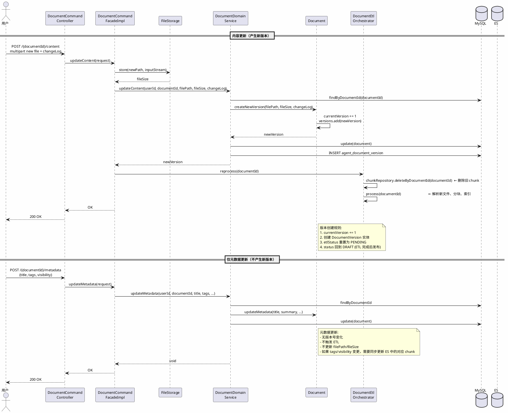
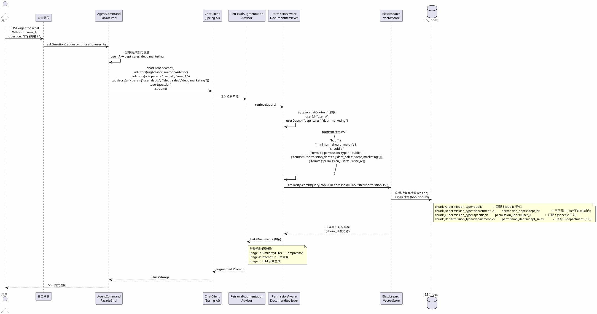
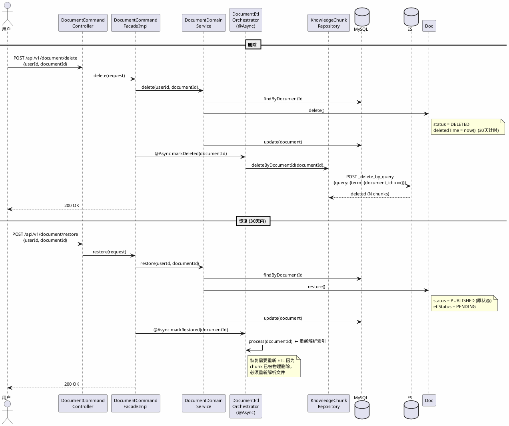

# 知识管理模块 — 详细设计

| 文档版本 | 修改日期 | 说明 |
|---------|---------|------|
| V1.0 | 2026-08-11 | 初稿，MVP 知识管理模块详细设计 |

---
<!-- TOC -->
* [知识管理模块 — 详细设计](#知识管理模块--详细设计)
  * [1. 设计概述](#1-设计概述)
    * [1.1 模块定位](#11-模块定位)
    * [1.2 与智能问答模块的关系](#12-与智能问答模块的关系)
    * [1.3 技术选型](#13-技术选型)
    * [1.4 设计原则](#14-设计原则)
    * [1.5 模块架构图](#15-模块架构图)
  * [2. 模块划分与包结构](#2-模块划分与包结构)
    * [2.1 模块依赖关系](#21-模块依赖关系)
    * [2.2 各模块新增内容](#22-各模块新增内容)
  * [3. 领域模型设计](#3-领域模型设计)
    * [3.1 Document（聚合根）](#31-document聚合根)
      * [3.1.1 字段定义](#311-字段定义)
      * [3.1.2 行为方法](#312-行为方法)
      * [3.1.3 为什么 tags 用 `List<String>` 而非独立实体？](#313-为什么-tags-用-liststring-而非独立实体)
    * [3.2 DocumentVersion（实体）](#32-documentversion实体)
      * [3.2.1 字段定义](#321-字段定义)
    * [3.3 Directory（聚合根）](#33-directory聚合根)
      * [3.3.1 字段定义](#331-字段定义)
      * [3.3.2 行为方法](#332-行为方法)
    * [3.4 KnowledgeChunk 扩展](#34-knowledgechunk-扩展)
    * [3.5 枚举设计](#35-枚举设计)
    * [3.6 仓储查询值对象](#36-仓储查询值对象)
      * [3.6.1 DocumentQuery — findByDocumentId 专用](#361-documentquery--findbydocumentid-专用)
      * [3.6.2 DocumentListQuery — findByUserId 专用](#362-documentlistquery--findbyuserid-专用)
      * [3.6.3 DocumentCountQuery — countByUserId 专用](#363-documentcountquery--countbyuserid-专用)
      * [3.6.4 KnowledgeSearchQuery — KnowledgeChunkRepository.searchWithPermission 专用](#364-knowledgesearchquery--knowledgechunkrepositorysearchwithpermission-专用)
    * [3.7 仓储接口](#37-仓储接口)
      * [3.7.1 DocumentRepository](#371-documentrepository)
      * [3.7.2 DocumentVersionRepository](#372-documentversionrepository)
      * [3.7.3 DirectoryRepository](#373-directoryrepository)
      * [3.7.4 KnowledgeChunkRepository 扩展](#374-knowledgechunkrepository-扩展)
      * [3.7.5 FileStorage](#375-filestorage)
    * [3.8 领域服务值对象](#38-领域服务值对象)
      * [3.8.1 CreateDocumentCommand — createDocument 专用](#381-createdocumentcommand--createdocument-专用)
      * [3.8.2 UpdateDocumentMetadataCommand — updateMetadata 专用](#382-updatedocumentmetadatacommand--updatemetadata-专用)
      * [3.8.3 UpdateDocumentContentCommand — updateContent 专用](#383-updatedocumentcontentcommand--updatecontent-专用)
      * [3.8.4 RollbackDocumentCommand — rollback 专用](#384-rollbackdocumentcommand--rollback-专用)
      * [3.8.5 UpdateEtlStatusCommand — updateEtlStatus 专用](#385-updateetlstatuscommand--updateetlstatus-专用)
      * [3.8.6 CreateDirectoryCommand — createDirectory 专用](#386-createdirectorycommand--createdirectory-专用)
    * [3.9 领域服务](#39-领域服务)
      * [3.9.1 DocumentDomainService](#391-documentdomainservice)
      * [3.9.2 DirectoryDomainService](#392-directorydomainservice)
    * [3.8 DocumentParser（解析器接口）](#38-documentparser解析器接口)
      * [3.8.1 ParsedDocument（值对象）](#381-parseddocument值对象)
  * [4. Facade 接口设计](#4-facade-接口设计)
    * [4.0 Command / Query 分离的设计原则](#40-command--query-分离的设计原则)
    * [4.1 DocumentCommandFacade](#41-documentcommandfacade)
    * [4.2 DocumentQueryFacade](#42-documentqueryfacade)
    * [4.3 DirectoryCommandFacade](#43-directorycommandfacade)
    * [4.4 DirectoryQueryFacade](#44-directoryqueryfacade)
    * [4.5 Request 对象设计](#45-request-对象设计)
      * [4.5.1 DocumentUploadRequest](#451-documentuploadrequest)
      * [4.5.2 DocumentUpdateMetadataRequest](#452-documentupdatemetadatarequest)
      * [4.5.3 DocumentUpdateContentRequest](#453-documentupdatecontentrequest)
      * [4.5.4 DocumentDeleteRequest / DocumentRestoreRequest](#454-documentdeleterequest--documentrestorerequest)
      * [4.5.5 DocumentRollbackRequest](#455-documentrollbackrequest)
      * [4.5.6 DocumentDetailQueryRequest / DocumentVersionListRequest / EtlStatusQueryRequest](#456-documentdetailqueryrequest--documentversionlistrequest--etlstatusqueryrequest)
      * [4.5.7 DocumentListQueryRequest](#457-documentlistqueryrequest)
      * [4.5.8 Directory Request 对象](#458-directory-request-对象)
    * [4.6 Result 对象设计](#46-result-对象设计)
      * [4.6.1 有数据返回的 Result](#461-有数据返回的-result)
      * [4.6.2 无数据返回的 Result（空 Result，保证接口兼容性）](#462-无数据返回的-result空-result保证接口兼容性)
    * [4.7 DTO 对象设计](#47-dto-对象设计)
    * [4.8 Facade 枚举定义](#48-facade-枚举定义)
    * [4.9 Facade 接口的设计约束](#49-facade-接口的设计约束)
  * [5. 应用层设计](#5-应用层设计)
    * [5.1 DocumentCommandFacadeImpl](#51-documentcommandfacadeimpl)
    * [5.2 DocumentQueryFacadeImpl](#52-documentqueryfacadeimpl)
    * [5.3 ETL 流水线设计](#53-etl-流水线设计)
      * [5.3.0 架构总览](#530-架构总览)
      * [5.3.1 DocumentEtlOrchestrator](#531-documentetlorchestrator)
      * [5.3.2 解析阶段](#532-解析阶段)
      * [5.3.3 分块策略（DocumentChunker）](#533-分块策略documentchunker)
      * [5.3.4 摘要与标签生成（DocumentEnricher）](#534-摘要与标签生成documentenricher)
      * [5.3.5 向量化与索引](#535-向量化与索引)
      * [5.3.6 异步处理配置](#536-异步处理配置)
    * [5.4 权限过滤集成（RAG 检索改造）](#54-权限过滤集成rag-检索改造)
      * [5.4.1 方案对比](#541-方案对比)
      * [5.4.2 PermissionAwareDocumentRetriever](#542-permissionawaredocumentretriever)
      * [5.4.3 RAG Advisor 参数传递](#543-rag-advisor-参数传递)
    * [5.5 组装器与转换器](#55-组装器与转换器)
  * [6. 适配器层设计](#6-适配器层设计)
    * [6.1 DocumentCommandController](#61-documentcommandcontroller)
    * [6.2 DocumentQueryController](#62-documentquerycontroller)
    * [6.3 DirectoryCommandController](#63-directorycommandcontroller)
    * [6.4 DirectoryQueryController](#64-directoryquerycontroller)
    * [6.5 前端对接方式](#65-前端对接方式)
  * [7. 基础设施层设计](#7-基础设施层设计)
    * [7.1 文件存储 — LocalFileStorage](#71-文件存储--localfilestorage)
    * [7.2 文档解析器实现](#72-文档解析器实现)
      * [7.2.1 PdfDocumentParser](#721-pdfdocumentparser)
      * [7.2.2 WordDocumentParser](#722-worddocumentparser)
      * [7.2.3 MarkdownDocumentParser](#723-markdowndocumentparser)
      * [7.2.4 HtmlDocumentParser](#724-htmldocumentparser)
      * [7.2.5 ParserRegistry](#725-parserregistry)
    * [7.3 仓储实现概述](#73-仓储实现概述)
    * [7.4 配置变更](#74-配置变更)
      * [7.4.1 application.yml 新增](#741-applicationyml-新增)
      * [7.4.2 POM 新增依赖](#742-pom-新增依赖)
  * [8. 核心流程设计](#8-核心流程设计)
    * [8.1 文档上传与 ETL 流程](#81-文档上传与-etl-流程)
    * [8.2 文档更新与版本管理流程](#82-文档更新与版本管理流程)
    * [8.3 权限过滤检索流程](#83-权限过滤检索流程)
    * [8.4 文档删除与恢复流程](#84-文档删除与恢复流程)
    * [8.5 版本回滚流程](#85-版本回滚流程)
  * [9. API 接口规范](#9-api-接口规范)
    * [9.1 文档上传](#91-文档上传)
    * [9.2 文档更新](#92-文档更新)
    * [9.3 查询文档详情](#93-查询文档详情)
    * [9.4 文档列表查询](#94-文档列表查询)
    * [9.5 删除文档（回收站）](#95-删除文档回收站)
    * [9.6 恢复文档](#96-恢复文档)
    * [9.7 版本历史](#97-版本历史)
    * [9.8 版本回滚](#98-版本回滚)
    * [9.9 目录管理](#99-目录管理)
    * [9.10 ETL 状态查询](#910-etl-状态查询)
  * [10. 数据库设计](#10-数据库设计)
    * [10.1 agent_document 表（MySQL）](#101-agent_document-表mysql)
    * [10.2 agent_document_version 表（MySQL）](#102-agent_document_version-表mysql)
    * [10.3 agent_directory 表（MySQL）](#103-agent_directory-表mysql)
  * [11. ES 索引扩展](#11-es-索引扩展)
    * [11.1 新增字段](#111-新增字段)
    * [11.2 权限过滤查询模板](#112-权限过滤查询模板)
  * [12. 异常处理](#12-异常处理)
  * [13. 实现计划](#13-实现计划)
    * [13.1 开发顺序](#131-开发顺序)
    * [13.2 关键里程碑](#132-关键里程碑)
  * [附录 A. BRD 需求追溯](#附录-a-brd-需求追溯)
  * [附录 B. 文件格式支持清单](#附录-b-文件格式支持清单)
  * [附录 C. 与智能问答模块接口约定](#附录-c-与智能问答模块接口约定)
    * [KnowledgeChunkRepository 扩展后的完整接口](#knowledgechunkrepository-扩展后的完整接口)
    * [Intelligent Q&A 模块所需的变更清单](#intelligent-qa-模块所需的变更清单)
<!-- TOC -->
---

## 1. 设计概述

### 1.1 模块定位

知识管理模块是 MVP 的第二个核心 P0 功能（与智能问答并级），负责知识文档的全生命周期管理——从上传、解析、分块、向量化入库（ETL），到目录组织、标签分类、版本控制、权限管理、删除恢复。它是 RAG 问答的**上游数据源头**：知识入库后才能被检索、被 LLM 引用回答。

### 1.2 与智能问答模块的关系

```
┌─────────────────────────────────────────────────────┐
│                    知识管理模块                        │
│  upload → parse → chunk → enrich → embed → index    │
│                                          ↓          │
│                              写入 ES zsagent_knowledge│
└─────────────────────────────────────────────────────┘
                                           ↓
                              检索时附带权限过滤条件
                                           ↓
┌─────────────────────────────────────────────────────┐
│                   智能问答模块（已有）                  │
│          RAG 检索 → 后处理 → LLM 生成 → SSE          │
└─────────────────────────────────────────────────────┘
```

- **上游（知识管理）**：负责"把知识放进去"——解析文档、生成摘要/标签、分块、向量化、索引到 ES，并管理文档元数据（版本、权限、目录）。
- **下游（智能问答）**：负责"把知识取出来"——根据用户问题检索相关 chunk，经 LLM 加工后流式返回答案。需要感知文档的**权限范围**，确保用户只能搜到有权限的文档。
- **共用资源**：ES `zsagent_knowledge` 索引（知识管理写入，问答检索读出）；阿里云 DashScope Embedding（知识管理批量向量化，问答实时向量化）。

### 1.3 技术选型

| 组件 | 选型 | 说明 |
|------|------|------|
| 文档解析 — PDF | Apache PDFBox 2.x | 提取文本 + 页码，纯 Java 无原生依赖 |
| 文档解析 — Word | Apache POI 5.x | .docx 文本提取，含标题层级 |
| 文档解析 — Markdown | Flexmark 0.64.x | 完整 CommonMark 支持 + 扩展 |
| 文档解析 — HTML | Jsoup 1.17.x | 正文提取，去标签/脚本 |
| 文档解析 — 纯文本 | — | UTF-8 直接读取 |
| 文件存储 | 本地文件系统（MVP） | 后续可平滑切换到 MinIO/OSS |
| 文本分块 | 自研 RecursiveCharacterTextSplitter | 递归按段落 → 句子 → 字符切分 |
| 摘要/标签生成 | LLM (DeepSeek) | 取文档前 2000 字，由 LLM 生成摘要和标签 |
| 向量化 | 阿里云 DashScope text-embedding-v4 | 与问答模块共用同一模型，1024 维 |
| 异步 ETL | Spring `@Async` + 自定义 ThreadPool | MVP 阶段不引入 MQ，后续可升级 |

### 1.4 设计原则

- 遵循项目已有 DDD/CQRS 架构，知识管理作为独立聚合 (`knowledge`)，与 `agent` 聚合并列
- `domain` 层保持框架无关，只依赖 rapidf-domain
- ETL 编排逻辑放在 `application` 层，解析器实现放在 `infrastructure` 层
- 文档权限信息随 chunk 一同写入 ES，检索时做 ES 端过滤（不在应用层后处理过滤），保证召回数量
- userId 显式传递至所有层级（遵循 ADR-002）
- 维管理严格遵循"写操作产生版本"原则，不可变历史

### 1.5 模块架构图

```plantuml
@startuml 知识管理模块架构
skinparam packageStyle rectangle
skinparam componentStyle rectangle
skinparam backgroundColor #FEFEFE
skinparam defaultFontSize 12

package "前端 (独立部署)" as Frontend #E8F5E9 {
  [文档管理界面] as UI
}

package "适配器层 (app/adapter)" as Adapter #E3F2FD {
  [DocumentCommandController\n(上传/更新/删除/恢复)] as DocCmdCtrl
  [DocumentQueryController\n(列表/详情/搜索/版本)] as DocQueryCtrl
  [DirectoryController\n(目录CURD + 树查询)] as DirCtrl
}

package "应用层 (app/application)" as Application #FFF3E0 {
  [DocumentCommandFacadeImpl] as DocCmdFacade
  [DocumentQueryFacadeImpl] as DocQueryFacade
  [DirectoryCommandFacadeImpl] as DirCmdFacade
  [DirectoryQueryFacadeImpl] as DirQueryFacade
  [DocumentEtlOrchestrator\n(ETL 异步编排)] as ETL
  [DocumentChunker\n(文本分块策略)] as Chunker
  [DocumentEnricher\n(LLM 摘要/标签)] as Enricher
  [PermissionAwareDocumentRetriever\n(RAG 权限过滤适配)] as PermRetriever
}

package "领域层 (app/domain)" as Domain #FCE4EC {
  [Document\n(聚合根)] as Doc
  [DocumentVersion\n(实体)] as Ver
  [Directory\n(聚合根)] as Dir
  [DocumentDomainService] as DocSvc
  [DirectoryDomainService] as DirSvc
  [DocumentParser\n(解析器接口)] as ParserAPI
  [FileStorage\n(文件存储接口)] as StorageAPI
  [DocumentRepository\n(仓储接口)] as DocRepo
  [DirectoryRepository\n(仓储接口)] as DirRepo
}

package "基础设施层 (app/infrastructure)" as Infra #F3E5F5 {
  package "acl" as ACL #EDE7F6 {
    [DocumentRepositoryImpl\n(MyBatis)] as DocRepoImpl
    [DirectoryRepositoryImpl\n(MyBatis)] as DirRepoImpl
    [KnowledgeChunkRepositoryImpl\n(ES VectorStore)] as ChunkRepoImpl
    [LocalFileStorage\n(本地文件存储)] as LocalFS
    [PdfDocumentParser] as PdfParser
    [WordDocumentParser] as WordParser
    [MarkdownDocumentParser] as MdParser
    [HtmlDocumentParser] as HtmlParser
    [ParserRegistry\n(解析器注册中心)] as ParserReg
  }
  package "dal" as DAL #E8EAF6 {
    [DocumentPO / DocumentVersionPO\n/ DirectoryPO] as POs
    [UdfMapper + XML] as Mappers
  }
}

cloud "外部 AI 服务" as AICloud #ECEFF1 {
  [DeepSeek API\n(摘要/标签生成)] as DeepSeek
  [阿里云 DashScope\n(text-embedding-v4)] as Embedding
}

database "MySQL 8\n(文档元数据)" as MySQL #C8E6C9
database "Elasticsearch 8.x\n(向量+全文检索)" as ES #BBDEFB
storage "本地文件系统\n(文档存储)" as Disk #FFE0B2

' 依赖关系
UI -down-> DocCmdCtrl : "上传/更新/删除"
UI -down-> DocQueryCtrl : "列表/详情"
UI -down-> DirCtrl : "目录管理"

DocCmdCtrl -down-> DocCmdFacade
DocQueryCtrl -down-> DocQueryFacade
DirCtrl -down-> DirCmdFacade
DirCtrl -down-> DirQueryFacade

DocCmdFacade -down-> DocSvc
DocCmdFacade -down-> ETL : "异步触发 ETL"
DocQueryFacade -down-> DocRepo

DirCmdFacade -down-> DirSvc
DirQueryFacade -down-> DirRepo

ETL -down-> ParserAPI : "解析文件"
ETL -down-> Chunker : "文本分块"
ETL -down-> Enricher : "LLM 摘要/标签"
ETL -down-> ChunkRepoImpl : "索引到 ES"
ETL -down-> Embedding : "向量化"

DocSvc -down-> Doc : "管理文档生命周期"
DocSvc -down-> StorageAPI : "文件存取"

DirSvc -down-> Dir

DocRepo -down-> DocRepoImpl
DirRepo -down-> DirRepoImpl

DocRepoImpl -down-> MySQL
DirRepoImpl -down-> MySQL
ChunkRepoImpl -down-> ES : "向量+权限过滤"

LocalFS -down-> Disk

PdfParser -up-> ParserAPI
WordParser -up-> ParserAPI
MdParser -up-> ParserAPI
HtmlParser -up-> ParserAPI

note bottom of ETL
  异步 ETL 流水线:
  1. 解析: DocumentParser → ParsedDocument
  2. 分块: DocumentChunker → List<KnowledgeChunk>
  3. 增强: DocumentEnricher → 摘要 + 候选标签
  4. 向量化: EmbeddingModel → float[1024]
  5. 索引: KnowledgeChunkRepository.index()
  每一步更新 document.etlStatus
end note

@enduml
```



---

## 2. 模块划分与包结构

### 2.1 模块依赖关系

```
facade (接口 + DTO)
  ↑
adapter (Controller)
  ↑
application (ETL 编排、Facade 实现)
  ↑           ↑
domain     infrastructure/acl
(领域模型)  (文件存储、解析器、ES向量存储)
```

### 2.2 各模块新增内容

```
app/facade/src/main/java/.../facade/knowledge/
├── api/
│   ├── DocumentCommandFacade.java        ← upload, updateMetadata, updateContent, delete, restore, rollback
│   ├── DocumentQueryFacade.java          ← getDocument, listDocuments, listVersions, getEtlStatus
│   ├── DirectoryCommandFacade.java       ← create, rename, move, delete
│   └── DirectoryQueryFacade.java         ← listChildren, tree
├── dto/
│   ├── DocumentDTO.java
│   ├── DocumentVersionDTO.java
│   └── DirectoryDTO.java
├── request/
│   ├── DocumentUploadRequest.java
│   ├── DocumentUpdateMetadataRequest.java
│   ├── DocumentUpdateContentRequest.java
│   ├── DocumentDeleteRequest.java
│   ├── DocumentRestoreRequest.java
│   ├── DocumentRollbackRequest.java
│   ├── DocumentDetailQueryRequest.java
│   ├── DocumentListQueryRequest.java
│   ├── DocumentVersionListRequest.java
│   ├── EtlStatusQueryRequest.java
│   ├── DirectoryCreateRequest.java
│   ├── DirectoryRenameRequest.java
│   ├── DirectoryMoveRequest.java
│   ├── DirectoryDeleteRequest.java
│   └── DirectoryChildrenQueryRequest.java
├── result/
│   ├── DocumentUploadResult.java
│   ├── DocumentUpdateMetadataResult.java
│   ├── DocumentUpdateContentResult.java
│   ├── DocumentDeleteResult.java
│   ├── DocumentRestoreResult.java
│   ├── DocumentRollbackResult.java
│   ├── DocumentDetailResult.java
│   ├── DocumentVersionListResult.java
│   ├── EtlStatusResult.java
│   ├── DirectoryCreateResult.java
│   ├── DirectoryRenameResult.java
│   ├── DirectoryMoveResult.java
│   └── DirectoryDeleteResult.java
└── enums/
    ├── DocumentFormatEnum.java
    ├── DocumentStatusEnum.java
    ├── VisibilityEnum.java
    └── EtlStatusEnum.java

app/domain/src/main/java/.../domain/knowledge/
├── model/
│   ├── Document.java                     ← @DomainAggregate
│   ├── DocumentVersion.java              ← @DomainEntity
│   └── Directory.java                    ← @DomainAggregate
├── enums/
│   ├── DocumentFormat.java
│   ├── DocumentStatus.java
│   ├── Visibility.java
│   └── EtlStatus.java
├── repository/
│   ├── DocumentRepository.java
│   ├── DocumentVersionRepository.java
│   ├── DirectoryRepository.java
│   └── FileStorage.java                  ← 文件存储接口（领域 SPI）
├── service/
│   ├── DocumentDomainService.java
│   ├── DirectoryDomainService.java
│   ├── DocumentParser.java               ← 文档解析器接口（领域 SPI）
│   └── impl/
│       ├── DocumentDomainServiceImpl.java
│       └── DirectoryDomainServiceImpl.java
└── valueobject/
    ├── DocumentQuery.java                 ← findByDocumentId 查询条件
    ├── DocumentListQuery.java             ← findByUserId 查询条件
    ├── DocumentCountQuery.java            ← countByUserId 查询条件
    ├── KnowledgeSearchQuery.java          ← knowledge searchWithPermission 检索条件
    ├── CreateDocumentCommand.java         ← createDocument 命令
    ├── UpdateDocumentMetadataCommand.java ← updateMetadata 命令
    ├── UpdateDocumentContentCommand.java  ← updateContent 命令
    ├── RollbackDocumentCommand.java       ← rollback 命令
    ├── UpdateEtlStatusCommand.java        ← updateEtlStatus 命令
    ├── CreateDirectoryCommand.java        ← createDirectory 命令
    ├── ParsedDocument.java               ← 解析后的结构化文档
    └── Section.java                       ← 文档章节

app/application/src/main/java/.../application/knowledge/
├── DocumentCommandFacadeImpl.java
├── DocumentQueryFacadeImpl.java
├── DirectoryCommandFacadeImpl.java
├── DirectoryQueryFacadeImpl.java
├── assembler/
│   ├── DocumentAssembler.java
│   └── DirectoryAssembler.java
├── converter/
│   ├── DocumentConverter.java
│   └── DirectoryConverter.java
├── handler/
│   ├── DocumentUploadHandler.java
│   └── DocumentUpdateHandler.java
├── etl/
│   ├── DocumentEtlOrchestrator.java      ← ETL 异步编排器
│   ├── DocumentChunker.java              ← 文本分块策略
│   └── DocumentEnricher.java             ← LLM 摘要/标签生成
├── retriever/
│   └── PermissionAwareDocumentRetriever.java  ← RAG 权限过滤适配
└── validator/
    └── DocumentUploadValidator.java

app/infrastructure/acl/src/main/java/.../infra/acl/
├── repository/
│   ├── DocumentRepositoryImpl.java
│   ├── DocumentVersionRepositoryImpl.java
│   └── DirectoryRepositoryImpl.java
├── converter/
│   └── DocumentInfraConverter.java
├── storage/
│   └── LocalFileStorage.java            ← FileStorage 的本地实现
└── parser/
    ├── PdfDocumentParser.java
    ├── WordDocumentParser.java
    ├── MarkdownDocumentParser.java
    ├── HtmlDocumentParser.java
    ├── TxtDocumentParser.java
    └── ParserRegistry.java               ← 解析器注册中心（按格式路由）

app/infrastructure/dal/
├── po/
│   ├── DocumentPO.java
│   ├── DocumentVersionPO.java
│   └── DirectoryPO.java
└── mapper/udf/
    ├── DocumentUdfMapper.java + XML
    ├── DocumentVersionUdfMapper.java + XML
    └── DirectoryUdfMapper.java + XML

app/adapter/src/main/java/.../adapter/web/knowledge/
├── DocumentCommandController.java
├── DocumentQueryController.java
├── DirectoryCommandController.java
└── DirectoryQueryController.java
```

---

## 3. 领域模型设计

领域层是整个知识管理模块的核心。Document 和 Directory 是两个独立的聚合根，分别管理知识文档和目录结构；DocumentVersion 作为 Document 聚合内的实体存在。

---

### 3.1 Document（聚合根）

**为什么是聚合根？** 一个"文档"是知识管理的操作边界——上传、更新、删除、恢复、版本回滚都以文档为维度。文档内部包含版本历史（`List<DocumentVersion>`），版本的增删必须通过文档来管控，不能绕过文档直接操作版本。

#### 3.1.1 字段定义

```java
@DomainAggregate
public class Document extends Aggregate<String> {

    private String documentId;            // ① 聚合根唯一标识
    private String title;                 // ② 文档标题
    private String summary;               // ③ 自动生成摘要
    private DocumentFormat format;        // ④ 文件格式
    private Long fileSize;                // ⑤ 文件大小（字节）
    private String filePath;              // ⑥ 当前版本文件存储路径
    private String directoryId;           // ⑦ 所属目录
    private List<String> tags;            // ⑧ 标签列表
    private Visibility visibility;        // ⑨ 可见范围
    private List<String> visibleTo;       // ⑩ 特定可见对象（用户ID或部门ID）
    private DocumentStatus status;        // ⑪ 文档状态
    private EtlStatus etlStatus;          // ⑫ ETL 处理状态
    private String etlErrorMessage;       // ⑬ ETL 错误信息
    private Integer currentVersion;       // ⑭ 当前版本号
    private List<DocumentVersion> versions; // ⑮ 版本列表
}
```

| 字段 | 类型 | 定义原因 |
|------|------|---------|
| ① `documentId` | String (UUID) | **聚合根标识。** 由后端在创建文档时生成 UUID。与对话模块不同（对话 ID 由前端生成以消除首问延迟），文档创建不涉及用户实时等待，后端生成即可 |
| ② `title` | String | **文档标题。** 用户上传时可指定，未指定则从文件名提取（去掉扩展名）。与对话标题自动截取首条问题不同——文档标题应支持用户自定义编辑 |
| ③ `summary` | String | **自动摘要。** ETL 阶段由 LLM 根据文档内容生成（≤200 字），展示在文档列表卡片和搜索摘要中。不要求用户手动填写——降低操作成本 |
| ④ `format` | DocumentFormat | **文件格式枚举。** 决定用什么解析器处理。枚举值：PDF, DOCX, MD, HTML, TXT 等 |
| ⑤ `fileSize` | Long | **文件大小（字节）。** 用于前端展示、存储容量统计、上传大小校验（BRD: 单文件 ≤100MB） |
| ⑥ `filePath` | String | **文件存储路径。** 是 FileStorage 的 key，不是绝对路径——屏蔽底层存储实现（本地文件系统 / MinIO / OSS）。例如 `/zsagent/documents/{documentId}/v1.pdf` |
| ⑦ `directoryId` | String (nullable) | **目录归属。** 可为空，表示放在根目录下。与 Directory 聚合是对等引用（非聚合内包含），通过 directoryId 关联 |
| ⑧ `tags` | List\<String\> | **标签列表。** ETL 阶段由 LLM 自动生成候选标签，用户可手动增删 |
| ⑨ `visibility` | Visibility | **可见范围。** PUBLIC = 全员可见，DEPARTMENT = 指定部门可见，SPECIFIC = 指定用户可见。ES 检索时据此构建权限过滤条件 |
| ⑩ `visibleTo` | List\<String\> | **可见对象列表。** visibility=DEPARTMENT 时存部门 ID 列表，visibility=SPECIFIC 时存用户 ID 列表。用 JSON 数组存储 |
| ⑪ `status` | DocumentStatus | **生命周期状态。** DRAFT（草稿，不可检索）→ PUBLISHED（已发布，可检索）→ ARCHIVED（归档，仍可检索但不活跃）→ DELETED（回收站，不可检索，30 天可恢复） |
| ⑫ `etlStatus` | EtlStatus | **ETL 处理状态。** PENDING → PARSING → CHUNKING → ENRICHING → EMBEDDING → INDEXING → COMPLETED / FAILED。前端轮询此状态展示处理进度 |
| ⑬ `etlErrorMessage` | String | **ETL 失败原因。** 仅 etlStatus=FAILED 时有值，供用户排查（如"文件已损坏，无法解析"） |
| ⑭ `currentVersion` | Integer | **当前版本号。** 从 1 开始自增。每次更新文档内容（非仅元数据修改）时 +1 |
| ⑮ `versions` | List\<DocumentVersion\> | **版本历史列表。** 聚合内实体集合。查询版本历史时一次加载，避免 N+1 |
| `creator` | String (继承) | 创建人 userId |
| `createTime` | LocalDateTime (继承) | 创建时间 |
| `updateTime` | LocalDateTime (继承) | 最后更新时间（通过 Aggregate 基类的 `update()` 方法刷新） |

#### 3.1.2 行为方法

```java
// 发布文档——ETL 完成后调用，将状态从 DRAFT 转为 PUBLISHED
public void publish()

// 归档文档
public void archive()

// 删除文档——移入回收站，设置删除时间，30 天后可物理删除
public void delete()

// 从回收站恢复
public void restore()

// 创建新版本——仅当文件内容变更时调用（标题/标签变更不产生新版本）
public DocumentVersion createNewVersion(String filePath, Long fileSize, String changeLog)

// 更新元数据——标题、标签、目录、可见范围，不产生新版本
public void updateMetadata(String title, String summary, String directoryId,
                            List<String> tags, Visibility visibility, List<String> visibleTo)

// 更新 ETL 状态
public void updateEtlStatus(EtlStatus status)

// 标记 ETL 失败
public void markEtlFailed(String errorMessage)
```

| 方法 | 设计理由 |
|------|---------|
| `publish()` | **显式状态转换。** 只有 ETL 成功完成的文档才能发布。DRAFT 状态的文档不可被检索——但 chunk 已经写入 ES（带 deleted 标记），发布时批量更新 ES 的 deleted=false |
| `archive()` | **归档而非删除。** BRD 未强制要求归档功能，但预留接口用于后续"低频文档降冷"场景 |
| `delete()` | **软删除进回收站。** 设置 status=DELETED，同时会将 ES 中的对应 chunk 标记 deleted=true（或先保留，恢复时改回）。聚合根内记录删除时间用于 30 天自动清理定时任务 |
| `restore()` | **从回收站恢复。** 将 status 从 DELETED 改为 PUBLISHED，并恢复 ES chunk 可见性 |
| `createNewVersion(filePath, fileSize, changeLog)` | **版本创建。** 每次文件内容更新时调用：currentVersion+1 → 创建 DocumentVersion 实体 → 追加到 versions 列表。返回新版本对象供调用方持久化 |
| `updateMetadata(...)` | **元数据独立更新。** 标题、标签、目录等变更不产生新版本——只有文件内容变更才产生版本。两类操作分离避免冗余版本记录 |
| `updateEtlStatus(status)` | **ETL 进度追踪。** 在 ETL 流水线的每个阶段开始时调用，前端轮询此字段以展示进度条 |
| `markEtlFailed(errorMessage)` | **ETL 失败记录。** 供用户和管理员排查问题（文件损坏、格式不支持等） |

#### 3.1.3 为什么 tags 用 `List<String>` 而非独立实体？

```
方案 A（采用）:  Document.tags = ["产品介绍", "安装指南"]
方案 B（不采用）: Tag 独立聚合，Document.tags 存 tagId 列表

选择理由:
1. MVP 阶段标签只是展示和搜索过滤的标签，不需要统计、层级、关联等高级能力
2. 标签随文档一起查询（详情页展示），独立实体导致每次查文档都要 JOIN tag 表
3. ES 中标签作为 keyword 数组字段，用 List<String> 直接映射更简单
4. V2 若需要"标签云 / 标签合并 / 标签层级"，再升级为独立聚合也不迟
```

---

### 3.2 DocumentVersion（实体）

**为什么是实体而非值对象？** 每个版本有独立唯一标识（versionId），有独立的生命周期（虽然不修改，但它有自己的文件路径和创建时间）。版本之间通过 versionNumber 排序，是可区分的。

#### 3.2.1 字段定义

```java
@DomainEntity
public class DocumentVersion extends Entity<String> {

    private String versionId;             // ① 版本唯一标识
    private String documentId;            // ② 所属文档 ID
    private Integer versionNumber;        // ③ 版本号（1, 2, 3...）
    private String filePath;              // ④ 该版本文件存储路径
    private Long fileSize;                // ⑤ 该版本文件大小
    private String changeLog;             // ⑥ 变更说明
}
```

| 字段 | 类型 | 定义原因 |
|------|------|---------|
| ① `versionId` | String (UUID) | **实体唯一标识。** 前端回滚时需指定 versionId |
| ② `documentId` | String | **反向引用。** 数据库查询索引字段 |
| ③ `versionNumber` | Integer | **版本序号。** 从 1 开始自增，前端展示"V1 / V2 / V3"。排序字段，同时用于乐观锁校验（更新时检查 currentVersion 是否匹配） |
| ④ `filePath` | String | **该版本的文件存储路径。** 每个版本的文件独立存储，互不覆盖。回滚时从对应路径读取文件重新解析即可 |
| ⑤ `fileSize` | Long | **文件大小。** 用于存储容量统计和前端展示 |
| ⑥ `changeLog` | String | **变更说明。** 用户更新时选填，版本历史列表中展示。长度限制 1000 字符 |
| `creator` | String (继承) | 版本创建人 userId |
| `updater` | String (继承) | 更新人（业务上不更新，但遵循基类规范保留） |
| `createTime` | LocalDateTime (继承) | 版本创建时间 |
| `updateTime` | LocalDateTime (继承) | 更新时间（遵循基类规范保留） |
| `deleted` | (继承) | 逻辑删除标记（遵循基类规范保留） |

> **说明：** 版本记录遵循 `Entity<T>` 基类及项目统一表结构规范，保留 `updater` / `updateTime` / `deleted` 字段。虽然版本历史在业务上是审计记录、创建后不修改，但"不可变"通过领域层不提供修改/删除行为方法来实现，而非省略标准字段。回滚操作是创建一个**新版本**（内容与指定历史版本相同），而非修改已有版本。

---

### 3.3 Directory（聚合根）

**为什么是独立聚合而非 Document 内的属性？** 目录有自己的生命周期——创建、重命名、移动、删除——可以独立于文档操作。目录下有子目录和多篇文档，是独立的组织维度。Document 只存一个 `directoryId` 引用，不持有目录实体。

#### 3.3.1 字段定义

```java
@DomainAggregate
public class Directory extends Aggregate<String> {

    private String directoryId;           // ① 目录唯一标识
    private String parentId;              // ② 父目录ID（根目录为 null）
    private String name;                  // ③ 目录名称
    private Integer sortOrder;            // ④ 排序序号
}
```

| 字段 | 类型 | 定义原因 |
|------|------|---------|
| ① `directoryId` | String (UUID) | **聚合根标识。** |
| ② `parentId` | String (nullable) | **父子层级关系。** null 表示根目录。查询子目录时 `WHERE parent_id = ?`。删除目录前需要检查是否有子节点 |
| ③ `name` | String | **目录名称。** 同级目录名称唯一约束（数据库 UNIQUE KEY `uk_parent_name`） |
| ④ `sortOrder` | Integer | **同级排序。** 默认 0，值越小越靠前。前端可拖拽排序后批量更新 |

#### 3.3.2 行为方法

```java
// 修改目录名称
public void rename(String newName)

// 移动目录（改变父级）
public void moveTo(String newParentId)

// 检查是否可以删除（无子目录 + 无关联文档）
public boolean canDelete()
```

---

### 3.4 KnowledgeChunk 扩展

> **说明：** `KnowledgeChunk` 是 `agent` 聚合下的领域实体，由智能问答模块定义。知识管理模块需要在已有字段基础上**新增权限和标签字段**，以便 ETL 流程填充并在检索时过滤。

```java
// 在已有字段基础上新增：
@DomainEntity
public class KnowledgeChunk extends Entity<String> {

    // ===== 已有字段（不变）=====
    private String chunkId;
    private String documentId;
    private String documentTitle;
    private String content;
    private float[] embedding;
    private Float score;
    private Map<String, Object> metadata;

    // ===== 新增字段 =====
    private List<String> tags;            // ① 文档标签（继承自 Document.tags）
    private String permissionType;        // ② 可见类型：PUBLIC / DEPARTMENT / SPECIFIC
    private List<String> permissionDepts; // ③ 可见部门 ID 列表
    private List<String> permissionUsers; // ④ 可见用户 ID 列表
}
```

| 字段 | 定义原因 |
|------|---------|
| ① `tags` | **标签过滤。** 写入 ES keyword 数组，后续支持按标签搜索（"只看'产品手册'标签的文档"） |
| ② `permissionType` | **权限过滤主字段。** PUBLIC 时无需进一步过滤；DEPARTMENT / SPECIFIC 时结合 ③ 或 ④ 过滤 |
| ③ `permissionDepts` | **部门级权限数据。** 从 Document.visibleTo 中提取部门 ID（根据 visibility=DEPARTMENT） |
| ④ `permissionUsers` | **用户级权限数据。** 从 Document.visibleTo 中提取用户 ID（根据 visibility=SPECIFIC） |

> **设计决策：为什么权限数据冗余在每个 chunk 中？** ES 中没有 JOIN 概念，chunk 必须自包含权限信息才能做 ES 端过滤。如果不在 chunk 中冗余，就只能应用层后处理过滤（已经被 5.4.1 节否决——会减少召回量）。

---

### 3.5 枚举设计

```java
// 文档格式
public enum DocumentFormat implements BaseEnum<String> {
    PDF("pdf", "PDF"),
    DOCX("docx", "Word 文档"),
    MD("md", "Markdown"),
    HTML("html", "HTML"),
    TXT("txt", "纯文本"),
    XLSX("xlsx", "Excel 表格"),      // MVP 预留，表格解析在 V2
    PPTX("pptx", "PowerPoint"),      // MVP 预留
    CSV("csv", "CSV"),               // MVP 预留
    IMAGE("image", "图片（需 OCR）"), // V2 支持
    OTHER("other", "其他");
}

// 文档状态
public enum DocumentStatus implements BaseEnum<String> {
    DRAFT("draft", "草稿"),           // 上传后 ETL 未完成的中间态
    PUBLISHED("published", "已发布"),  // 正常可检索状态
    ARCHIVED("archived", "已归档"),    // 仍可检索但不活跃
    DELETED("deleted", "已删除");      // 回收站，不可检索
}

// 可见范围
public enum Visibility implements BaseEnum<String> {
    PUBLIC("public", "全员可见"),
    DEPARTMENT("department", "指定部门"),
    SPECIFIC("specific", "指定人员");
}

// ETL 处理状态
public enum EtlStatus implements BaseEnum<String> {
    PENDING("pending", "等待处理"),
    PARSING("parsing", "正在解析"),
    CHUNKING("chunking", "正在分块"),
    ENRICHING("enriching", "正在生成摘要"),
    EMBEDDING("embedding", "正在向量化"),
    INDEXING("indexing", "正在索引"),
    COMPLETED("completed", "已完成"),
    FAILED("failed", "处理失败");
}
```

| 设计决策 | 理由 |
|---------|------|
| **实现 `BaseEnum<String>`** | 项目统一规范，序列化存 code |
| **DocumentStatus 区分 DRAFT 和 PUBLISHED** | ETL 未完成时文档不可检索。前端展示"处理中"，搜索不返回。与 BRD "从上传到可检索 ≤10 分钟"对应——COMPLETED 后自动 PUBLISHED |
| **Visibility 单独定义** | 权限模型的核心，直接映射到 ES permission_type 字段 |
| **EtlStatus 细粒度状态** | 长流程需要细粒度追踪。前端用步骤条展示进度（"解析完成 → 正在分块 → 正在向量化..."） |

---

### 3.6 仓储查询值对象

遵循"方法参数不超过 2 个"的编码规范，将多参数查询封装为每个方法专属的值对象——每个值对象内聚该方法的全部入参，避免散列参数传递。

#### 3.6.1 DocumentQuery — findByDocumentId 专用

```java
/**
 * 单文档查询条件 —— 封装 findByDocumentId 所需的全部参数。
 */
@ValueObject
public record DocumentQuery(
    String userId,
    List<String> userDepts,
    String documentId
) {}
```

| 字段 | 定义原因 |
|------|---------|
| `userId` | **操作主体标识。** 权限过滤的基准——SPECIFIC 可见范围时精确匹配 |
| `userDepts` | **部门列表而非单个部门。** 用户可能属于多个部门（如兼任），权限校验需包含所有所属部门 |
| `documentId` | 目标文档ID |

#### 3.6.2 DocumentListQuery — findByUserId 专用

```java
/**
 * 文档列表查询条件 —— 封装 findByUserId 所需的筛选参数。
 * Pagination 独立传入：分页是查询控制参数，不属于筛选条件，概念上应当分离。
 */
@ValueObject
public record DocumentListQuery(
    String userId,
    List<String> userDepts,
    String directoryId,
    DocumentStatus status,
    String keyword
) {}
```

| 字段 | 定义原因 |
|------|---------|
| `userId` | **操作主体标识。** |
| `userDepts` | **部门列表。** 权限校验包含所有所属部门 |
| `directoryId` | **按目录过滤。** 可空，表示不限目录 |
| `status` | **按状态过滤。** 可空，表示所有状态（需排除 DELETED） |
| `keyword` | **标题/标签模糊搜索。** 可空 |

#### 3.6.3 DocumentCountQuery — countByUserId 专用

```java
/**
 * 文档计数查询条件 —— 封装 countByUserId 所需的全部参数。
 * 与 DocumentListQuery 字段重叠（仅缺少 pagination），但语义不同（count vs list），
 * 独立定义避免 pagination 字段在 count 场景中为 null 的语义歧义。
 */
@ValueObject
public record DocumentCountQuery(
    String userId,
    List<String> userDepts,
    String directoryId,
    DocumentStatus status,
    String keyword
) {}
```

| 字段 | 定义原因 |
|------|---------|
| `userId` | **操作主体标识。** |
| `userDepts` | **部门列表。** |
| `directoryId` | **按目录过滤。** 可空 |
| `status` | **按状态过滤。** 可空 |
| `keyword` | **标题/标签模糊搜索。** 可空 |

#### 3.6.4 KnowledgeSearchQuery — KnowledgeChunkRepository.searchWithPermission 专用

```java
/**
 * 知识块权限检索条件 —— 封装 searchWithPermission 所需的全部参数。
 */
@ValueObject
public record KnowledgeSearchQuery(
    String query,
    int topK,
    String userId,
    List<String> userDepts
) {}
```

| 字段 | 定义原因 |
|------|---------|
| `query` | **查询文本。** 原始自然语言问题，由实现层负责向量化 |
| `topK` | **返回数量上限。** RAG 检索时传入 10，留给后处理过滤 |
| `userId` | **当前用户 ID。** 构建 ES 权限过滤 DSL 时用于 SPECIFIC 可见范围匹配 |
| `userDepts` | **当前用户所属部门列表。** 构建 ES 权限过滤 DSL 时用于 DEPARTMENT 可见范围匹配 |

---

### 3.7 仓储接口

#### 3.7.1 DocumentRepository

```java
public interface DocumentRepository {

    /** 新建文档 */
    void save(Document document);

    /** 按ID查询（含权限校验——只能查自己有权限的） */
    Document findByDocumentId(DocumentQuery query);

    /** 分页查询文档列表（用户可见范围内） */
    List<Document> findByUserId(DocumentListQuery query, Pagination pagination);

    /** 统计文档数（用户可见范围内） */
    int countByUserId(DocumentCountQuery query);

    /** 更新文档（元数据, 状态, ETL状态） */
    void update(Document document);

    /** 按目录统计文档数（删除目录前校验） */
    int countByDirectoryId(String directoryId);
}
```

| 方法 | 设计理由 |
|------|---------|
| `findByDocumentId(query)` | **接口层强制权限校验。** `DocumentQuery` 封装 userId + userDepts + documentId，入参只有一个对象 |
| `findByUserId(query, pagination)` | **多维度筛选。** `DocumentListQuery` 内聚 userId / userDepts / directoryId / status / keyword 五个筛选维度；`Pagination` 作为分页控制参数独立传入 |
| `countByUserId(query)` | **与 findByUserId 筛选逻辑一致**，仅返回类型不同。使用独立的 `DocumentCountQuery`（不含 pagination，语义更清晰） |
| `countByDirectoryId(directoryId)` | **删除目录前的安全校验。** 目录下有文档时禁止删除 |

#### 3.7.2 DocumentVersionRepository

```java
public interface DocumentVersionRepository {

    /** 批量保存版本记录 */
    void save(List<DocumentVersion> versions);

    /** 查询文档的所有版本 */
    List<DocumentVersion> findByDocumentId(String documentId);

    /** 查询单个版本 */
    DocumentVersion findByVersionId(String versionId);
}
```

| 设计要点 | 说明 |
|---------|------|
| **批量保存** | 每次文档内容变更产生一个新版本，一次 INSERT 一条 |
| **无 update/delete** | 版本记录不可变，接口不提供修改入口 |
| **无分页** | MVP 阶段版本数有限（< 1000），一次查询全部。V2 按需加分页 |

#### 3.7.3 DirectoryRepository

```java
public interface DirectoryRepository {

    void save(Directory directory);

    Directory findByDirectoryId(String directoryId);

    /** 查询指定父目录下的所有子目录 */
    List<Directory> findByParentId(String parentId);

    /** 查询用户创建的所有目录（用于构建目录树） */
    List<Directory> findAll();

    void update(Directory directory);

    /** 软删除目录 */
    void delete(String directoryId);

    /** 统计子目录数 */
    int countByParentId(String parentId);
}
```

#### 3.7.4 KnowledgeChunkRepository 扩展

```java
// 在已有 KnowledgeChunkRepository 接口中新增两个方法：

public interface KnowledgeChunkRepository {

    // ===== 已有方法 =====
    List<KnowledgeChunk> search(String query, int topK);
    void index(List<KnowledgeChunk> chunks);

    // ===== 新增方法 =====

    /**
     * 带权限过滤的语义检索。
     *
     * @param query 封装查询文本、topK、userId、userDepts 的检索条件
     * @return 用户可见的 chunk 列表
     */
    List<KnowledgeChunk> searchWithPermission(KnowledgeSearchQuery query);

    /**
     * 按文档 ID 批量删除 chunk（逻辑删除）。
     * 文档更新或删除时调用，用新的 chunk 替换或标记 deleted=true。
     */
    void deleteByDocumentId(String documentId);
}
```

| 方法 | 设计理由 |
|------|---------|
| `searchWithPermission(query)` | **ES 端权限过滤。** `KnowledgeSearchQuery` 封装全部检索条件，在 ES 查询中追加 `should` 子句：`permission_type=PUBLIC OR permission_depts IN (userDepts) OR permission_users = userId`。ES 层过滤保证召回数量不因权限过滤而低于 topK |
| `deleteByDocumentId(documentId)` | **批量清理。** 文档更新时旧 chunk 需全部移除。ES 的 `delete_by_query` 比逐条 delete 高效。物理删除而非逻辑删除——旧版本 chunk 在 ES 中没有恢复价值，回滚时重新解析即可 |
| **为什么保留已有 `search(query, topK)`？** | 向后兼容智能问答模块当前调用方式。后续智能问答升级为带权限检索后，旧方法可逐步废弃 |

#### 3.7.5 FileStorage

```java
/**
 * 文件存储接口。定义在 domain 层作为领域 SPI，
 * 由 infrastructure 层提供具体实现。
 */
public interface FileStorage {

    /**
     * 保存文件。
     *
     * @param path        文件路径（key）
     * @param inputStream 文件输入流
     * @return 文件大小（字节）
     */
    long store(String path, InputStream inputStream) throws IOException;

    /**
     * 读取文件。
     *
     * @param path 文件路径（key）
     * @return 文件输入流，调用方负责关闭
     */
    InputStream load(String path) throws IOException;

    /**
     * 删除文件。
     *
     * @param path 文件路径（key）
     * @return 是否删除成功
     */
    boolean delete(String path);
}
```

| 设计决策 | 理由 |
|---------|------|
| **接口定义在 domain** | 与 Repository 接口同级——domain 定义"我需要存取文件"，不关心存到哪里 |
| **path 作为 key 而非绝对路径** | 屏蔽底层存储实现差异。本地实现可拼接 baseDir，MinIO 实现用 bucket + objectKey |
| **方法抛出 IOException** | 存储操作属于 I/O 密集型，调用方（application/ETL）需要感知和处理 I/O 异常 |
| **不返回 byte[]** | 大文件（100MB）全部读入内存不可行。用流式接口，调用方按需读取 |

---

### 3.8 领域服务值对象

遵循"领域服务方法入参超过三个时封装成值对象"的编码规范。

#### 3.8.1 CreateDocumentCommand — createDocument 专用

```java
@ValueObject
public record CreateDocumentCommand(
    String userId,
    String title,
    DocumentFormat format,
    Long fileSize,
    String filePath,
    String directoryId,
    List<String> tags,
    Visibility visibility,
    List<String> visibleTo
) {}
```

#### 3.8.2 UpdateDocumentMetadataCommand — updateMetadata 专用

```java
@ValueObject
public record UpdateDocumentMetadataCommand(
    String userId,
    String documentId,
    String title,
    String summary,
    String directoryId,
    List<String> tags,
    Visibility visibility,
    List<String> visibleTo
) {}
```

#### 3.8.3 UpdateDocumentContentCommand — updateContent 专用

```java
@ValueObject
public record UpdateDocumentContentCommand(
    String userId,
    String documentId,
    String filePath,
    Long fileSize,
    String changeLog
) {}
```

#### 3.8.4 RollbackDocumentCommand — rollback 专用

```java
@ValueObject
public record RollbackDocumentCommand(
    String userId,
    String documentId,
    String targetVersionId
) {}
```

#### 3.8.5 UpdateEtlStatusCommand — updateEtlStatus 专用

```java
@ValueObject
public record UpdateEtlStatusCommand(
    String documentId,
    EtlStatus status,
    String errorMessage
) {}
```

#### 3.8.6 CreateDirectoryCommand — createDirectory 专用

```java
@ValueObject
public record CreateDirectoryCommand(
    String userId,
    String parentId,
    String name
) {}
```

---

### 3.9 领域服务

#### 3.9.1 DocumentDomainService

```java
public interface DocumentDomainService {

    /**
     * 创建文档——初始化聚合、保存到仓储、返回 documentId。
     */
    String createDocument(CreateDocumentCommand command);

    /**
     * 更新文档元数据（标题、标签、目录、权限），不产生新版本。
     */
    void updateMetadata(UpdateDocumentMetadataCommand command);

    /**
     * 更新文档文件内容——创建新版本 + 重置 ETL 状态为 PENDING。
     * 返回新的 DocumentVersion 供调用方获取 versionId。
     */
    DocumentVersion updateContent(UpdateDocumentContentCommand command);

    /**
     * 删除文档——移入回收站，ES chunk 逻辑删除。
     */
    void delete(String userId, String documentId);

    /**
     * 恢复文档——从回收站恢复，ES chunk 恢复可见。
     */
    void restore(String userId, String documentId);

    /**
     * 回滚到指定版本——取该版本文件路径，重置 ETL。
     */
    DocumentVersion rollback(RollbackDocumentCommand command);

    /**
     * 更新 ETL 状态。
     */
    void updateEtlStatus(UpdateEtlStatusCommand command);

    /**
     * ETL 完成后发布文档（DRAFT → PUBLISHED）。
     */
    void publish(String documentId);
}
```

#### 3.9.2 DirectoryDomainService

```java
public interface DirectoryDomainService {

    /** 创建目录 */
    String createDirectory(CreateDirectoryCommand command);

    /** 重命名 */
    void rename(String directoryId, String newName);

    /** 移动目录 */
    void moveTo(String directoryId, String newParentId);

    /** 删除目录（需先检查无子目录、无关连文档） */
    void delete(String directoryId);
}
```

---

### 3.8 DocumentParser（解析器接口）

```java
/**
 * 文档解析器接口。定义在 domain 层作为领域 SPI，
 * 由 infrastructure 层提供按格式的多态实现。
 *
 * @author lazycece
 */
public interface DocumentParser {

    /**
     * 解析文档，提取结构化内容。
     *
     * @param filePath 文件存储路径（通过 FileStorage 读取）
     * @return 结构化文档内容
     */
    ParsedDocument parse(String filePath) throws IOException;

    /**
     * 支持的文档格式。
     */
    DocumentFormat supportedFormat();
}
```

#### 3.8.1 ParsedDocument（值对象）

```java
/**
 * 解析后的结构化文档 —— 解析阶段的输出，分块阶段的输入。
 */
@ValueObject
public record ParsedDocument(
    String title,                       // 文档标题（从内容/元数据提取）
    String fullText,                    // 完整纯文本内容
    List<Section> sections              // 按章节组织的结构
) {}

/**
 * 文档章节。
 */
@ValueObject
public record Section(
    int headingLevel,                   // 标题层级：0=无标题, 1=H1, 2=H2...
    String headingText,                 // 标题文字
    String content,                     // 该章节的文本内容
    int pageNumber,                     // 起始页码（PDF 专有，其他格式置 0）
    int charOffset                      // 在全文中的字符偏移量
) {}
```

| 字段 | 设计理由 |
|------|---------|
| `headingLevel` | **保留结构层级。** 分块时优先按章节边界切分——同一章节的内容尽量放在同一 chunk 中，不切断逻辑段落 |
| `pageNumber` | **溯源定位。** 引用时展示"第 X 页"，前端跳转时精确定位。PDF 以外格式置 0 |
| `charOffset` | **chunk 定位辅助。** 分块后记录每个 chunk 在全文中的位置，方便后续高亮原文片段（V2 功能） |

---

## 4. Facade 接口设计

Facade 层在 DDD 架构中充当 **API 契约**——定义对外暴露的方法签名和数据结构，与实现（application 层）解耦。调用方（adapter 层）只依赖接口，不感知底层实现。

---

### 4.0 Command / Query 分离的设计原则

```
DocumentCommandFacade    → 写操作，产生副作用（上传、更新、删除、回滚）
DocumentQueryFacade      → 读操作，无副作用（详情、列表、版本历史、ETL 状态）
DirectoryCommandFacade   → 写操作（创建、重命名、移动、删除目录）
DirectoryQueryFacade     → 读操作（子目录列表、目录树）
```

| 考量 | 说明 |
|------|------|
| **CQRS 对齐** | 项目已有架构约定，遵循 `XxxCommandFacade` / `XxxQueryFacade` 命名模式 |
| **入参统一封装 Request** | 所有 Facade 方法入参必须封装为 `XxxRequest` 对象（继承 `BaseRequest`），禁止使用裸参数。即使是简单的 userId + documentId 也必须包装——保证接口契约的一致性和后续参数扩展的兼容性 |
| **出参统一封装 Result** | 所有返回体必须使用专用的 `XxxResult` 对象，即使没有出参字段也需定义空 Result——禁止直接使用 `RespData<Void>`。Result 对象可随需求演进添加字段而不破坏接口兼容性 |
| **userId 在 Request 中** | userId 不依赖 Session/ThreadLocal，Controller 从 HTTP Header 提取后注入 Request 对象，Facade 直接从 Request 中读取 |

---

### 4.1 DocumentCommandFacade

```java
public interface DocumentCommandFacade {

    /** 上传文档，异步触发 ETL */
    RespData<DocumentUploadResult> upload(DocumentUploadRequest request);

    /** 更新元数据（标题、标签、目录、权限），不产生新版本 */
    RespData<DocumentUpdateMetadataResult> updateMetadata(DocumentUpdateMetadataRequest request);

    /** 更新文件内容，产生新版本并触发 ETL */
    RespData<DocumentUpdateContentResult> updateContent(DocumentUpdateContentRequest request);

    /** 删除文档（移入回收站） */
    RespData<DocumentDeleteResult> delete(DocumentDeleteRequest request);

    /** 从回收站恢复 */
    RespData<DocumentRestoreResult> restore(DocumentRestoreRequest request);

    /** 回滚到指定历史版本 */
    RespData<DocumentRollbackResult> rollback(DocumentRollbackRequest request);
}
```

---

### 4.2 DocumentQueryFacade

```java
public interface DocumentQueryFacade {

    /** 查询文档详情（含版本列表） */
    RespData<DocumentDetailResult> getDocument(DocumentDetailQueryRequest request);

    /** 分页查询文档列表 */
    RespData<PageData<DocumentDTO>> listDocuments(DocumentListQueryRequest request);

    /** 查询文档版本历史 */
    RespData<DocumentVersionListResult> listVersions(DocumentVersionListRequest request);

    /** 查询 ETL 处理状态 */
    RespData<EtlStatusResult> getEtlStatus(EtlStatusQueryRequest request);
}
```

---

### 4.3 DirectoryCommandFacade

```java
public interface DirectoryCommandFacade {

    /** 创建目录 */
    RespData<DirectoryCreateResult> create(DirectoryCreateRequest request);

    /** 重命名 */
    RespData<DirectoryRenameResult> rename(DirectoryRenameRequest request);

    /** 移动目录 */
    RespData<DirectoryMoveResult> move(DirectoryMoveRequest request);

    /** 删除目录（需先检查无子目录、无关连文档） */
    RespData<DirectoryDeleteResult> delete(DirectoryDeleteRequest request);
}
```

---

### 4.4 DirectoryQueryFacade

```java
public interface DirectoryQueryFacade {

    /** 查询子目录列表 */
    RespData<List<DirectoryDTO>> listChildren(DirectoryChildrenQueryRequest request);

    /** 查询完整目录树 */
    RespData<List<DirectoryDTO>> tree();
}
```

> **`tree()` 无参说明：** 该方法无业务过滤条件，不需要 userId（目录树对所有用户可见，仅做结构展示），符合"无参不需要 Request"的例外情况。

---

### 4.5 Request 对象设计

所有 Request 均继承 `BaseRequest`（rapidf-restful 提供）并实现 `Serializable`。`BaseRequest` 提供 `toPagination()` 等通用方法。

#### 4.5.1 DocumentUploadRequest

```java
public class DocumentUploadRequest extends BaseRequest implements Serializable {
    @NotBlank
    private String userId;

    private String title;                    // 未填则取文件名
    private String directoryId;              // 可空，表示根目录
    private List<String> tags;               // 可空

    @NotNull
    private VisibilityEnum visibility;

    private List<String> visibleTo;          // DEPARTMENT / SPECIFIC 时必填

    private byte[] fileContent;              // 文件二进制内容（Controller 读取 multipart 后注入）
    private String originalFilename;         // 原始文件名（用于提取标题、识别格式）
}
```

#### 4.5.2 DocumentUpdateMetadataRequest

```java
public class DocumentUpdateMetadataRequest extends BaseRequest implements Serializable {
    @NotBlank
    private String userId;
    @NotBlank
    private String documentId;

    private String title;
    private String summary;
    private String directoryId;
    private List<String> tags;
    private VisibilityEnum visibility;
    private List<String> visibleTo;
}
```

#### 4.5.3 DocumentUpdateContentRequest

```java
public class DocumentUpdateContentRequest extends BaseRequest implements Serializable {
    @NotBlank
    private String userId;
    @NotBlank
    private String documentId;

    private String changeLog;                // 变更说明

    private byte[] fileContent;              // 新文件二进制内容（Controller 读取 multipart 后注入）
    private String originalFilename;         // 原始文件名
}
```

#### 4.5.4 DocumentDeleteRequest / DocumentRestoreRequest

```java
public class DocumentDeleteRequest extends BaseRequest implements Serializable {
    @NotBlank
    private String userId;
    @NotBlank
    private String documentId;
}

// restore 参数与 delete 完全一致，但拆分为两个 Request 保证语义清晰、可独立演进
public class DocumentRestoreRequest extends BaseRequest implements Serializable {
    @NotBlank
    private String userId;
    @NotBlank
    private String documentId;
}
```

#### 4.5.5 DocumentRollbackRequest

```java
public class DocumentRollbackRequest extends BaseRequest implements Serializable {
    @NotBlank
    private String userId;
    @NotBlank
    private String documentId;
    @NotBlank
    private String targetVersionId;
}
```

#### 4.5.6 DocumentDetailQueryRequest / DocumentVersionListRequest / EtlStatusQueryRequest

```java
public class DocumentDetailQueryRequest extends BaseRequest implements Serializable {
    @NotBlank
    private String userId;
    @NotBlank
    private String documentId;
}

public class DocumentVersionListRequest extends BaseRequest implements Serializable {
    @NotBlank
    private String userId;
    @NotBlank
    private String documentId;
}

public class EtlStatusQueryRequest extends BaseRequest implements Serializable {
    @NotBlank
    private String userId;
    @NotBlank
    private String documentId;
}
```

> **设计决策：query 入参为何拆成三个独立 Request？** 虽然当前字段相同，但三者语义不同（详情 / 版本历史 / ETL 状态），后续演进的扩展方向可能不同——详情可能加 `includeContent` 开关，版本列表可能加 `pageNum/pageSize` 分页，ETL 状态不需要这些。拆分为独立 Request 防止未来单一个 Request 字段膨胀且语义混乱。

#### 4.5.7 DocumentListQueryRequest

```java
public class DocumentListQueryRequest extends BaseRequest implements Serializable {
    @NotBlank
    private String userId;

    private String directoryId;              // 按目录过滤
    private String keyword;                  // 标题/标签模糊搜索
    private DocumentStatusEnum status;       // 按状态过滤
    private Integer page = 1;
    private Integer size = 20;
}
```

> **分页参数命名：** 遵循项目规范使用 `page`（从 1 开始）和 `size`（默认 20），而非 `pageNum` / `pageSize`。

#### 4.5.8 Directory Request 对象

```java
public class DirectoryCreateRequest extends BaseRequest implements Serializable {
    @NotBlank
    private String userId;
    private String parentId;                 // 可空，根目录
    @NotBlank
    private String name;
}

public class DirectoryRenameRequest extends BaseRequest implements Serializable {
    @NotBlank
    private String userId;
    @NotBlank
    private String directoryId;
    @NotBlank
    private String newName;
}

public class DirectoryMoveRequest extends BaseRequest implements Serializable {
    @NotBlank
    private String userId;
    @NotBlank
    private String directoryId;
    @NotBlank
    private String newParentId;
}

public class DirectoryDeleteRequest extends BaseRequest implements Serializable {
    @NotBlank
    private String userId;
    @NotBlank
    private String directoryId;
}

public class DirectoryChildrenQueryRequest extends BaseRequest implements Serializable {
    private String parentId;                 // 可空，查询根级目录
}
```

---

### 4.6 Result 对象设计

遵循"出参必须封装 `XxxResult` 对象"的规范，即使无出参字段也需定义空 Result。

#### 4.6.1 有数据返回的 Result

```java
public class DocumentUploadResult implements Serializable {
    private String documentId;
    private EtlStatusEnum etlStatus;
}

public class DocumentDetailResult implements Serializable {
    private DocumentDTO document;
}

public class DocumentVersionListResult implements Serializable {
    private List<DocumentVersionDTO> versions;
}

public class EtlStatusResult implements Serializable {
    private String documentId;
    private EtlStatusEnum etlStatus;
    private String errorMessage;             // 仅 FAILED 时有值
    private DocumentStatusEnum documentStatus;
}

public class DirectoryCreateResult implements Serializable {
    private String directoryId;
}
```

#### 4.6.2 无数据返回的 Result（空 Result，保证接口兼容性）

```java
public class DocumentUpdateMetadataResult implements Serializable {}
public class DocumentUpdateContentResult implements Serializable {}
public class DocumentDeleteResult implements Serializable {}
public class DocumentRestoreResult implements Serializable {}
public class DocumentRollbackResult implements Serializable {}
public class DirectoryRenameResult implements Serializable {}
public class DirectoryMoveResult implements Serializable {}
public class DirectoryDeleteResult implements Serializable {}
```

> **为什么用空 Result 而非 `RespData<Void>`？** 遵循项目 facade 规范——"出参必须封装 XxxResult 对象，即便没有出参参数"。空 Result 后续可以无破坏性添加字段（如 `DocumentDeleteResult` 后续可加 `deletedTime`），而 `Void` 永远不能变成有值的返回体。

---

### 4.7 DTO 对象设计

DTO 是给前端的视图，不是领域对象的镜像。以下仅列关键设计要点，完整字段已在 4.6.1 的 Result 中体现。

```java
public class DocumentDTO implements Serializable {
    private String documentId;
    private String title;
    private String summary;
    private DocumentFormatEnum format;
    private Long fileSize;
    private String directoryId;
    private String directoryName;            // 冗余展示，避免前端二次查询
    private List<String> tags;
    private VisibilityEnum visibility;
    private DocumentStatusEnum status;
    private EtlStatusEnum etlStatus;
    private String etlErrorMessage;          // 仅 FAILED 时有值
    private Integer currentVersion;
    private String creator;
    private LocalDateTime createTime;
    private LocalDateTime updateTime;
}

public class DocumentVersionDTO implements Serializable {
    private String versionId;
    private Integer versionNumber;
    private Long fileSize;
    private String changeLog;
    private String creator;
    private LocalDateTime createTime;
}

public class DirectoryDTO implements Serializable {
    private String directoryId;
    private String parentId;
    private String name;
    private Integer sortOrder;
    private List<DirectoryDTO> children;     // 仅 tree 接口填充
    private Integer documentCount;           // 关联文档数（可选）
    private LocalDateTime createTime;
}
```

| 设计要点 | 说明 |
|---------|------|
| `directoryName` | 列表/详情展示目录名称，避免前端二次查询 |
| `DocumentDTO.content` 不在此 | 文档正文通过文件下载接口获取，不在 DTO 中携带（可能数 MB） |
| `DocumentVersionDTO` 不暴露 `filePath` | 内部存储路径不对外暴露，下载通过独立接口 |
| `DirectoryDTO.children` | 仅 `tree()` 接口填充，`listChildren()` 不递归 |

---

### 4.8 Facade 枚举定义

Facade 层定义对外暴露的枚举（与 domain 枚举一一对应但独立维护，避免 domain 变更直接溢出到 API 层）。

```java
public enum DocumentFormatEnum implements BaseEnum<String> {
    PDF("pdf", "PDF"),
    DOCX("docx", "Word"),
    MD("md", "Markdown"),
    HTML("html", "HTML"),
    TXT("txt", "纯文本");
}

public enum DocumentStatusEnum implements BaseEnum<String> {
    DRAFT("draft", "草稿"),
    PUBLISHED("published", "已发布"),
    ARCHIVED("archived", "已归档"),
    DELETED("deleted", "已删除");
}

public enum VisibilityEnum implements BaseEnum<String> {
    PUBLIC("public", "全员可见"),
    DEPARTMENT("department", "指定部门"),
    SPECIFIC("specific", "指定人员");
}

public enum EtlStatusEnum implements BaseEnum<String> {
    PENDING("pending", "等待处理"),
    PARSING("parsing", "正在解析"),
    CHUNKING("chunking", "正在分块"),
    ENRICHING("enriching", "正在生成摘要"),
    EMBEDDING("embedding", "正在向量化"),
    INDEXING("indexing", "正在索引"),
    COMPLETED("completed", "已完成"),
    FAILED("failed", "处理失败");
}
```

---

### 4.9 Facade 接口的设计约束

| 约束 | 原因 |
|------|------|
| **入参必须封装为 XxxRequest** | 项目 facade 规范：禁止裸参数。保证接口一致性、参数可扩展、与 `BaseRequest` 集成 |
| **出参必须封装为 XxxResult** | 项目 facade 规范：禁止 `RespData<Void>`。空 Result 可无破坏性扩展 |
| **Request 必须继承 BaseRequest** | 统一获取 `toPagination()` 等通用方法，框架层可做统一拦截 |
| **Facade 不依赖 Spring 注解** | 纯 Java 接口，调用方可不使用 Spring；Mock 测试更简单 |
| **Request/DTO/Result 实现 Serializable** | 项目统一规范，为分布式部署和缓存做准备 |
| **返回类型统一使用 RespData<T>** | 项目统一响应格式 `{"code":200, "data":{...}}` |
| **枚举独立于 domain** | Facade 层枚举定义在 `facade/knowledge/enums/`，避免 domain 枚举变更直接溢出到 API 契约 |

---

## 5. 应用层设计

### 5.1 DocumentCommandFacadeImpl

```java
@ApplicationService
public class DocumentCommandFacadeImpl implements DocumentCommandFacade {

    private final DocumentDomainService documentService;
    private final DocumentVersionRepository versionRepository;
    private final DocumentEtlOrchestrator etlOrchestrator;
    private final FileStorage fileStorage;

    @Override
    public RespData<DocumentUploadResult> upload(DocumentUploadRequest request) {
        DocumentUploadValidator.validate(request);

        // 1. 识别格式与标题
        DocumentFormat format = detectFormat(request.getOriginalFilename());
        String title = StringUtils.isNotBlank(request.getTitle())
            ? request.getTitle()
            : extractFileNameWithoutExtension(request.getOriginalFilename());

        // 2. 保存文件到存储（application 层统一处理文件落盘）
        String filePath = buildFilePath(request.getUserId(), request.getOriginalFilename());
        long fileSize = fileStorage.store(filePath,
            new ByteArrayInputStream(request.getFileContent()));

        // 3. 创建 Document 聚合
        String documentId = documentService.createDocument(new CreateDocumentCommand(
            request.getUserId(), title, format,
            fileSize, filePath, request.getDirectoryId(),
            request.getTags(), EnumUtils.getEnum(Visibility.class, request.getVisibility().getCode()),
            request.getVisibleTo()
        ));

        // 4. 异步触发 ETL
        etlOrchestrator.process(documentId);

        DocumentUploadResult result = new DocumentUploadResult();
        result.setDocumentId(documentId);
        result.setEtlStatus(EtlStatusEnum.PENDING);
        return RespData.success(result);
    }

    @Override
    public RespData<DocumentUpdateMetadataResult> updateMetadata(DocumentUpdateMetadataRequest request) {
        documentService.updateMetadata(new UpdateDocumentMetadataCommand(
            request.getUserId(), request.getDocumentId(),
            request.getTitle(), request.getSummary(),
            request.getDirectoryId(), request.getTags(),
            EnumUtils.getEnum(Visibility.class, request.getVisibility().getCode()), request.getVisibleTo()
        ));
        return RespData.success(new DocumentUpdateMetadataResult());
    }

    @Override
    public RespData<DocumentUpdateContentResult> updateContent(DocumentUpdateContentRequest request) {
        // 1. 保存新文件
        String filePath = buildVersionFilePath(request.getUserId(), request.getDocumentId(),
                                                request.getOriginalFilename());
        long fileSize = fileStorage.store(filePath,
            new ByteArrayInputStream(request.getFileContent()));

        // 2. 创建新版本
        documentService.updateContent(new UpdateDocumentContentCommand(
            request.getUserId(), request.getDocumentId(),
            filePath, fileSize, request.getChangeLog()
        ));

        // 3. 重新触发 ETL
        etlOrchestrator.reprocess(request.getDocumentId());
        return RespData.success(new DocumentUpdateContentResult());
    }

    @Override
    public RespData<DocumentDeleteResult> delete(DocumentDeleteRequest request) {
        documentService.delete(request.getUserId(), request.getDocumentId());
        etlOrchestrator.markDeleted(request.getDocumentId());
        return RespData.success(new DocumentDeleteResult());
    }

    @Override
    public RespData<DocumentRestoreResult> restore(DocumentRestoreRequest request) {
        documentService.restore(request.getUserId(), request.getDocumentId());
        etlOrchestrator.markRestored(request.getDocumentId());
        return RespData.success(new DocumentRestoreResult());
    }

    @Override
    public RespData<DocumentRollbackResult> rollback(DocumentRollbackRequest request) {
        DocumentVersion targetVersion = versionRepository.findByVersionId(request.getTargetVersionId());
        documentService.rollback(
            new RollbackDocumentCommand(request.getUserId(), request.getDocumentId(),
                                        request.getTargetVersionId()));
        etlOrchestrator.reprocess(request.getDocumentId());
        return RespData.success(new DocumentRollbackResult());
    }

    /** 根据文件扩展名识别格式 */
    private DocumentFormat detectFormat(String filename) { /* .pdf → PDF, .docx → DOCX ... */ }

    /** 从文件名提取标题（去除扩展名） */
    private String extractFileNameWithoutExtension(String filename) { /* "产品手册.pdf" → "产品手册" */ }
}
```

> **文件存储下沉到 application 层的理由：** Controller 保持薄层，不持有 `FileStorage` 依赖；文件落盘、格式识别等与领域强相关的逻辑统一在 application 层处理，符合"adapter → facade → application"的依赖方向。

---

### 5.2 DocumentQueryFacadeImpl

```java
@ApplicationService
public class DocumentQueryFacadeImpl implements DocumentQueryFacade {

    private final DocumentRepository documentRepository;
    private final DocumentVersionRepository versionRepository;
    private final DirectoryRepository directoryRepository;

    @Override
    public RespData<DocumentDetailResult> getDocument(DocumentDetailQueryRequest request) {
        List<String> userDepts = getUserDeptsFromContext();
        DocumentQuery query = new DocumentQuery(
            request.getUserId(), userDepts, request.getDocumentId()
        );

        Document document = documentRepository.findByDocumentId(query);
        if (document == null) {
            throw ExceptionFactory.businessException("文档不存在或无权访问");
        }
        DocumentDetailResult result = new DocumentDetailResult();
        result.setDocument(DocumentConverter.toDocumentDTO(document));
        return RespData.success(result);
    }
    @Override
    public RespData<PageData<DocumentDTO>> listDocuments(DocumentListQueryRequest request) {
        List<String> userDepts = getUserDeptsFromContext();
        DocumentListQuery query = new DocumentListQuery(
            request.getUserId(), userDepts,
            request.getDirectoryId(), request.getStatus(), request.getKeyword()
        );

        List<Document> documents = documentRepository.findByUserId(query, request.toPagination());
        int total = documentRepository.countByUserId(new DocumentCountQuery(
            request.getUserId(), userDepts,
            request.getDirectoryId(), request.getStatus(), request.getKeyword()
        ));

        List<DocumentDTO> dtos = documents.stream()
            .map(doc -> {
                DocumentDTO dto = DocumentConverter.toDocumentDTO(doc);
                if (StringUtils.isNotBlank(doc.getDirectoryId())) {
                    Directory dir = directoryRepository.findByDirectoryId(doc.getDirectoryId());
                    if (dir != null) dto.setDirectoryName(dir.getName());
                }
                return dto;
            })
            .collect(Collectors.toList());

        return RespData.success(PageData.of(dtos, total, request.getPage(), request.getSize()));
    }

    @Override
    public RespData<DocumentVersionListResult> listVersions(DocumentVersionListRequest request) {
        List<DocumentVersion> versions = versionRepository.findByDocumentId(request.getDocumentId());
        DocumentVersionListResult result = new DocumentVersionListResult();
        result.setVersions(DocumentConverter.toVersionDTOList(versions));
        return RespData.success(result);
    }

    @Override
    public RespData<EtlStatusResult> getEtlStatus(EtlStatusQueryRequest request) {
        // 此查询不需要权限过滤——文档 ETL 状态不涉及敏感信息
        Document document = documentRepository.findByDocumentId(
            new DocumentQuery(request.getUserId(), List.of(), request.getDocumentId()));
        if (document == null) {
            throw ExceptionFactory.businessException("文档不存在");
        }
        EtlStatusResult result = new EtlStatusResult();
        result.setDocumentId(document.getDocumentId());
        result.setEtlStatus(EnumUtils.getEnum(EtlStatusEnum.class, document.getEtlStatus().getCode()));
        result.setErrorMessage(document.getEtlErrorMessage());
        result.setDocumentStatus(EnumUtils.getEnum(DocumentStatusEnum.class, document.getStatus().getCode()));
        return RespData.success(result);
    }
}
```

---

### 5.3 ETL 流水线设计

#### 5.3.0 架构总览

```
┌──────────────────────────────────────────────────────────────────┐
│                    DocumentEtlOrchestrator                        │
│                     (异步编排  @Async)                             │
│                                                                   │
│  process(documentId)                                              │
│    │                                                              │
│    ├─ Phase 1: 解析 ────────────────────────────────────────────│
│    │   documentService.updateEtlStatus(PARSING)                   │
│    │   parser.parse(filePath) → ParsedDocument                    │
│    │                                                              │
│    ├─ Phase 2: 分块 ────────────────────────────────────────────│
│    │   documentService.updateEtlStatus(CHUNKING)                  │
│    │   chunker.chunk(parsedDocument) → List<KnowledgeChunk>       │
│    │                                                              │
│    ├─ Phase 3: 增强 ────────────────────────────────────────────│
│    │   documentService.updateEtlStatus(ENRICHING)                 │
│    │   enricher.enrich(parsedDocument) → (summary, tags)          │
│    │   documentService.updateMetadata(summary, tags)              │
│    │                                                              │
│    ├─ Phase 4: 向量化 ──────────────────────────────────────────│
│    │   documentService.updateEtlStatus(EMBEDDING)                 │
│    │   embeddingModel.embed(chunks) → chunks with float[1024]     │
│    │                                                              │
│    ├─ Phase 5: 索引 ────────────────────────────────────────────│
│    │   documentService.updateEtlStatus(INDEXING)                  │
│    │   chunkRepository.index(chunks)                              │
│    │                                                              │
│    └─ Phase 6: 发布 ────────────────────────────────────────────│
│        documentService.publish(documentId)                        │
│        (ETL COMPLETED + Document PUBLISHED)                       │
│                                                                   │
│  ⚠ 任一步骤异常 → documentService.markEtlFailed(error)            │
└──────────────────────────────────────────────────────────────────┘
```

#### 5.3.1 DocumentEtlOrchestrator

```java
@Component
public class DocumentEtlOrchestrator {

    private final DocumentDomainService documentService;
    private final DocumentRepository documentRepository;
    private final FileStorage fileStorage;
    private final ParserRegistry parserRegistry;       // infra 层提供的解析器注册中心
    private final DocumentChunker chunker;
    private final DocumentEnricher enricher;
    private final EmbeddingModel embeddingModel;       // Spring AI 自动配置
    private final KnowledgeChunkRepository chunkRepository;

    @Async("etlTaskExecutor")
    public void process(String documentId) {
        try {
            Document document = loadDocument(documentId);

            // Phase 1: 解析
            documentService.updateEtlStatus(new UpdateEtlStatusCommand(documentId, EtlStatus.PARSING, null));
            DocumentParser parser = parserRegistry.getParser(document.getFormat());
            ParsedDocument parsed = parser.parse(document.getFilePath());

            // Phase 2: 分块
            documentService.updateEtlStatus(new UpdateEtlStatusCommand(documentId, EtlStatus.CHUNKING, null));
            List<KnowledgeChunk> chunks = chunker.chunk(parsed, document);

            // Phase 3: 增强（LLM 摘要/标签）
            documentService.updateEtlStatus(new UpdateEtlStatusCommand(documentId, EtlStatus.ENRICHING, null));
            EnrichResult enrichResult = enricher.enrich(parsed, document.getTitle());
            documentService.updateMetadata(new UpdateDocumentMetadataCommand(
                document.getCreator(), documentId,
                document.getTitle(), enrichResult.summary(),
                document.getDirectoryId(), enrichResult.tags(),
                document.getVisibility(), document.getVisibleTo()
            ));

            // Phase 4: 向量化
            documentService.updateEtlStatus(new UpdateEtlStatusCommand(documentId, EtlStatus.EMBEDDING, null));
            embedChunks(chunks);

            // Phase 5: 索引
            documentService.updateEtlStatus(new UpdateEtlStatusCommand(documentId, EtlStatus.INDEXING, null));
            chunkRepository.index(chunks);

            // Phase 6: 发布
            documentService.publish(documentId);

        } catch (Exception e) {
            log.error("ETL failed for document: {}", documentId, e);
            documentService.updateEtlStatus(new UpdateEtlStatusCommand(documentId, EtlStatus.FAILED,
                e.getMessage() != null ? e.getMessage() : "未知错误"));
        }
    }

    @Async("etlTaskExecutor")
    public void reprocess(String documentId) {
        // 先删除旧 chunk，再重新处理
        chunkRepository.deleteByDocumentId(documentId);
        process(documentId);
    }

    @Async("etlTaskExecutor")
    public void markDeleted(String documentId) {
        chunkRepository.deleteByDocumentId(documentId);
    }

    @Async("etlTaskExecutor")
    public void markRestored(String documentId) {
        // 恢复需要重新解析索引（因为 chunk 已被物理删除）
        process(documentId);
    }

    private void embedChunks(List<KnowledgeChunk> chunks) {
        // 批量向量化——调用 Spring AI EmbeddingModel
        List<String> texts = chunks.stream()
            .map(KnowledgeChunk::getContent)
            .collect(Collectors.toList());
        List<float[]> embeddings = embeddingModel.embed(texts);
        for (int i = 0; i < chunks.size(); i++) {
            chunks.get(i).setEmbedding(embeddings.get(i));
        }
    }
}
```

#### 5.3.2 解析阶段

解析器接口已定义在 domain 层（`DocumentParser`），此处展示 application 层如何使用 `ParserRegistry` 路由到合适的解析器。

```java
/**
 * 解析器注册中心。定义在 infrastructure/acl 层，
 * 聚合所有 DocumentParser 实现，按格式路由。
 */
@Component
public class ParserRegistry {

    private final Map<DocumentFormat, DocumentParser> parserMap;

    public ParserRegistry(List<DocumentParser> parsers) {
        this.parserMap = parsers.stream()
            .collect(Collectors.toMap(DocumentParser::supportedFormat, Function.identity()));
    }

    public DocumentParser getParser(DocumentFormat format) {
        DocumentParser parser = parserMap.get(format);
        if (parser == null) {
            throw ExceptionFactory.businessException("不支持的文件格式: " + format.getCode());
        }
        return parser;
    }
}
```

#### 5.3.3 分块策略（DocumentChunker）

```java
@Component
public class DocumentChunker {

    private static final int CHUNK_SIZE = 500;         // 目标 chunk 大小（字符）
    private static final int CHUNK_OVERLAP = 50;       // 相邻 chunk 重叠（字符）
    private static final int MIN_CHUNK_SIZE = 100;     // 最小 chunk 大小（小于此值合并到前一个）

    /**
     * 将解析后的文档切分为 KnowledgeChunk 列表。
     */
    public List<KnowledgeChunk> chunk(ParsedDocument parsed, Document document) {
        List<KnowledgeChunk> chunks = new ArrayList<>();
        int chunkIndex = 0;

        for (Section section : parsed.sections()) {
            String text = section.content();

            // 跳过空章节
            if (StringUtils.isBlank(text)) continue;

            // 按段落切分
            String[] paragraphs = text.split("\n\n");

            StringBuilder currentChunk = new StringBuilder();
            int currentPage = section.pageNumber();

            for (String paragraph : paragraphs) {
                if (currentChunk.length() + paragraph.length() > CHUNK_SIZE
                    && currentChunk.length() >= MIN_CHUNK_SIZE) {
                    // 当前 chunk 已满，输出
                    chunks.add(buildChunk(currentChunk.toString(), chunkIndex++,
                        currentPage, section, document));
                    // 保留 overlap 部分
                    currentChunk = new StringBuilder(
                        currentChunk.substring(
                            Math.max(0, currentChunk.length() - CHUNK_OVERLAP)));
                }
                currentChunk.append(paragraph).append("\n\n");
            }

            // 输出最后一个 chunk
            if (currentChunk.length() > 0) {
                chunks.add(buildChunk(currentChunk.toString(), chunkIndex++,
                    currentPage, section, document));
            }
        }
        return chunks;
    }

    private KnowledgeChunk buildChunk(String content, int chunkIndex,
                                       int pageNumber, Section section, Document document) {
        KnowledgeChunk chunk = new KnowledgeChunk();
        chunk.setChunkId(UUIDUtils.uuid());
        chunk.setDocumentId(document.getDocumentId());
        chunk.setDocumentTitle(document.getTitle());
        chunk.setContent(content.trim());
        chunk.setTags(document.getTags());
        chunk.setPermissionType(document.getVisibility().getCode());
        // 根据 visibility 类型填充 permissionDepts 或 permissionUsers
        if (document.getVisibility() == Visibility.DEPARTMENT) {
            chunk.setPermissionDepts(document.getVisibleTo());
        } else if (document.getVisibility() == Visibility.SPECIFIC) {
            chunk.setPermissionUsers(document.getVisibleTo());
        }
        // 元数据
        Map<String, Object> metadata = new HashMap<>();
        metadata.put("chunk_index", chunkIndex);
        metadata.put("page_number", pageNumber);
        metadata.put("heading_level", section.headingLevel());
        metadata.put("heading_text", section.headingText());
        chunk.setMetadata(metadata);
        chunk.setCreateTime(LocalDateTime.now());
        return chunk;
    }
}
```

| 设计决策 | 理由 |
|---------|------|
| **500 字符 chunk 大小** | 中文 500 字 ≈ 120~150 tokens。加上重叠 50 字，单个 chunk 的向量表达能力足够。检索时 topK=10 意味着注入 Prompt 合计约 5000 字，在 DeepSeek 128K 上下文窗口内非常安全 |
| **按段落边界切分** | 不在句子中间截断——保证每个 chunk 是一个语义完整的段落组 |
| **50 字重叠** | 避免关键信息恰好落在两个 chunk 边界处导致召回缺失 |
| **保留 section 层级元数据** | 写入 ES metadata，后续可能支持"在某章某节范围内搜索" |

#### 5.3.4 摘要与标签生成（DocumentEnricher）

```java
@Component
public class DocumentEnricher {

    private final ChatClient.Builder chatClientBuilder;

    private static final String ENRICH_PROMPT = """
        ## 任务
        你是一个知识管理助手。根据以下文档内容，完成两个任务：
        1. 生成一段简洁的摘要（不超过 200 字）
        2. 提取 3~5 个关键词标签

        ## 文档标题
        {title}

        ## 文档内容（前 2000 字）
        {content}

        ## 输出格式（严格按此 JSON 格式输出，不要输出其他内容）
        {"summary": "文档摘要...", "tags": ["标签1", "标签2", "标签3"]}
        """;

    public EnrichResult enrich(ParsedDocument parsed, String title) {
        // 取前 2000 字送给 LLM
        String previewContent = parsed.fullText();
        if (previewContent.length() > 2000) {
            previewContent = previewContent.substring(0, 2000);
        }

        PromptTemplate template = new PromptTemplate(ENRICH_PROMPT);
        Prompt prompt = template.create(Map.of("title", title, "content", previewContent));

        String response = chatClientBuilder.build()
            .prompt(prompt)
            .call()
            .content();

        // 解析 LLM 返回的 JSON
        EnrichResult result = JsonUtils.parseObject(response, EnrichResult.class);
        return result;
    }

    /** LLM 返回的增强结果 */
    public record EnrichResult(String summary, List<String> tags) {}
}
```

| 设计决策 | 理由 |
|---------|------|
| **仅取前 2000 字** | 摘要和标签不需要全文理解——前 2000 字通常覆盖了文档的主题和关键信息。50 页文档全送 LLM 既不必要又浪费 token |
| **严格要求 JSON 输出** | 避免 LLM 返回多余文字导致解析失败。配合 DeepSeek 的 JSON mode 使用 |
| **同步调用** | 摘要生成是 ETL 中的一个步骤，在异步线程中同步调用即可。不需要流式输出 |
| **失败容错** | LLM 调用失败不应阻塞整个 ETL——catch 异常，设置空摘要和空标签，文档仍可检索 |

#### 5.3.5 向量化与索引

向量化使用 Spring AI 自动配置的 `EmbeddingModel`（阿里云 DashScope text-embedding-v4），与智能问答模块共用。索引使用已有的 `KnowledgeChunkRepository.index()`。详见 5.3.1 节代码。

#### 5.3.6 异步处理配置

```java
@Configuration
@EnableAsync
public class EtlAsyncConfig {

    @Bean("etlTaskExecutor")
    public Executor etlTaskExecutor() {
        ThreadPoolTaskExecutor executor = new ThreadPoolTaskExecutor();
        executor.setCorePoolSize(2);          // 核心线程数（同时处理 2 个 ETL 任务）
        executor.setMaxPoolSize(4);
        executor.setQueueCapacity(100);       // 队列容量（排队等待的 ETL 任务）
        executor.setThreadNamePrefix("etl-");
        executor.setRejectedExecutionHandler(new CallerRunsPolicy());
        executor.initialize();
        return executor;
    }
}
```

| 参数 | 定值依据 |
|------|---------|
| `corePoolSize=2` | 向量化是主要瓶颈（DashScope API QPS 有限）。2 个并发线程避免打满 embedding API 配额 |
| `queueCapacity=100` | MVP 用户规模小，100 个排队任务足够缓冲 |
| `CallerRunsPolicy` | 队列满时由调用线程执行——降低提交速率而非丢弃任务 |

---

### 5.4 权限过滤集成（RAG 检索改造）

#### 5.4.1 方案对比

| 方案 | 描述 | 召回质量 | 复杂度 | 结论 |
|------|------|:---:|:---:|:---:|
| A. 应用层后处理过滤 | Stage 3 新增 `PermissionFilter` PostProcessor，从检索结果中移除无权限的文档 | **差**——ES 返回 10 条，过滤后可能只剩 2 条 | 低 | ❌ 不采用 |
| B. ES 端过滤（自定义 Retriever） | 替换 `VectorStoreDocumentRetriever`，在 ES 查询中追加权限 filter | **好**——过滤在 ES 层完成，始终返回 topK 条用户可见的 chunk | 中 | ✅ 采用 |
| C. 独立索引（每用户/部门一个索引） | 不同权限的数据写入不同 ES 索引 | **好**——但运维复杂度高 | 高 | ❌ MVPP 过度设计 |

#### 5.4.2 PermissionAwareDocumentRetriever

替换现有的 `VectorStoreDocumentRetriever`，在 ES 查询中追加权限过滤条件：

```java
@Component
public class PermissionAwareDocumentRetriever implements DocumentRetriever {

    private final VectorStore vectorStore;

    private static final int TOP_K = 10;
    private static final double SIMILARITY_THRESHOLD = 0.65;

    public PermissionAwareDocumentRetriever(VectorStore vectorStore) {
        this.vectorStore = vectorStore;
    }

    @Override
    public List<Document> retrieve(Query query) {
        // 从 AdvisorContext 中获取权限信息
        Map<String, Object> context = query.getContext();
        String userId = (String) context.getOrDefault("user_id", "");
        @SuppressWarnings("unchecked")
        List<String> userDepts = (List<String>) context.getOrDefault("user_depts", List.of());

        // 构建 ES 权限过滤 DSL
        String permissionFilter = buildPermissionFilter(userId, userDepts);

        SearchRequest request = SearchRequest.query(query.text())
            .withTopK(TOP_K)
            .withSimilarityThreshold(SIMILARITY_THRESHOLD)
            .withFilterExpression(new FilterExpression(permissionFilter));

        return vectorStore.similaritySearch(request);
    }

    /**
     * 构建 ES bool 查询的权限过滤片段：
     * {
     *   "bool": {
     *     "minimum_should_match": 1,
     *     "should": [
     *       {"term": {"permission_type": "public"}},
     *       {"terms": {"permission_depts": ["dept_a","dept_b"]}},
     *       {"term": {"permission_users": "user_12345"}}
     *     ]
     *   }
     * }
     */
    private String buildPermissionFilter(String userId, List<String> userDepts) {
        // 详见 11.2 节的完整 DSL 构建
    }
}
```

> **注意：** 该组件替代了 `DocumentRetrievalConfig` 中创建的 `VectorStoreDocumentRetriever` Bean。需要移除旧的 `DocumentRetrievalConfig`，改用此实现。`PermissionAwareDocumentRetriever` 内部仍使用 `VectorStore.similaritySearch(SearchRequest)`，在调用前动态追加 `filterExpression`。

#### 5.4.3 RAG Advisor 参数传递

在 `AgentCommandFacadeImpl`（智能问答模块）中，通过 Advisor 参数传递用户权限上下文：

```java
// AgentCommandFacadeImpl.askQuestion() 中：
chatClientBuilder.build().prompt()
    .advisors(ragAdvisor, memoryAdvisor)
    .user(question)
    .advisors(a -> a.param("chat_memory_conversation_id", conversationId))
    .advisors(a -> a.param("user_id", userId))           // ← 新增
    .advisors(a -> a.param("user_depts", getUserDepts())) // ← 新增
    .stream()
    .content();
```

`PermissionAwareDocumentRetriever` 通过 `Query.getContext()` 读取这些参数，构建动态的权限过滤 DSL。

---

### 5.5 组装器与转换器

```java
// DocumentAssembler — 从 Request 构建领域对象
public class DocumentAssembler {
    public static Document createDocument(String userId, String title, DocumentFormat format,
                                           Long fileSize, String filePath, String directoryId,
                                           List<String> tags, Visibility visibility,
                                           List<String> visibleTo) { /* ... */ }

    public static DocumentVersion createVersion(String documentId, Integer versionNumber,
                                                  String filePath, Long fileSize,
                                                  String changeLog, String creator) { /* ... */ }
}

// DocumentConverter — 领域对象 → DTO
public class DocumentConverter {
    public static DocumentDTO toDocumentDTO(Document document) { /* ... */ }
    public static DocumentVersionDTO toVersionDTO(DocumentVersion version) { /* ... */ }
    public static List<DocumentDTO> toDocumentDTOList(List<Document> documents) { /* ... */ }
}

// DirectoryConverter — 目录 → DTO（含树结构构建）
public class DirectoryConverter {
    public static DirectoryDTO toDirectoryDTO(Directory directory) { /* ... */ }
    public static List<DirectoryDTO> toDirectoryTree(List<Directory> allDirectories) {
        // 构建树形结构：查找根节点 → 递归填充 children
    }
}
```

---

## 6. 适配器层设计

适配器层是系统流量入口，负责 HTTP 请求的接收、参数绑定、校验，并委托给 facade 接口处理。遵循以下规范：

- **构造器注入**：依赖通过构造器注入（`private final` 字段 + 显式构造器），禁止 `@Autowired` 字段注入
- **`@Validated` 校验**：POST 请求体用 `@RequestBody` + `@Validated`；GET 请求参数自动绑定到 Request 对象并校验
- **URL 规范**：全小写短横线分割，统一前缀 `/api/v1/{agg}`，资源路径与 facade 方法名保持一致（`updateMetadata` → `/update-metadata`）
- **HTTP 动词**：查询用 GET，创建/更新/删除统一用 POST，**禁止 PUT / DELETE**
- **userId 传递**：userId 作为 Request 字段由前端传入（或由安全网关透明注入），Controller **不手动从 Header 提取**

> **文件上传处理位置：** 文件存储不在 Controller 中处理。Controller 读取 multipart 文件内容（`byte[]`）后随 Request 传入 facade，由 application 层统一完成文件落盘、格式识别、文档创建。Controller 保持薄层职责。

---

### 6.1 DocumentCommandController

```java
/**
 * 文档命令控制器
 *
 * @author lazycece
 */
@RestController
@RequestMapping("/api/v1/document")
public class DocumentCommandController {

    private final DocumentCommandFacade documentCommandFacade;

    public DocumentCommandController(DocumentCommandFacade documentCommandFacade) {
        this.documentCommandFacade = documentCommandFacade;
    }

    /**
     * 上传文档。
     */
    @PostMapping(value = "/upload", consumes = MediaType.MULTIPART_FORM_DATA_VALUE)
    public RespData<DocumentUploadResult> upload(
            @RequestPart("file") MultipartFile file,
            @RequestParam String userId,
            @RequestParam(required = false) String title,
            @RequestParam(required = false) String directoryId,
            @RequestParam(required = false) List<String> tags,
            @RequestParam VisibilityEnum visibility,
            @RequestParam(required = false) List<String> visibleTo) throws IOException {
        DocumentUploadRequest request = new DocumentUploadRequest();
        request.setUserId(userId);
        request.setTitle(title);
        request.setDirectoryId(directoryId);
        request.setTags(tags);
        request.setVisibility(visibility);
        request.setVisibleTo(visibleTo);
        request.setFileContent(file.getBytes());
        request.setOriginalFilename(file.getOriginalFilename());
        return documentCommandFacade.upload(request);
    }

    /**
     * 更新文档元数据（不产生新版本）。
     */
    @PostMapping("/update-metadata")
    public RespData<DocumentUpdateMetadataResult> updateMetadata(
            @Validated @RequestBody DocumentUpdateMetadataRequest request) {
        return documentCommandFacade.updateMetadata(request);
    }

    /**
     * 更新文档内容（产生新版本并触发 ETL）。
     */
    @PostMapping(value = "/update-content", consumes = MediaType.MULTIPART_FORM_DATA_VALUE)
    public RespData<DocumentUpdateContentResult> updateContent(
            @RequestPart("file") MultipartFile file,
            @RequestParam String userId,
            @RequestParam String documentId,
            @RequestParam(required = false) String changeLog) throws IOException {
        DocumentUpdateContentRequest request = new DocumentUpdateContentRequest();
        request.setUserId(userId);
        request.setDocumentId(documentId);
        request.setChangeLog(changeLog);
        request.setFileContent(file.getBytes());
        request.setOriginalFilename(file.getOriginalFilename());
        return documentCommandFacade.updateContent(request);
    }

    /**
     * 删除文档（移入回收站）。
     */
    @PostMapping("/delete")
    public RespData<DocumentDeleteResult> delete(
            @Validated @RequestBody DocumentDeleteRequest request) {
        return documentCommandFacade.delete(request);
    }

    /**
     * 恢复文档。
     */
    @PostMapping("/restore")
    public RespData<DocumentRestoreResult> restore(
            @Validated @RequestBody DocumentRestoreRequest request) {
        return documentCommandFacade.restore(request);
    }

    /**
     * 回滚到指定历史版本。
     */
    @PostMapping("/rollback")
    public RespData<DocumentRollbackResult> rollback(
            @Validated @RequestBody DocumentRollbackRequest request) {
        return documentCommandFacade.rollback(request);
    }
}
```

---

### 6.2 DocumentQueryController

```java
/**
 * 文档查询控制器
 *
 * @author lazycece
 */
@RestController
@RequestMapping("/api/v1/document")
public class DocumentQueryController {

    private final DocumentQueryFacade documentQueryFacade;

    public DocumentQueryController(DocumentQueryFacade documentQueryFacade) {
        this.documentQueryFacade = documentQueryFacade;
    }

    /**
     * 查询文档详情。
     */
    @GetMapping("/get-document")
    public RespData<DocumentDetailResult> getDocument(
            @Validated DocumentDetailQueryRequest request) {
        return documentQueryFacade.getDocument(request);
    }

    /**
     * 分页查询文档列表。
     */
    @GetMapping("/list-documents")
    public RespData<PageData<DocumentDTO>> listDocuments(
            @Validated DocumentListQueryRequest request) {
        return documentQueryFacade.listDocuments(request);
    }

    /**
     * 查询文档版本历史。
     */
    @GetMapping("/list-versions")
    public RespData<DocumentVersionListResult> listVersions(
            @Validated DocumentVersionListRequest request) {
        return documentQueryFacade.listVersions(request);
    }

    /**
     * 查询 ETL 处理状态。
     */
    @GetMapping("/get-etl-status")
    public RespData<EtlStatusResult> getEtlStatus(
            @Validated EtlStatusQueryRequest request) {
        return documentQueryFacade.getEtlStatus(request);
    }
}
```

---

### 6.3 DirectoryCommandController

```java
/**
 * 目录命令控制器
 *
 * @author lazycece
 */
@RestController
@RequestMapping("/api/v1/directory")
public class DirectoryCommandController {

    private final DirectoryCommandFacade directoryCommandFacade;

    public DirectoryCommandController(DirectoryCommandFacade directoryCommandFacade) {
        this.directoryCommandFacade = directoryCommandFacade;
    }

    /**
     * 创建目录。
     */
    @PostMapping("/create")
    public RespData<DirectoryCreateResult> create(
            @Validated @RequestBody DirectoryCreateRequest request) {
        return directoryCommandFacade.create(request);
    }

    /**
     * 重命名目录。
     */
    @PostMapping("/rename")
    public RespData<DirectoryRenameResult> rename(
            @Validated @RequestBody DirectoryRenameRequest request) {
        return directoryCommandFacade.rename(request);
    }

    /**
     * 移动目录。
     */
    @PostMapping("/move")
    public RespData<DirectoryMoveResult> move(
            @Validated @RequestBody DirectoryMoveRequest request) {
        return directoryCommandFacade.move(request);
    }

    /**
     * 删除目录。
     */
    @PostMapping("/delete")
    public RespData<DirectoryDeleteResult> delete(
            @Validated @RequestBody DirectoryDeleteRequest request) {
        return directoryCommandFacade.delete(request);
    }
}
```

---

### 6.4 DirectoryQueryController

```java
/**
 * 目录查询控制器
 *
 * @author lazycece
 */
@RestController
@RequestMapping("/api/v1/directory")
public class DirectoryQueryController {

    private final DirectoryQueryFacade directoryQueryFacade;

    public DirectoryQueryController(DirectoryQueryFacade directoryQueryFacade) {
        this.directoryQueryFacade = directoryQueryFacade;
    }

    /**
     * 查询子目录列表。
     */
    @GetMapping("/list-children")
    public RespData<List<DirectoryDTO>> listChildren(
            @Validated DirectoryChildrenQueryRequest request) {
        return directoryQueryFacade.listChildren(request);
    }

    /**
     * 查询完整目录树。
     */
    @GetMapping("/tree")
    public RespData<List<DirectoryDTO>> tree() {
        return directoryQueryFacade.tree();
    }
}
```

---

### 6.5 前端对接方式

```
# 上传文档（multipart）
POST /api/v1/document/upload
Content-Type: multipart/form-data

Form fields:
  file:        (binary, required)
  userId:      "user_12345"
  title:       "产品手册 V2.3"       (可选)
  directoryId: "dir_xxx"             (可选)
  visibility:  "public"              (required)
  tags:        "产品,手册"            (可选，逗号分隔)
  visibleTo:   "dept_001,dept_002"   (DEPARTMENT/SPECIFIC 时必填)

Response:
{
  "code": 200,
  "message": "success",
  "data": {
    "documentId": "uuid-xxx",
    "etlStatus": "pending"
  }
}

# 更新元数据（JSON）
POST /api/v1/document/update-metadata
Content-Type: application/json
{
  "userId": "user_12345",
  "documentId": "uuid-xxx",
  "title": "产品手册 V2.4"
}

# 查询详情（GET，参数绑定到 Request 对象）
GET /api/v1/document/get-document?userId=user_12345&documentId=uuid-xxx

# 删除（JSON）
POST /api/v1/document/delete
Content-Type: application/json
{ "userId": "user_12345", "documentId": "uuid-xxx" }
```

上传后前端轮询 `GET /api/v1/document/get-etl-status?userId=user_12345&documentId=uuid-xxx` 直到 `etlStatus` 变为 `completed` 或 `failed`。

---

## 7. 基础设施层设计

### 7.1 文件存储 — LocalFileStorage

```java
@Component
public class LocalFileStorage implements FileStorage {

    @Value("${zsagent.storage.local.base-dir:/data/zsagent/documents}")
    private String baseDir;

    @Override
    public long store(String path, InputStream inputStream) throws IOException {
        Path fullPath = Path.of(baseDir, path);
        Files.createDirectories(fullPath.getParent());
        long size = Files.copy(inputStream, fullPath, StandardCopyOption.REPLACE_EXISTING);
        return size;
    }

    @Override
    public InputStream load(String path) throws IOException {
        Path fullPath = Path.of(baseDir, path);
        if (!Files.exists(fullPath)) {
            throw new IOException("文件不存在: " + path);
        }
        return Files.newInputStream(fullPath);
    }

    @Override
    public boolean delete(String path) {
        try {
            return Files.deleteIfExists(Path.of(baseDir, path));
        } catch (IOException e) {
            return false;
        }
    }
}
```

| 设计要点 | 说明 |
|---------|------|
| **path 是相对路径** | `baseDir + path` 拼接为绝对路径。切换 MinIO 时只需换实现，不改接口 |
| **路径结构** | `/documents/{documentId}/v{version}.{ext}` —— 如 `/documents/abc123/v1.pdf`。支持版本隔离和恢复 |
| **自动创建父目录** | `Files.createDirectories(fullPath.getParent())` 确保路径存在 |

### 7.2 文档解析器实现

#### 7.2.1 PdfDocumentParser

```java
@Component
public class PdfDocumentParser implements DocumentParser {

    @Override
    public ParsedDocument parse(String filePath) throws IOException {
        // 使用 Apache PDFBox 提取文本
        try (PDDocument pdfDoc = Loader.loadPDF(new File(filePath))) {
            StringBuilder fullText = new StringBuilder();
            List<Section> sections = new ArrayList<>();
            PDFTextStripper stripper = new PDFTextStripper();

            for (int page = 0; page < pdfDoc.getNumberOfPages(); page++) {
                stripper.setStartPage(page + 1);
                stripper.setEndPage(page + 1);
                String pageText = stripper.getText(pdfDoc);

                // 按段落切分，检测标题（大写/加粗/字号变化）
                sections.addAll(extractSections(pageText, page + 1));
                fullText.append(pageText).append("\n");
            }

            return new ParsedDocument(extractTitle(fullText.toString()),
                fullText.toString(), sections);
        }
    }

    @Override
    public DocumentFormat supportedFormat() {
        return DocumentFormat.PDF;
    }
}
```

| 技术要点 | 说明 |
|---------|------|
| **PDFBox** | 纯 Java 无原生依赖，部署简单。支持逐页提取文本和页码 |
| **标题检测** | PDF 中标题通常为大号字体/加粗。PDFBox 可以访问字体大小，用于识别标题层级 |
| **表格处理** | MVP 阶段按文本提取（表格内容转为用空格分隔的文本行）。V2 可升级为专门的表格提取 |

#### 7.2.2 WordDocumentParser

```java
@Component
public class WordDocumentParser implements DocumentParser {

    @Override
    public ParsedDocument parse(String filePath) throws IOException {
        try (XWPFDocument doc = new XWPFDocument(new FileInputStream(filePath))) {
            StringBuilder fullText = new StringBuilder();
            List<Section> sections = new ArrayList<>();
            int charOffset = 0;

            for (IBodyElement element : doc.getBodyElements()) {
                if (element instanceof XWPFParagraph) {
                    XWPFParagraph paragraph = (XWPFParagraph) element;
                    String text = paragraph.getText();
                    if (StringUtils.isBlank(text)) continue;

                    // 通过段落样式识别标题层级
                    String style = paragraph.getStyle();
                    int headingLevel = extractHeadingLevel(style);

                    if (headingLevel > 0) {
                        sections.add(new Section(headingLevel, text, "", 0, charOffset));
                    } else {
                        // 追加到当前 section 或创建新 section
                        appendToSection(sections, text, charOffset);
                    }
                    fullText.append(text).append("\n\n");
                    charOffset += text.length() + 2;
                }
                // 表格处理——MVP 阶段提取文本，V2 保留表格结构
            }

            return new ParsedDocument(extractTitle(fullText.toString()),
                fullText.toString(), sections);
        }
    }

    @Override
    public DocumentFormat supportedFormat() {
        return DocumentFormat.DOCX;
    }
}
```

#### 7.2.3 MarkdownDocumentParser

```java
@Component
public class MarkdownDocumentParser implements DocumentParser {

    @Override
    public ParsedDocument parse(String filePath) throws IOException {
        String rawText = Files.readString(Path.of(filePath), StandardCharsets.UTF_8);
        List<Section> sections = new ArrayList<>();
        StringBuilder fullText = new StringBuilder();
        int charOffset = 0;

        for (String line : rawText.split("\n")) {
            int headingLevel = extractMarkdownHeadingLevel(line);
            if (headingLevel > 0) {
                String headingText = line.replaceFirst("^#+\\s*", "");
                sections.add(new Section(headingLevel, headingText, "", 0, charOffset));
            } else if (!sections.isEmpty()) {
                // 追加文本到最后一个 section
                Section last = sections.get(sections.size() - 1);
                sections.set(sections.size() - 1,
                    new Section(last.headingLevel(), last.headingText(),
                        last.content() + line + "\n", 0, last.charOffset()));
            }
            fullText.append(line).append("\n");
            charOffset += line.length() + 1;
        }

        return new ParsedDocument(extractTitle(fullText.toString()),
            fullText.toString(), sections);
    }

    @Override
    public DocumentFormat supportedFormat() {
        return DocumentFormat.MD;
    }
}
```

#### 7.2.4 HtmlDocumentParser

```java
@Component
public class HtmlDocumentParser implements DocumentParser {

    @Override
    public ParsedDocument parse(String filePath) throws IOException {
        Document htmlDoc = Jsoup.parse(new File(filePath), "UTF-8");

        // 移除 script 和 style 标签
        htmlDoc.select("script, style, nav, footer, header").remove();

        // 提取正文内容
        String bodyText = htmlDoc.body().text();
        List<Section> sections = extractSectionsFromHtml(htmlDoc);

        return new ParsedDocument(htmlDoc.title(), bodyText, sections);
    }

    @Override
    public DocumentFormat supportedFormat() {
        return DocumentFormat.HTML;
    }
}
```

#### 7.2.5 ParserRegistry

已在 5.3.2 节展示。Spring 自动收集所有 `DocumentParser` 实现，按 `supportedFormat()` 路由。

### 7.3 仓储实现概述

`DocumentRepositoryImpl`、`DocumentVersionRepositoryImpl`、`DirectoryRepositoryImpl` 使用 MyBatis 访问 MySQL，遵循项目已有的仓储实现模式：

- 继承 `AgentConversationRepositoryImpl` 的模式：DAO 使用 `UdfMapper`，PO 与领域对象转换通过 `DocumentInfraConverter`
- 权限过滤 SQL：在 MyBatis XML 的 WHERE 子句中动态追加 `AND (visibility = 'public' OR ...)`

`KnowledgeChunkRepositoryImpl` 的变更（权限过滤检索方法 `searchWithPermission`、按 documentId 批量删除方法 `deleteByDocumentId`）详见附录 C。

### 7.4 配置变更

#### 7.4.1 application.yml 新增

```yaml
zsagent:
  storage:
    local:
      base-dir: ${ZSAGENT_STORAGE_DIR:/data/zsagent/documents}  # 文件存储根目录
  etl:
    chunk-size: 500        # chunk 大小（字符）
    chunk-overlap: 50      # chunk 重叠（字符）
    enrich:
      preview-length: 2000 # 送 LLM 做摘要的文档前 N 字符

spring:
  servlet:
    multipart:
      max-file-size: 100MB       # BRD: 单文件 ≤100MB
      max-request-size: 100MB
```

#### 7.4.2 POM 新增依赖

**app/infrastructure/acl/pom.xml**:
```xml
<!-- PDF 解析 -->
<dependency>
    <groupId>org.apache.pdfbox</groupId>
    <artifactId>pdfbox</artifactId>
    <version>3.0.3</version>
</dependency>
<!-- Word 解析 -->
<dependency>
    <groupId>org.apache.poi</groupId>
    <artifactId>poi-ooxml</artifactId>
    <version>5.3.0</version>
</dependency>
<!-- Markdown 解析 -->
<dependency>
    <groupId>com.vladsch.flexmark</groupId>
    <artifactId>flexmark-all</artifactId>
    <version>0.64.8</version>
</dependency>
<!-- HTML 解析 -->
<dependency>
    <groupId>org.jsoup</groupId>
    <artifactId>jsoup</artifactId>
    <version>1.18.1</version>
</dependency>
```

---

## 8. 核心流程设计

### 8.1 文档上传与 ETL 流程

```plantuml
@startuml 文档上传与ETL流程
skinparam backgroundColor #FEFEFE
skinparam defaultFontSize 11
skinparam sequenceMessageAlign center

actor 用户 as User
participant "DocumentCommand\nController" as Controller
participant "DocumentCommand\nFacadeImpl" as Facade
participant "FileStorage\n(Local)" as Storage
participant "DocumentDomain\nService" as DomainSvc
participant "DocumentEtl\nOrchestrator\n(@Async)" as ETL
participant "DocumentParser\n(PDF/Word/MD)" as Parser
participant "DocumentChunker" as Chunker
participant "DocumentEnricher\n(LLM)" as Enricher
participant "EmbeddingModel\n(DashScope)" as Embedding
participant "KnowledgeChunk\nRepository" as ChunkRepo
database MySQL
database ES
cloud DeepSeek

== 阶段 A: 上传与存储 ==
User -> Controller: POST /api/v1/document/upload\nmultipart file + metadata
Controller -> Controller: 读取 multipart\n构建 DocumentUploadRequest

Controller -> Facade: upload(request)
Facade -> Facade: 识别格式 + 提取标题
Facade -> Storage: store(path, byte[])
Storage --> Facade: fileSize

Facade -> DomainSvc: createDocument(userId, title, format, ...)
DomainSvc -> DomainSvc: new Document()\nstatus=DRAFT, etlStatus=PENDING
DomainSvc -> MySQL: repository.save(document)
DomainSvc --> Facade: documentId

Facade -> ETL: @Async process(documentId)
Facade --> Controller: {documentId, etlStatus: PENDING}
Controller --> User: 200 OK (ETL 异步进行中)

== 阶段 B: ETL 异步流水线 ==
ETL -> ETL: loadDocument(documentId)

ETL -> DomainSvc: updateEtlStatus(PARSING)
ETL -> Parser: parse(filePath)
Parser -> Storage: load(filePath)
Parser --> ETL: ParsedDocument (fullText + sections)

ETL -> DomainSvc: updateEtlStatus(CHUNKING)
ETL -> Chunker: chunk(parsedDocument, document)
Chunker --> ETL: List<KnowledgeChunk> (50~200 chunks)

ETL -> DomainSvc: updateEtlStatus(ENRICHING)
ETL -> Enricher: enrich(parsedDocument, title)
Enricher -> DeepSeek: LLM 摘要 + 标签生成
DeepSeek --> Enricher: {"summary": "...", "tags": [...]}
Enricher --> ETL: EnrichResult(summary, tags)
ETL -> DomainSvc: updateMetadata(summary, tags)

ETL -> DomainSvc: updateEtlStatus(EMBEDDING)
ETL -> Embedding: embed(chunk texts[])
Embedding --> ETL: float[1024][]  (每个 chunk 一个向量)

ETL -> DomainSvc: updateEtlStatus(INDEXING)
ETL -> ChunkRepo: index(chunks)
ChunkRepo -> ES: bulk index
ES --> ChunkRepo: OK

ETL -> DomainSvc: publish(documentId)
DomainSvc -> MySQL: status=PUBLISHED, etlStatus=COMPLETED

== 阶段 C: 前端轮询 ==
User -> Controller: GET /{documentId}/etl-status
Controller --> User: {etlStatus: "completed", status: "published"}

@enduml
```

### 8.2 文档更新与版本管理流程



### 8.3 权限过滤检索流程



### 8.4 文档删除与恢复流程



### 8.5 版本回滚流程

```plantuml
@startuml 版本回滚流程
skinparam backgroundColor #FEFEFE
skinparam defaultFontSize 11
skinparam sequenceMessageAlign center

actor 用户 as User
participant "DocumentCommand\nController" as Controller
participant "DocumentCommand\nFacadeImpl" as Facade
participant "DocumentVersion\nRepository" as VerRepo
participant "DocumentDomain\nService" as DomainSvc
participant "DocumentEtl\nOrchestrator" as ETL
database MySQL
database ES

User -> Controller: POST /api/v1/document/rollback\n{userId, documentId, targetVersionId}

Controller -> Facade: rollback(request)

Facade -> VerRepo: findByVersionId(targetVersionId)
VerRepo -> MySQL: SELECT * FROM agent_document_version
MySQL --> VerRepo: targetVersion (filePath, versionNumber, etc.)

Facade -> DomainSvc: rollback(userId, documentId, versionId)
DomainSvc -> MySQL: findByDocumentId
DomainSvc -> Doc: createNewVersion(\n  filePath=targetVersion.filePath,\n  fileSize=targetVersion.fileSize,\n  changeLog="回滚到 V" + targetVersion.versionNumber)
note right Doc
  回滚逻辑:
  1. 创建新版本（versionNumber = current+1）
  2. 新版本复用目标版本的 filePath
  3. changeLog 自动生成
  4. etlStatus 重置为 PENDING
end note
DomainSvc -> MySQL: update + insert version

Facade -> ETL: reprocess(documentId)
ETL -> ETL: chunkRepository.deleteByDocumentId(documentId)
ETL -> ETL: process(documentId)
note right ETL
  使用目标版本的文件
  重新解析、分块、向量化、索引
end note

Facade --> User: 200 OK

note bottom of Doc
  回滚策略选择:
  采用: 创建新版本 + 重新 ETL
  不采用:
  1. 直接替换 currentVersion → 丢失审计记录
  2. 存储每个版本的 chunk → ES 存储爆炸
end note

@enduml
```

---

## 9. API 接口规范

> URL 统一前缀 `/api/v1/document`（文档）与 `/api/v1/directory`（目录），资源路径与 facade 方法名短横线对齐；userId 作为请求参数显式传递（POST 放 body / GET 放 query），不通过 Header 注入。

### 9.1 文档上传

```
POST /api/v1/document/upload
Content-Type: multipart/form-data

Form fields:
  file:        (binary, required)
  userId:      "user_12345" (required)
  title:       "产品手册 V2.3" (optional, 未填取文件名)
  directoryId: "dir_xxx" (optional)
  visibility:  "public" | "department" | "specific" (required)
  visibleTo:   "dept_001,dept_002" (逗号分隔, DEPARTMENT/SPECIFIC时必填)
  tags:        "产品,手册" (逗号分隔, optional)

Response:
{
  "code": 200,
  "message": "success",
  "data": {
    "documentId": "550e8400-...",
    "etlStatus": "pending"
  }
}

Error (文件过大):
{
  "code": 701,
  "message": "文件大小超过限制（最大100MB）"
}
```

### 9.2 更新文档元数据

```
POST /api/v1/document/update-metadata
Content-Type: application/json

{
  "userId": "user_12345",
  "documentId": "uuid-xxx",
  "title": "产品手册 V2.4",
  "summary": "手动修改的摘要",
  "directoryId": "dir_yyy",
  "tags": ["产品", "手册", "2026版"],
  "visibility": "department",
  "visibleTo": ["dept_001"]
}

Response:
{ "code": 200, "message": "success", "data": {} }
```

### 9.3 更新文档内容（替换文件，产生新版本）

```
POST /api/v1/document/update-content
Content-Type: multipart/form-data

Form fields:
  file:       (binary, required)
  userId:     "user_12345"
  documentId: "uuid-xxx"
  changeLog:  "更新了价格信息" (optional)

Response:
{ "code": 200, "message": "success", "data": {} }
```

### 9.4 查询文档详情

```
GET /api/v1/document/get-document?userId=user_12345&documentId=uuid-xxx

Response:
{
  "code": 200,
  "message": "success",
  "data": {
    "document": {
      "documentId": "550e8400-...",
      "title": "产品手册 V2.3",
      "summary": "本文档介绍了XX产品的主要功能...",
      "format": "pdf",
      "fileSize": 5242880,
      "directoryId": "dir_xxx",
      "directoryName": "产品文档",
      "tags": ["产品", "手册"],
      "visibility": "public",
      "status": "published",
      "etlStatus": "completed",
      "currentVersion": 3,
      "creator": "user_12345",
      "createTime": "2026-08-10T10:00:00",
      "updateTime": "2026-08-11T14:30:00"
    }
  }
}
```

### 9.5 文档列表查询

```
GET /api/v1/document/list-documents?userId=user_12345&directoryId=dir_xxx&status=published&keyword=产品&page=1&size=20

Response:
{
  "code": 200,
  "message": "success",
  "data": {
    "list": [ { ...DocumentDTO... } ],
    "total": 42,
    "page": 1,
    "size": 20
  }
}
```

### 9.6 删除文档（回收站）

```
POST /api/v1/document/delete
Content-Type: application/json

{ "userId": "user_12345", "documentId": "uuid-xxx" }

Response:
{ "code": 200, "message": "success", "data": {} }
```

### 9.7 恢复文档

```
POST /api/v1/document/restore
Content-Type: application/json

{ "userId": "user_12345", "documentId": "uuid-xxx" }

Response:
{ "code": 200, "message": "success", "data": {} }
```

### 9.8 版本历史

```
GET /api/v1/document/list-versions?userId=user_12345&documentId=uuid-xxx

Response:
{
  "code": 200,
  "data": {
    "versions": [
      {
        "versionId": "v3-uuid",
        "versionNumber": 3,
        "fileSize": 5242880,
        "changeLog": "更新了价格信息",
        "creator": "user_12345",
        "createTime": "2026-08-11T14:30:00"
      },
      {
        "versionId": "v2-uuid",
        "versionNumber": 2,
        "fileSize": 5120000,
        "changeLog": "新增第三章",
        "creator": "user_67890",
        "createTime": "2026-08-09T09:00:00"
      },
      {
        "versionId": "v1-uuid",
        "versionNumber": 1,
        "fileSize": 5000000,
        "changeLog": "初始版本",
        "creator": "user_12345",
        "createTime": "2026-08-01T10:00:00"
      }
    ]
  }
}
```

### 9.9 版本回滚

```
POST /api/v1/document/rollback
Content-Type: application/json

{ "userId": "user_12345", "documentId": "uuid-xxx", "targetVersionId": "v1-uuid" }

Response:
{ "code": 200, "message": "success", "data": {} }
```

### 9.10 目录管理

```
# 创建目录
POST /api/v1/directory/create
{"userId": "user_12345", "parentId": null, "name": "产品文档"}

# 子目录列表
GET /api/v1/directory/list-children?parentId=dir_xxx

# 完整目录树
GET /api/v1/directory/tree

# 重命名
POST /api/v1/directory/rename
{"userId": "user_12345", "directoryId": "dir_xxx", "newName": "新名称"}

# 移动
POST /api/v1/directory/move
{"userId": "user_12345", "directoryId": "dir_xxx", "newParentId": "dir_new"}

# 删除（禁止 DELETE 动词，统一用 POST）
POST /api/v1/directory/delete
{"userId": "user_12345", "directoryId": "dir_xxx"}
```

### 9.11 ETL 状态查询

```
GET /api/v1/document/get-etl-status?userId=user_12345&documentId=uuid-xxx

Response:
{
  "code": 200,
  "data": {
    "documentId": "550e8400-...",
    "etlStatus": "chunking",
    "errorMessage": null,
    "documentStatus": "draft"
  }
}
```

---

## 10. 数据库设计

### 10.1 agent_document 表（MySQL）

```sql
CREATE TABLE agent_document (
    id               BIGINT AUTO_INCREMENT PRIMARY KEY,
    document_id      VARCHAR(64)   NOT NULL COMMENT '文档唯一标识',
    title            VARCHAR(200)  NOT NULL DEFAULT '' COMMENT '文档标题',
    summary          TEXT          COMMENT '自动生成摘要（≤200字）',
    format           VARCHAR(20)   NOT NULL COMMENT '文件格式: pdf/docx/md/html/txt',
    file_size        BIGINT        NOT NULL DEFAULT 0 COMMENT '当前版本文件大小（字节）',
    file_path        VARCHAR(500)  NOT NULL COMMENT '当前版本文件存储路径',
    directory_id     VARCHAR(64)   COMMENT '所属目录ID',
    tags             JSON          COMMENT '标签列表 JSON数组',
    visibility       VARCHAR(20)   NOT NULL DEFAULT 'public' COMMENT '可见范围: public/department/specific',
    visible_to       JSON          COMMENT '可见对象列表 JSON数组（部门ID或用户ID）',
    status           VARCHAR(20)   NOT NULL DEFAULT 'draft' COMMENT '文档状态: draft/published/archived/deleted',
    etl_status       VARCHAR(20)   NOT NULL DEFAULT 'pending' COMMENT 'ETL状态: pending/parsing/chunking/enriching/embedding/indexing/completed/failed',
    etl_error_msg    VARCHAR(1000) COMMENT 'ETL失败原因',
    current_version  INT           NOT NULL DEFAULT 1 COMMENT '当前版本号',
    deleted_time     DATETIME      COMMENT '删除时间（回收站30天计时）',
    creator          VARCHAR(64)   NOT NULL DEFAULT '' COMMENT '创建人',
    updater          VARCHAR(64)   NOT NULL DEFAULT '' COMMENT '更新人',
    create_time      DATETIME      NOT NULL DEFAULT CURRENT_TIMESTAMP COMMENT '创建时间',
    update_time      DATETIME      NOT NULL DEFAULT CURRENT_TIMESTAMP ON UPDATE CURRENT_TIMESTAMP COMMENT '更新时间',
    deleted          TINYINT(1)    NOT NULL DEFAULT 0 COMMENT '逻辑删除: 0-未删除, 1-已删除',
    UNIQUE KEY uk_document_id (document_id),
    INDEX idx_directory_status (directory_id, status),
    INDEX idx_creator (creator),
    INDEX idx_status_deleted_time (status, deleted_time)
) ENGINE=InnoDB DEFAULT CHARSET=utf8mb4 COMMENT='知识文档表';
```

| 字段 | 类型 | 设计原因 |
|------|------|---------|
| `document_id` | VARCHAR(64) UNIQUE | UUID 全局唯一标识 |
| `title` | VARCHAR(200) | 200 字符足够覆盖绝大多数文档标题 |
| `summary` | TEXT | LLM 生成的摘要可能超出 varchar 上限 |
| `format` | VARCHAR(20) | 标识解析器路由 |
| `file_path` | VARCHAR(500) | 存储路径 key，非绝对路径 |
| `tags` | JSON | MySQL 5.7+ 原生 JSON 类型，支持 `JSON_CONTAINS` 查询 |
| `visible_to` | JSON | 同上。部门和用户 ID 列表 |
| `etl_status` | VARCHAR(20) | 细粒度追踪 ETL 进度 |
| `deleted_time` | DATETIME | 回收站 30 天计时器。定时任务 `WHERE status='deleted' AND deleted_time < NOW() - INTERVAL 30 DAY` 物理删除 |
| INDEX `idx_status_deleted_time` | 联合索引 | 定时清理任务的查询优化 |

### 10.2 agent_document_version 表（MySQL）

```sql
CREATE TABLE agent_document_version (
    id              BIGINT AUTO_INCREMENT PRIMARY KEY,
    version_id      VARCHAR(64)   NOT NULL COMMENT '版本唯一标识',
    document_id     VARCHAR(64)   NOT NULL COMMENT '所属文档ID',
    version_number  INT           NOT NULL COMMENT '版本号（1, 2, 3...）',
    file_path       VARCHAR(500)  NOT NULL COMMENT '该版本文件存储路径',
    file_size       BIGINT        NOT NULL DEFAULT 0 COMMENT '该版本文件大小（字节）',
    change_log      VARCHAR(1000) COMMENT '变更说明',
    creator         VARCHAR(64)   NOT NULL DEFAULT '' COMMENT '创建人',
    updater         VARCHAR(64)   NOT NULL DEFAULT '' COMMENT '更新人',
    create_time     DATETIME      NOT NULL DEFAULT CURRENT_TIMESTAMP COMMENT '创建时间',
    update_time     DATETIME      NOT NULL DEFAULT CURRENT_TIMESTAMP ON UPDATE CURRENT_TIMESTAMP COMMENT '更新时间',
    deleted         TINYINT(1)    NOT NULL DEFAULT 0 COMMENT '逻辑删除: 0-未删除, 1-已删除',
    UNIQUE KEY uk_version_id (version_id),
    INDEX idx_document_id_version (document_id, version_number)
) ENGINE=InnoDB DEFAULT CHARSET=utf8mb4 COMMENT='文档版本表';
```

| 设计决策 | 理由 |
|---------|------|
| **保留 `updater` / `update_time` / `deleted`** | 遵循项目统一表结构规范，所有表保留审计字段。版本记录虽然业务上创建后不修改，但字段仍保留并填充默认值，"不可变"由领域层不提供修改行为来保证 |
| `INDEX idx_document_id_version` | 按文档查询所有版本的历史列表 + 按版本号排序 |

### 10.3 agent_directory 表（MySQL）

```sql
CREATE TABLE agent_directory (
    id              BIGINT AUTO_INCREMENT PRIMARY KEY,
    directory_id    VARCHAR(64)   NOT NULL COMMENT '目录唯一标识',
    parent_id       VARCHAR(64)   COMMENT '父目录ID（null表示根目录）',
    name            VARCHAR(100)  NOT NULL COMMENT '目录名称',
    sort_order      INT           NOT NULL DEFAULT 0 COMMENT '排序序号（值越小越靠前）',
    creator         VARCHAR(64)   NOT NULL DEFAULT '' COMMENT '创建人',
    updater         VARCHAR(64)   NOT NULL DEFAULT '' COMMENT '更新人',
    create_time     DATETIME      NOT NULL DEFAULT CURRENT_TIMESTAMP COMMENT '创建时间',
    update_time     DATETIME      NOT NULL DEFAULT CURRENT_TIMESTAMP ON UPDATE CURRENT_TIMESTAMP COMMENT '更新时间',
    deleted         TINYINT(1)    NOT NULL DEFAULT 0 COMMENT '逻辑删除',
    UNIQUE KEY uk_directory_id (directory_id),
    UNIQUE KEY uk_parent_name (parent_id, name)
) ENGINE=InnoDB DEFAULT CHARSET=utf8mb4 COMMENT='文档目录表';
```

| 设计决策 | 理由 |
|---------|------|
| `UNIQUE KEY uk_parent_name` | **同级目录名称唯一。** 防止用户创建两个"产品文档"目录造成混淆。注意：`parent_id` 为 NULL 时该约束在 MySQL 中可能失效（NULL != NULL），需要在应用层或通过函数索引处理 |
| ~~`idx_parent_id`~~（不建立） | **冗余索引，已移除。** `uk_parent_name (parent_id, name)` 的最左列就是 `parent_id`，按最左前缀匹配原则，`WHERE parent_id = ?` 的查询已能命中该复合索引，单独建 `idx_parent_id` 只会浪费存储和写入开销 |
| `parent_id` 可为 NULL | NULL 表示根目录 |
| `sort_order` | 支持前端拖拽排序 |

---

## 11. ES 索引扩展

> **说明：** 在已有 `zsagent_knowledge` 索引基础上新增权限和标签字段。这是增量变更，不影响已有数据。

### 11.1 新增字段

```json
// PUT /zsagent_knowledge/_mapping
{
  "properties": {
    "tags": {
      "type": "keyword"
    },
    "permission_type": {
      "type": "keyword"
    },
    "permission_depts": {
      "type": "keyword"
    },
    "permission_users": {
      "type": "keyword"
    }
  }
}
```

| 字段 | 类型 | 选择原因 |
|------|------|---------|
| `tags` | **keyword** (数组) | 精确匹配过滤。标签用于"只看某标签的文档"精确筛选，不需要分词匹配。"产品手册"作为一个完整标签精确匹配。用 `text` 会分词导致"产品手册"匹配到标签"产品经理手册"——不符合标签语义 |
| `permission_type` | **keyword** | 精确匹配 `public` / `department` / `specific` |
| `permission_depts` | **keyword** (数组) | `terms` 查询——用户所在部门列表与 chunk 的可见部门列表取交集 |
| `permission_users` | **keyword** (数组) | `term` 查询——用户 ID 是否在可见用户列表中 |

### 11.2 权限过滤查询模板

ES 检索时的权限过滤 DSL（由 `PermissionAwareDocumentRetriever` 动态构建）：

```json
{
  "query": {
    "bool": {
      "must": [
        { "script_score": { "...": "cosineSimilarity(...)" } }
      ],
      "filter": [
        { "term": { "deleted": false } },
        {
          "bool": {
            "minimum_should_match": 1,
            "should": [
              { "term": { "permission_type": "public" } },
              {
                "bool": {
                  "must": [
                    { "term": { "permission_type": "department" } },
                    { "terms": { "permission_depts": ["dept_sales", "dept_marketing"] } }
                  ]
                }
              },
              {
                "bool": {
                  "must": [
                    { "term": { "permission_type": "specific" } },
                    { "term": { "permission_users": "user_A" } }
                  ]
                }
              }
            ]
          }
        }
      ]
    }
  }
}
```

| 设计要点 | 说明 |
|---------|------|
| `minimum_should_match: 1` | 至少满足一个权限子句 |
| `filter` 上下文 | 不参与评分——权限是硬过滤条件 |
| `deleted: false` | 基础过滤——逻辑删除的 chunk 永不返回 |
| 三个 `should` 子句 | 覆盖三种可见范围，任一满足即可 |

---

## 12. 异常处理

| 场景 | 处理方式 | 用户提示 |
|------|---------|---------|
| 文件超过 100MB | Controller 层 `MultipartException` → 全局异常处理器返回 701 | "文件大小超过限制（最大100MB）" |
| 不支持的文件格式 | `ParserRegistry.getParser()` 抛出 `BusinessException` | "不支持的文件格式：.xyz，支持的格式：PDF/Word/Markdown/HTML/TXT" |
| 文件损坏无法解析 | 解析器抛出异常 → ETL 捕获 → `markEtlFailed()` | "文件解析失败：文件可能已损坏" |
| LLM 摘要生成失败 | `DocumentEnricher` catch → 空摘要和空标签 → ETL 继续 | 文档正常入库（无摘要，无标签），用户可手动补充 |
| Embedding API 超时/限流 | 向量化阶段失败 → ETL 标记 FAILED | "文档处理失败（向量化服务异常），请稍后重试" |
| ES 不可用 | 索引阶段失败 → ETL 标记 FAILED | "文档处理失败（搜索引擎异常），请稍后重试" |
| 并发更新同一文档 | 乐观锁（version_number 校验）→ `BusinessException` | "文档已被他人修改，请刷新后重试" |
| 删除非空目录 | `DirectoryDomainService.delete()` 校验 `countByParentId` + `countByDirectoryId` → 拒绝 | "目录下存在子目录或文档，无法删除" |
| 无权限访问文档 | `DocumentRepository` 查询不到记录 → `BusinessException` | "文档不存在或无权访问" |
| 回滚到不存在的版本 | `VersionRepository.findByVersionId()` 返回 null → `BusinessException` | "版本不存在" |
| ETL 处理超时（10 分钟） | `@Async` 方法内定时器 → 超过 10 分钟 → 标记 FAILED | "文档处理超时，请尝试拆分文档后重新上传" |

---

## 13. 实现计划

### 13.1 开发顺序

| 步骤 | 内容 | 涉及模块 | 预估工作量 |
|------|------|---------|:---:|
| 1 | 领域模型：Document、DocumentVersion、Directory、枚举、仓储接口、FileStorage 接口、DocumentParser 接口 | domain | 2d |
| 2 | Facade 接口 + DTO/Request/Result/Enum | facade | 1d |
| 3 | 数据库：3 张表 DDL + 初始化脚本 | dal, document/script | 0.5d |
| 4 | 基础设施：MyBatis PO + UdfMapper + XML + 仓储实现 | infrastructure/dal, infrastructure/acl | 1.5d |
| 5 | 基础设施：文件存储（LocalFileStorage）+ 文档解析器（PDF/Word/MD/HTML/TXT）| infrastructure/acl | 2d |
| 6 | 应用层：DocumentCommandFacadeImpl + DocumentQueryFacadeImpl | application | 1.5d |
| 7 | 应用层：ETL 异步编排器 + DocumentChunker + DocumentEnricher | application | 2d |
| 8 | 应用层：PermissionAwareDocumentRetriever + RAG Advisor 参数传递改造 | application | 1d |
| 9 | 适配器：DocumentCommandController + DocumentQueryController | adapter | 1d |
| 10 | 适配器：DirectoryCommandController + DirectoryQueryController | adapter | 0.5d |
| 11 | ES 索引扩展：mapping 更新 + KnowledgeChunk 扩展 + KnowledgeChunkRepository 扩展 | infrastructure/acl | 1d |
| 12 | ETL 异步配置 + application.yml 配置变更 | infrastructure/acl, bootstrap | 0.5d |
| 13 | POM 依赖更新 | 各模块 pom.xml | 0.5d |
| 14 | 集成测试 + API 测试 | test | 1.5d |

### 13.2 关键里程碑

- 步骤 1~3 完成后：领域模型就绪，数据库表可创建，可编写单元测试验证领域逻辑
- 步骤 4~5 完成后：可手动调用解析器验证各文件格式的解析质量，LocalFileStorage 可读写
- 步骤 6~8 完成后：端到端上传 → ETL → 索引流程可用，可验证文档入库后问答是否能检索到
- 步骤 9~10 完成后：全部 API 可用，前端可对接
- 步骤 11~14 完成后：完整功能，可提交测试

---

## 附录 A. BRD 需求追溯

| BRD 需求 | 设计映射 |
|---------|---------|
| US-KM-01：上传 50 页手册，自动提取目录/章节/表格，生成初步标签 | 3.8 DocumentParser 接口 + 7.2 解析器实现（提取标题层级） + 5.3.4 DocumentEnricher（LLM 标签生成） |
| US-KM-02：修改价格信息，生成新版本，旧版本可查看和回滚 | 3.2 DocumentVersion 实体 + 8.2 更新与版本管理流程 + 9.8 版本回滚 API |
| US-KM-03：为部门设置文档可见范围 | 3.1 Document.visibility + 5.4 权限过滤检索 + 11 ES 权限字段 |
| 支持 10 种文件格式 | 3.5 DocumentFormat 枚举（含 9 种格式 + OCR 预留）+ 附录 B 格式清单 |
| 单文件 ≤100MB，解析 ≤30s | 7.4.1 multipart 配置 + 5.3.6 异步线程池 |
| 版本历史 ≥100 次 | 3.2 DocumentVersion 实体（记录数无限制） |
| 回收站 30 天可恢复 | 3.1 DocumentStatus.DELETED + 8.4 删除恢复流程 + 10.1 deleted_time 字段 |
| 上传后 ≤10 分钟可检索 | 5.3 ETL 异步流水线（解析→分块→向量化→索引）+ 9.10 ETL 状态轮询 |
| NFR-05：用户只能访问权限范围内的知识 | 3.4 KnowledgeChunk 权限字段 + 5.4 PermissionAwareDocumentRetriever + 11.2 ES 权限过滤 DSL |

---

## 附录 B. 文件格式支持清单

| 序号 | 格式 | 枚举 | MVPP 支持 | 解析器 | 备注 |
|:---:|------|------|:---:|------|------|
| 1 | PDF | PDF | ✅ | PdfDocumentParser (PDFBox) | 支持页码提取 |
| 2 | Word (.docx) | DOCX | ✅ | WordDocumentParser (POI) | 支持标题层级 |
| 3 | Markdown | MD | ✅ | MarkdownDocumentParser (Flexmark) | 支持代码块 |
| 4 | HTML | HTML | ✅ | HtmlDocumentParser (Jsoup) | 去标签/脚本 |
| 5 | 纯文本 | TXT | ✅ | TxtDocumentParser (原生) | UTF-8 直接读取 |
| 6 | Excel (.xlsx) | XLSX | V2 | — | 表格结构化提取 |
| 7 | PowerPoint (.pptx) | PPTX | V2 | — | 文本+备注提取 |
| 8 | CSV | CSV | V2 | — | 表格提取 |
| 9 | 图片 (PNG/JPG) | IMAGE | V2 | — | OCR 文字识别 |
| 10 | Word (.doc) | — | ❌ | — | 旧格式不支持，建议用户转为 .docx |
| — | 其他 | OTHER | ❌ | — | 不支持，提示转换格式 |

---

## 附录 C. 与智能问答模块接口约定

知识管理模块与已有智能问答模块的交互点：

| 交互点 | 知识管理（上游） | 智能问答（下游） | 影响 |
|--------|---------------|---------------|------|
| ES `zsagent_knowledge` 索引 | 写入 chunk（增删改） | 检索 chunk（只读） | KM 写必须包含权限字段（permission_type / permission_depts / permission_users / tags） |
| `KnowledgeChunk` 领域对象 | 新增权限/标签字段 | 已有字段不变 | 新增字段为非必需字段（可空），不影响已有代码 |
| `KnowledgeChunkRepository` 接口 | 新增 `searchWithPermission()` + `deleteByDocumentId()` | 保留已有 `search()` 方法 | 向后兼容，问答模块可逐步升级为带权限检索 |
| `DocumentRetriever` (RAG Stage 2) | 提供 `PermissionAwareDocumentRetriever` | 替换已有 `VectorStoreDocumentRetriever` Bean | 需要移除 `DocumentRetrievalConfig` 中的旧 Bean 定义 |
| `AgentCommandFacadeImpl` | 无直接变更 | 追加 advisor 参数：`user_id` + `user_depts` | 需要在流式问答方法中获取当前用户的部门信息并传入 |
| `AgentCommandFacadeImpl` 中提取用户部门 | — | `GET /api/v1/users/{userId}/departments` | 需要调研当前用户服务的实际接口，或暂时通过 Request Header 传入 |

### KnowledgeChunkRepository 扩展后的完整接口

```java
public interface KnowledgeChunkRepository {

    // ===== 已有方法（向后兼容）=====
    List<KnowledgeChunk> search(String query, int topK);
    void index(List<KnowledgeChunk> chunks);

    // ===== 新增方法 =====
    List<KnowledgeChunk> searchWithPermission(KnowledgeSearchQuery query);
    void deleteByDocumentId(String documentId);
}
```

### Intelligent Q&A 模块所需的变更清单

| 文件 | 变更 | 类型 |
|------|------|:---:|
| `application/.../rag/DocumentRetrievalConfig.java` | **移除** `VectorStoreDocumentRetriever` Bean 定义，改用 `PermissionAwareDocumentRetriever` | 修改 |
| `application/.../AgentCommandFacadeImpl.java` | 新增 advisor 参数 `user_id` 和 `user_depts`；新增获取用户部门逻辑 | 修改 |
| `domain/.../model/KnowledgeChunk.java` | 新增 `tags`, `permissionType`, `permissionDepts`, `permissionUsers` 字段 | 修改 |
| `domain/.../repository/KnowledgeChunkRepository.java` | 新增 `searchWithPermission`, `deleteByDocumentId` 方法 | 修改 |
| `infrastructure/.../repository/KnowledgeChunkRepositoryImpl.java` | 实现新增方法（ES 权限过滤 DSL） | 修改 |
| `document/script/index_zsagent_knowledge.json` | 新增 4 个字段 mapping | 修改 |
